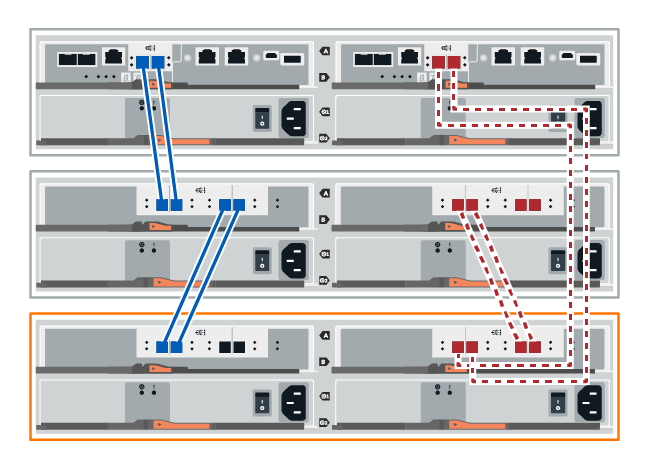
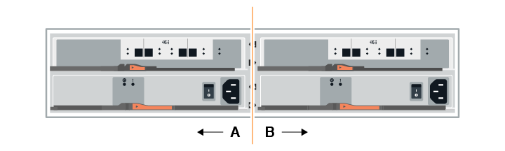
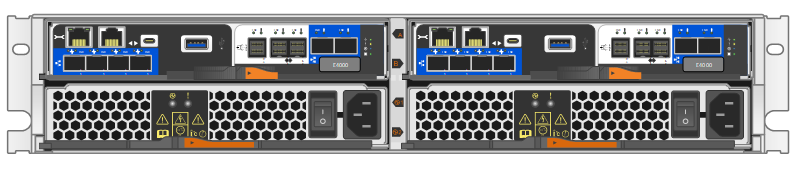
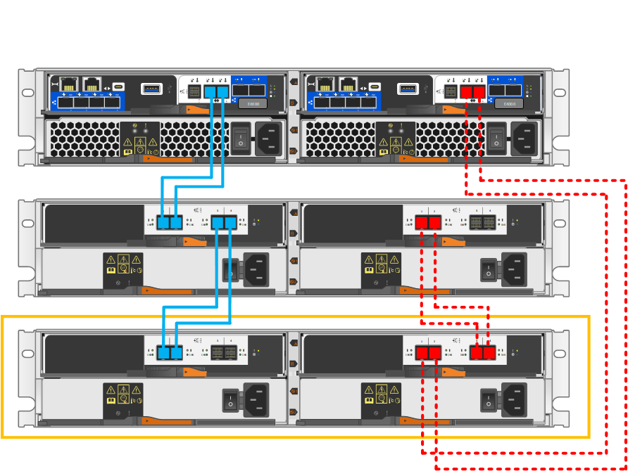
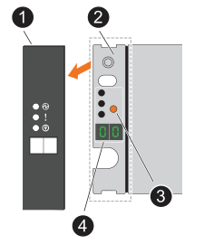

.Before you begin

* Due to the complexity of this procedure, read all steps before beginning the procedure.
+
To maintain system integrity during the hot-add procedure, you must always maintain one active path. You must follow the procedure exactly in the order presented.
+
To cable the new shelf, you recable the A-side (shelf IOM A) controller-to-shelf connections and add shelf-to-shelf connections, verify the A-side path is active, recable the B-side (shelf IOMB) controller-to-shelf connections and add shelf-to-shelf connections, and then verify redundancy has been reestablished.
+
NOTE: If you are installing a drive shelf that has previously been installed in a storage system, there are additonal steps you must take.

* Ensure hot adding a drive shelf is the procedure you need. 

* Verify that your storage system is running a version of SANtricity that supports SAS expansion shelves and that you do not exceed the maximum number of supported SAS shelves. 
+
For information about the supported versions of SANtricity and maximum number of SAS expansion shelves supported for your storage system, see the NetApp Hardware Universe: https://hwu.netapp.com/Controller/Index?platformTypeId=2357027[Hardware Universe^].
+
NOTE: EF50 and EF80 storage systems running SANtricity 12.10 or later support SAS expansion shelves. 

* Your storage system must have available SAS ports. This means SAS I/O modules must already be installed. If they are not, use the applicable procedure to install the SAS I/O modules:
+
** For EF50 and EF80 storage systems, use the link:../maintenance-ef50-ef80/io-module-upgrade.html[Upgrade I/O Modules^] procedure.
** For older storage systems, use the _SAS expansion cards_ procedure for your storage system model in the _Maintain systems_ section.

.About this task

* This procedure applies to an E2800, E2800B, EF280, E5700, E5700B, EF570, EF300, EF600, EF300C, EF600C, E4000, EF50, or EF80 controller shelf.
+
NOTE: If you are cabling an older controller shelf, see https://mysupport.netapp.com/ecm/ecm_download_file/ECMLP2859057[Adding IOM Drive Shelves to an Existing E27XX, E56XX, or EF560 Controller Shelf^].

* This procedure applies to hot adding a DE212C, DE224C, or DE460C drive shelves with IOM12, IOM12B, or IOM12C modules.
+
NOTE: IOM12C modules are only supported on SANtricity OS 11.90R3 onward. Ensure your controller's firmware has been updated before installing or upgrading to an IOM12C.

== Step 1: Prepare to add the drive shelf

To prepare to hot add a drive shelf, you must check for critical events and check the status of the IOMs.

.Before you begin

* The power source for your storage system must be able to accommodate the power requirements of the new drive shelf. For the power specification for your drive shelf, see the https://hwu.netapp.com/Controller/Index?platformTypeId=2357027[Hardware Universe^].
* The cabling pattern for the existing storage system must match one of the applicable schemes shown in this procedure.

.Steps

. In SANtricity System Manager, select *Support* > *Support Center* > *Diagnostics*.
. Select *Collect Support Data*.
+
The Collect Support Data dialog box appears.

. Click *Collect*.
+
The file is saved in the Downloads folder for your browser with the name support-data.7z. The data is not automatically sent to technical support.

. Select *Support* > *Event Log*.
+
The Event Log page displays the event data.

. Select the heading of the *Priority* column to sort critical events to the top of the list.
. Review the system critical events for events that have occurred in the last two to three weeks, and verify that any recent critical events have been resolved or otherwise addressed.
+
NOTE: If unresolved critical events have occurred within the previous two to three weeks, stop the procedure and contact technical support. Continue the procedure only when the issue is resolved.

. If you have IOMs connected to your hardware, complete the following steps. Otherwise, go to <<step2_install_drive_shelf, Step 2: Install the drive shelf and apply power.>>
.. Select menu:Hardware[Controllers and components].
.. Select the *IOMs (ESMs)* icon.
+
image::../media/sam1130_ss_hardware_iom_icon.gif["IOMs (ESMs) icon"]
+
The Shelf Component Settings dialog box appears with the *IOMs (ESMs)* tab selected.

.. Make sure that the status shown for each IOM/ESM is _Optimal_.
.. Click *Show more settings*.
.. Confirm that the following conditions exist:
 *** The number of ESMs/IOMs detected matches the number of ESMs/IOMs installed in the system and that for each drive shelf.
 *** Both of the ESMs/IOMs show that communication is OK.
 *** The data rate is 12Gb/s for DE212C, DE224C, and DE460C drive shelves or 6 Gb/s for other drive trays.

[[step2_install_drive_shelf]]
== Step 2: Install the drive shelf and apply power

You install a new drive shelf or a previously installed drive shelf, turn on the power, and check for any LEDs that require attention.

.Steps

. If you are installing a drive shelf that has previously been installed in a storage system, remove the drives. The drives must be installed one at a time later in this procedure.
+
If the installation history of the drive shelf that you are installing is unknown, you should assume that it has been previously installed in a storage system.

. Install the drive shelf in the rack that holds the storage system components.
+
NOTE: See the installation instructions for your model for the full procedure for physical installation and power cabling. The installation instructions for your model includes notes and warnings that you must take into account to safely install a drive shelf.

. Power on the new drive shelf, and confirm that no amber attention LEDs are illuminated on the drive shelf. If possible, resolve any fault conditions before you continue with this procedure.

== Step 3: Cable the drive shelf

If you are cabling an older controller shelf to a DE212C, DE224C, or DE460C, see https://mysupport.netapp.com/ecm/ecm_download_file/ECMLP2859057[Adding IOM Drive Shelves to an Existing E27XX, E56XX, or EF560 Controller Shelf^].

[role="tabbed-block"]
====

.Connect the drive shelf for EF50 or EF80
--

This procedure instructs you on how to hot-add an initial SAS expansion shelf to your EF50 or EF80 storage system and how to recable the initial shelf to hot-add a second shelf; however, this procedure can be applied when adding additional shelves.

.Before you begin

You have updated your firmware to the latest version. To update your firmware, follow the instructions in the link:../upgrade-santricity/index.html[Upgrading SANtricity OS].

.About this task

* If you are hot-adding an additional shelf to existing shelves, this procedure has you recable the controller-to-shelf connections so that you always maintain one active path to the controller shelf. 
+
To maintain one active path during this procedure, you recable the A-side (shelf IOMA) controller-to-shelf connections and add shelf-to-shelf connections, verify the A-side path is active, recable the B-side (shelf IOMB) controller-to-shelf connections and add shelf-to-shelf connections, and then verify redundancy has been reestablished (Optimal status is indicated).

* This procedure has steps for hot-adding up to two shelves. However, if you are hot-adding an additional shelf, start with step 2 and apply the steps to the additional (new) shelf.
+
You always move cables from the last shelf in the stack to the same IOMs and IOM ports on the new shelf, and then connect the new shelf to the previous last shelf in the stack (shelf-to-shelf connections).

* In the cabling illustrations, controller A connections are shown in blue and controller B connections are shown in red. The dashed lines (blue and red) represent the existing cabling that you are moving to perform cabling steps. The gray ports and lines represent the existing cabling that remains in place while you perform cabling steps.

.Steps

. To hot-add one SAS shelf that is the initial SAS expansion shelf, complete the following substeps; otherwise, go to the next step.
.. Connect controller A port 3a to the shelf IOMA port 1.
.. Connect controller A port 3b to the shelf IOMA port 2.
.. Connect controller A port 3c to the shelf IOMB port 3.
.. Connect controller A port 3d to the shelf IOMB port 4.
.. Connect controller B port 3a to the shelf IOMA port 3.
.. Connect controller B port 3b to the shelf IOMA port 4.
.. Connect controller B port 3c to the shelf IOMB port 1.
.. Connect controller B port 3d to the shelf IOMB port 2.
+
When you are done cabling the shelf, the cabling should look like the following:
+
image::../media/drw_ef50-ef80_1_de460c_cabling_ieops-2981.svg[cable the initial shelf]
+
. To hot-add a second SAS expansion shelf (shelf 2), recable the A-side controller-to-shelf connections and add A-side shelf-to-shelf connections, as follows:
.. Disconnect the cable from shelf 1 IOMA port 1 and reconnect it to shelf 2 IOMA port 1.
.. Disconnect the cable from shelf 1 IOMA port 2 and reconnect it to shelf 2 IOMA port 2.
.. Connect shelf 1 IOMA port 1 to shelf 2 IOMA port 4.
.. Connect shelf 1 IOMA port 2 to shelf 2 IOMA port 3.
+
When you are done recabling the A-side connections, the cabling should look like the following:
+
image::../media/drw_ef50-ef80_2nd_de460c_cabling_hotadd_a-side_ieops-2998.svg[add second shelf and recable the a side connections]

. In SANtricity System Manager, click menu:Hardware[Controllers and components].
+
NOTE: If you are adding a second SAS expansion shelf, at this point in the procedure, you have only one active path to the controller shelf.

. Scroll down, as necessary, to see all the drive shelves in the new storage system. If the new drive shelf is not displayed, resolve the connection issue.
. Select the *ESMs/IOMs* icon for the new drive shelf.
+
image::../media/sam1130_ss_hardware_iom_icon.gif["ESMs/IOMs icon"]
+
The *Shelf Component Settings* dialog box appears.

. Select the *ESMs/IOMs* tab in the *Shelf Component Settings* dialog box.
. Select *Show more options*, and verify the following:
 ** If you are adding the initial SAS expansion shelf, IOM/ESM A and IOM/ESM B are listed. If you are adding a second SAS expansion shelf, IOM/ESM A is listed.
 ** Current data rate is 12 Gbps for a SAS-3 drive shelf.
 ** Card communications is OK.

. If you are adding a second SAS expansion shelf, recable the B-side controller-to-shelf connections and add B-side shelf-to-shelf connections, as follows:
.. Disconnect the cable from shelf 1 IOMB port 1 and reconnect it to shelf 2 IOMB port 1.
.. Disconnect the cable from shelf 1 IOMB port 2 and reconnect it to shelf 2 IOMB port 2.
.. Connect shelf 1 IOMB port 1 to shelf 2 IOMB port 3.
.. Connect shelf 1 IOMB port 2 to shelf 2 IOMB port 4.
+
When you are done recabling the B-side connections, the cabling should look like the following:
+
image::../media/drw_ef50-ef80_2nd_de460c_cabling_hotadd_b-side_ieops-3007.svg[add second shelf and recable the b side connections]

. If you are adding a second SAS expansion shelf, when you are done recabling the two shelves, the cabling should look like the following:
+
image::../media/drw_ef50-ef80_2nd_de460c_cabling_hotadd_final_ieops-3012.svg[example of cabling for two hot added shelves]
+
. If it is not already selected, select the *ESMs/IOMs* tab in the *Shelf Component Settings* dialog box, and then select *Show more options*. Verify that Card communications is *YES*.
+
NOTE: Optimal status indicates that the loss of redundancy error associated with the new drive shelf has been resolved and the storage system is stabilized.

--

.Connect the drive shelf for E2800 or E5700
--

You connect the drive shelf to controller A, confirm IOM status, and then connect the drive shelf to controller B.

.Steps

. Connect the drive shelf to controller A.
+
The following figure shows an example connection between an additional drive shelf and controller A. To locate the ports on your model, see the https://hwu.netapp.com/Controller/Index?platformTypeId=2357027[Hardware Universe^].
+
image::../media/hot_e5700_0.png["Connect drive shelf to controller"]
+
image::../media/hot_e5700_1.png["Connect drive shelf to controller"]

. In SANtricity System Manager, click *Hardware*.
+
NOTE: At this point in the procedure, you have only one active path to the controller shelf.

. Scroll down, as necessary, to see all the drive shelves in the new storage system. If the new drive shelf is not displayed, resolve the connection issue.
. Select the *ESMs/IOMs* icon for the new drive shelf.
+
image::../media/sam1130_ss_hardware_iom_icon.gif["ESMs/IOMs icon"]
+
The *Shelf Component Settings* dialog box appears.

. Select the *ESMs/IOMs* tab in the *Shelf Component Settings* dialog box.
. Select *Show more options*, and verify the following:
 ** IOM/ESM A is listed.
 ** Current data rate is 12 Gbps for a SAS-3 drive shelf.
 ** Card communications is OK.
. Disconnect all expansion cables from controller B.
. Connect the drive shelf to controller B.
+
The following figure shows an example connection between an additional drive shelf and controller B. To locate the ports on your model, see the https://hwu.netapp.com/Controller/Index?platformTypeId=2357027[Hardware Universe^].
+

. If it is not already selected, select the *ESMs/IOMs* tab in the *Shelf Component Settings* dialog box, and then select *Show more options*. Verify that Card communications is *YES*.
+
NOTE: Optimal status indicates that the loss of redundancy error associated with the new drive shelf has been resolved and the storage system is stabilized.

--

.Connect the drive shelf for EF300 or EF600
--

You connect the drive shelf to controller A, confirm IOM status, and then connect the drive shelf to controller B.

.Before you begin

* You have updated your firmware to the latest version. To update your firmware, follow the instructions in the link:../upgrade-santricity/index.html[Upgrading SANtricity OS].

.Steps

. Disconnect both of the A-side controller cables from IOM12 ports one and two from previous last shelf in the stack and then connect them to the new shelf IOM12 ports one and two.
+

. Connect the cables to A-side IOM12 ports three and four from the new shelf to previous last shelf IOM12 ports one and two.
+
The following figure shows an example connection for A side between an additional drive shelf and the previous last shelf. To locate the ports on your model, see the https://hwu.netapp.com/Controller/Index?platformTypeId=2357027[Hardware Universe^].
+
image::../media/hot_ef_0.png["Drive shelf cabling example"]
+
image::../media/hot_ef_1.png["Drive shelf cabling example"]

. In SANtricity System Manager, click menu:Hardware[Controllers and components].
+
NOTE: At this point in the procedure, you have only one active path to the controller shelf.

. Scroll down, as necessary, to see all the drive shelves in the new storage system. If the new drive shelf is not displayed, resolve the connection issue.
. Select the *ESMs/IOMs* icon for the new drive shelf.
+
image::../media/sam1130_ss_hardware_iom_icon.gif["ESMs/IOMs icon"]
+
The *Shelf Component Settings* dialog box appears.

. Select the *ESMs/IOMs* tab in the *Shelf Component Settings* dialog box.
. Select *Show more options*, and verify the following:
 ** IOM/ESM A is listed.
 ** Current data rate is 12 Gbps for a SAS-3 drive shelf.
 ** Card communications is OK.
. Disconnect both the B-side controller cables from IOM12 ports one and two from the previous last shelf in the stack then connect them to the new shelf IOM12 ports one and two.
. Connect the cables to B-side IOM12 ports three and four from the new shelf to the previous last shelf IOM12 ports one and two.
+
The following figure shows an example connection for B side between an additional drive shelf and the previous last shelf. To locate the ports on your model, see the https://hwu.netapp.com/Controller/Index?platformTypeId=2357027[Hardware Universe^].
+
image::../media/hot_ef_2.png["Drive shelf cabling example"]

. If it is not already selected, select the *ESMs/IOMs* tab in the *Shelf Component Settings* dialog box, and then select *Show more options*. Verify that Card communications is *YES*.
+
NOTE: Optimal status indicates that the loss of redundancy error associated with the new drive shelf has been resolved and the storage system is stabilized.

--

.Connect the drive shelf for E4000
--

You connect the drive shelf to controller A, confirm IOM status, and then connect the drive shelf to controller B.

.Steps

. Connect the drive shelf to controller A.
+

. In SANtricity System Manager, click menu:Hardware[Controllers and components].
+
NOTE: At this point in the procedure, you have only one active path to the controller shelf.

. Scroll down, as necessary, to see all the drive shelves in the new storage system. If the new drive shelf is not displayed, resolve the connection issue.
. Select the *ESMs/IOMs* icon for the new drive shelf.
+
image::../media/sam1130_ss_hardware_iom_icon.gif[IOM hardware icon]
+
The *Shelf Component Settings* dialog box appears.

. Select the *ESMs/IOMs* tab in the *Shelf Component Settings* dialog box.
. Select *Show more options*, and verify the following:
 ** IOM/ESM A is listed.
 ** Current data rate is 12 Gbps for a SAS-3 drive shelf.
 ** Card communications is OK.
. Disconnect all expansion cables from controller B.
. Connect the drive shelf to controller B.
+

. If it is not already selected, select the *ESMs/IOMs* tab in the *Shelf Component Settings* dialog box, and then select *Show more options*. Verify that Card communications is *YES*.
+
NOTE: Optimal status indicates that the loss of redundancy error associated with the new drive shelf has been resolved and the storage system is stabilized.

--
====

== Step 4: Assign drive shelf IDs

Each shelf is distinguished by a unique shelf ID. This ID ensures that the shelf is distinct within your storage system.

.About this task
* A valid shelf ID is 01 through 99. 
+
Internal shelves (storage), which are integrated within the controllers, are assigned a fixed shelf ID of 00.

* You must power cycle a shelf (turn off the power switch on each of the power supplies of the SAS shelf, wait the appropriate amount of time, and then switch the power back on) for the shelf ID to take effect.

.Steps
. Remove the left end cap to access the orange shelf ID button on the faceplate.
+

+

[cols="20%,80%"]
|===
a|
image::../media/icon_round_1.png[Callout number 1] 
a|
Shelf end cap
a|
image::../media/icon_round_2.png[[Callout number 2]
a|
Shelf faceplate 
a|
image::../media/icon_round_3.png[[Callout number 3]
a|
Shelf ID button
a|
image::../media/icon_round_4.png[[Callout number 4]
a|
Shelf ID number

|===
+
. Change the first number of the shelf ID:
.. Press and hold the shelf ID button until the first number on the digital display blinks, and then release the button.
+
It can take up to 15 seconds for the number to blink. This activates the shelf ID programming mode.
+
NOTE: If the ID takes longer than 15 seconds to blink, press and hold the shelf ID button again, making sure to press it in all the way.

.. Press and release the shelf ID button to advance the number until you reach the desired number from 0 to 9.
+
Each press and release duration can be as short as one second.
+
The first number continues to blink.
. Change the second number of the shelf ID:
.. Press and hold the button until the second number on the digital display blinks.
+
It can take up to three seconds for the number to blink.
+
The first number on the digital display stops blinking.

.. Press and release the shelf ID button to advance the number until you reach the desired number from 0 to 9.
+
The second number continues to blink.
. Lock in the desired number and exit the programming mode by pressing and holding the shelf ID button until the second number stops blinking.
+
It can take up to three seconds for the number to stop blinking.
+
Both numbers on the digital display start blinking and the amber LED illuminates after about five seconds, alerting you that the pending shelf ID has not yet taken effect.

. Power-cycle the shelf for at least 10 seconds to make the shelf ID take effect.
+
.. Turn off the power switch on each of the power supplies. 

+
.. Wait 10 seconds.
+
.. Turn on the power switch on each of the power supplies to complete the power cycle.
+
When a power supply is powered on, the bicolored LED should illuminate green.

. Replace the left end cap.

== Step 5: Complete the hot add

You complete the hot add by checking for any errors and confirming that the newly added drive shelf uses the latest firmware.

.Steps

. In SANtricity System Manager, click *Home*.
. If the link labeled *Recover from problems* appears at the center top of the page, click the link, and resolve any issues indicated in the Recovery Guru.
. In SANtricity System Manager, click menu:Hardware[Controllers and components], and scroll down, as necessary, to see the newly added drive shelf.
. For drives that were previously installed in a different storage system, add one drive at time to the newly installed drive shelf. Wait for each drive to be recognized before you insert the next drive.
+
When a drive is recognized by the storage system, the representation of the drive slot in the *Hardware* page displays as a blue rectangle.

. Select *Support* > *Support Center* > *Support Resources* tab.
. Click the *Software and Firmware Inventory* link, and check which versions of the IOM/ESM firmware and the drive firmware are installed on the new drive shelf.
+
NOTE: You might need to scroll down the page to locate this link.

. If necessary, upgrade the drive firmware.
+
IOM/ESM firmware automatically upgrades to the latest version unless you have disabled the upgrade feature.

.What's next?

The hot add procedure is complete. You can resume normal operations.