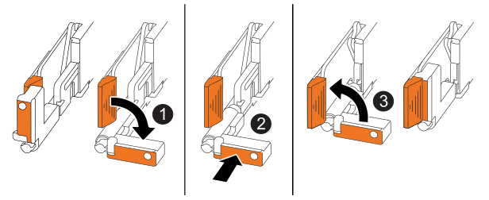

.About this task

The following illustration shows the operation of the controller handles (from the left side of a controller) when reinstalling the controller, and can be used as a reference for the controller reinstallation steps.

[cols="1,4"]

|===
a|
image::../media/icon_round_1.png[Callout number 1]
a|
If you rotated the controller handles upright (next to the tabs) to move them out of the way while you serviced the controller, rotate them down to the horizontal position. 
a|
image::../media/icon_round_2.png[Callout number 2] 
a|
Push the handles to reinsert the controller into the chassis.
a|
image::../media/icon_round_3.png[Callout number 3] 
a|
Rotate the handles to the upright position and lock in place with the locking tabs.

|===

.Steps

. Close the controller cover and turn the thumbscrew clockwise until tightened.

. Insert the controller into the chassis:
+
.. Align the rear of the controller with the opening in the chassis, and gently but firmly push on the handles until the controller meets the midplane and is fully seated.
+
NOTE: Do not use excessive force when sliding the controller into the chassis; it could damage the connectors.
+
.. Rotate the controller handles up and lock in place with the tabs.

. Reconnect the power cord to the power supply and secure the power cord with the power cord retainer.
+
Once power is restored to the power supply, the status LED should be green.

. Reconnect all of the cables to the controller.
+
Reconnecting the cables must be done before placing the controller online. This is especially important for the mirroring cable connections because they ensure full system redundancy and are used for cache mirroring and I/O shipping.

//They must be connected for full system redundancy. They're used for cache mirroring and I/O shipping. (I/O shipping in a NetApp E-Series system is a mechanism where the non-owning controller receives host I/O and transfers it to the owning controller via internal, high-speed interconnect channels for processing. This enables active-active access, allowing hosts to access volumes through any controller.)

