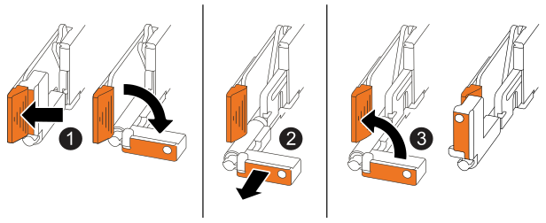

Verify any data in cache memory has been written to the drives, unplug all of the cables from the impaired controller, and then remove the impaired controller from the chassis.

.Steps

. On the impaired controller, make sure the NV Caching Active (green) LED is off.
+
When the NV Caching Active (green) LED is off, any data in cache memory has been written to the drives and it is safe to remove the impaired controller.
+
NOTE: If the NV Caching Active (green) LED is on, cached data is being written to the drives. You must wait for the process to complete and the NV Caching Active LED to turn off. However, if the LED remains on for longer than five minutes, contact https://mysupport.netapp.com/site/global/dashboard[NetApp Support] before continuing with this procedure.
+
The NV Caching Active (green) LED is located next to the NV icon on the controller.
+
image::../media/drw_g_nvmem_led_ieops-1839.svg[NV status LED location]
+
[cols="1,4"]

|===
a|
image::../media/icon_round_1.png[Callout number 1]
a|
NV icon and NV Caching Active LED on the controller

|===

[start=2]
. Put on an ESD wristband or take other antistatic precautions.

. Label each cable that is attached to the impaired controller.

. Disconnect the power cord from the power supply on the impaired controller.
+
NOTE: The power supply (PSU) does not have a power switch.
+
. Unplug all cables from the impaired controller.

. Remove the impaired controller:
+
The following illustration shows the operation of the controller handles (from the left side of the controller) when removing a controller:
+

+
[cols="1,4"]

|===
a|
image::../media/icon_round_1.png[Callout number 1]
a|
On both ends of the controller, push the vertical locking tabs outward to release the handles to their horizontal position.
a|
image::../media/icon_round_2.png[Callout number 2] 
a|
* Pull the handles towards you to unseat the controller from the midplane.
+
As you pull, the handles extend out from the controller and then you feel some resistance, keep pulling.
+
* Slide the controller out of the chassis while supporting the bottom of the controller, and place it on a flat, static-free work surface.
a|
image::../media/icon_round_3.png[Callout number 3] 
a|
If needed, rotate the handles upright (next to the tabs) to move them out of the way.
|===

. Open the controller cover by turning the thumbscrew counterclockwise to loosen, and then open the cover. 

