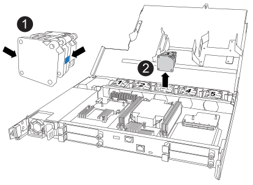
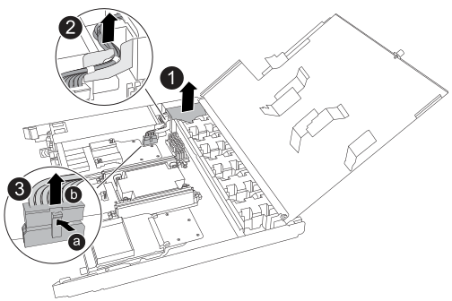
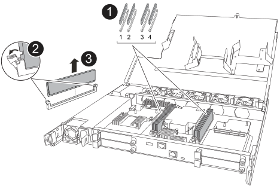

.About this task
* Install the replacement controller within 60 minutes of removing the failed controller to maintain proper cooling for the storage system. 
+
CAUTION: To prevent overheating, do not leave the controller bay empty for longer than 60 minutes.

* You must place the impaired controller offline before unplugging any of its cables.

* You can turn on the storage system location (blue) LEDs (on the front of the storage system and both controllers) to aid in physically locating the affected storage system. Using SANtricity System Manager, select *Hardware* > *Controllers and components*, select the *Controller shelf* tab, and from the context menu select *Turn on locator light*.

== Step 1: Remove the controller

include::../_include/ge_controller_remove.adoc[] 

== Step 2: Move the power supply

Move the power supply (PSU) to the replacement controller.

.Steps

. Remove the PSU from the impaired controller:
+
Make sure the left side controller handle is in the upright position to allow you access to the PSU.
+
image::../media/ef50-ef80_psu_ac_orange_tab_replace_ieops-2611.svg[Replace AC PSU]

+
[cols="1,4"]
|===
a|
image::../media/icon_round_1.png[Callout number 1]
a|
Rotate the PSU handle up, to its horizontal position, and then grasp it.
a|
image::../media/icon_round_2.png[Callout number 2]
a|
With your thumb, press the orange locking tab to release the PSU from the controller.
a|
image::../media/icon_round_3.png[Callout number 3]
a|
Pull the PSU out of the controller while using your other hand to support its weight. 

CAUTION: The PSU is short. Always use two hands to support it when removing it from the controller so that it does not suddenly swing free from the controller and injure you.
|===
+
. Insert the PSU into the replacement controller:
.. Using both hands, support and align the edges of the PSU with the opening in the controller.
.. Gently slide the PSU into the controller until the orange locking tab clicks into place.
+
A PSU must properly engage with the internal connector and locking mechanism. Repeat this step if you feel the PSU is not properly seated.
+
NOTE: To avoid damaging the internal connector, do not use excessive force when sliding the PSU into the controller.
+
.. Rotate the handle down, so it is out of the way of normal operations.

== Step 3: Move the fans

Move the fans to the replacement controller.

.Steps

. Remove one of the fans from the impaired controller:
+

+
[cols="1,4"]
|===
a|
image::../media/icon_round_1.png[Callout number 1]|
Hold both sides of the fan at the blue touch points.
a|
image::../media/icon_round_2.png[Callout number 2]|
Pull the fan straight up and out its socket.
|===

+

.  Insert the fan into the replacement controller by aligning it within the guides, and then push down until the fan connector is fully seated in the socket.

. Repeat these steps for the remaining fans.

== Step 4: Move the NV battery

Move the NV battery to the replacement controller.

.Steps

. Remove the NV battery from the impaired controller:
+

+
[cols="1,4"]

|===
a|
image::../media/icon_round_1.png[Callout number 1]
a|
Lift the NV battery up and out of its compartment.
a|
image::../media/icon_round_2.png[Callout number 2]
a|
Remove the wiring harness from its retainer.
a|
image::../media/icon_round_3.png[Callout number 3]
a| 
a. Push in and hold the tab on the connector.

b. Pull the connector up and out of the socket.
+
As you pull up, gently rock the connector from end to end (lengthwise) to unseat it.
|===

. Install the NV battery into the replacement controller:
.. Plug the wiring connector into its socket.
+
.. Route the wiring along the side of the power supply, into its retainer, and then through the channel in front of the NV battery compartment.
.. Place the NV battery into the compartment.
+
The NV battery should sit flush in its compartment.
 
== Step 5: Move system DIMMs

Move the DIMMs to the replacement controller.

If you have DIMM blanks, you do not need to move them, the replacement controller should come with them installed.

.Steps

. Remove one of the DIMMs from the impaired controller:
+

+
[cols="1,4"]

|===
a|
image::../media/icon_round_1.png[Callout number 1]
a|
DIMM slot numbering and positions.

NOTE: Depending on your storage system model, you will have two or four DIMMs.
a|
image::../media/icon_round_2.png[Callout number 1]
a|
* Note the orientation of the DIMM in the socket so that you can insert the DIMM in the replacement controller in the proper orientation.
* Eject the DIMM by slowly pushing apart the two DIMM ejector tabs on both ends of the DIMM slot.

IMPORTANT: Carefully hold the DIMM by the corners or edges to avoid pressure on the DIMM circuit board components.
a|
image::../media/icon_round_3.png[Callout number 3]
a|
Lift the DIMM up and out of the slot.

The ejector tabs remain in the open position.
|===

. Install the DIMM in the replacement controller:

.. Make sure that the DIMM ejector tabs on the connector are in the open position.

.. Hold the DIMM by the corners and insert it squarely into the slot.
+
The notch on the bottom of the DIMM, among the pins, should line up with the tab in the slot.
+
When inserted correctly, the DIMM goes in easily but fits tightly in the slot. If not, reinsert the DIMM.

.. Visually check the DIMM to make sure it is evenly aligned and fully inserted into the slot.

.. Push down carefully, but firmly, on the top edge of the DIMM until the ejector tabs snap into place over the notches at both ends of the DIMM.

. Repeat these steps for the remaining DIMMs.

== Step 6: Move the I/O modules

Move the I/O modules and any I/O blanking modules to the replacement controller.

.Steps

. Remove one of the I/O modules from the impaired controller:
+
Make sure that you keep track of which slot the I/O module was in.
+
If you are removing the I/O module in slot 4, make sure the right side controller handle is in the upright position to allow you access to the I/O module.
+
image::../media/drw_g_io_module_replace_ieops-1900.svg[Remove I/O module]
+
[cols="1,4"]
|===

a|
image::../media/icon_round_1.png[Callout number 1]
a|
Turn the I/O module thumbscrew counterclockwise to loosen.
a|
image::../media/icon_round_2.png[Callout number 2]
a|
Pull the I/O module out of the controller using the port label tab on the left and the thumbscrew on the right.

|===

. Install the I/O module into the replacement controller:

.. Align the I/O module with the edges of the slot.

.. Gently push the I/O module all the way into the slot, making sure to properly seat the module into the connector.
+
You can use the tab on the left and the thumbscrew on the right to push in the I/O Module.
+
.. Turn the thumbscrew clockwise to tighten.

. Repeat these steps to move the remaining I/O modules and any I/O blanking modules to the replacement controller. 

== Step 7: Install the controller

Install the replacement controller into the chassis, reconnect its power cord, and all of its cables.

include::../_include/ge_controller_reinstall.adoc[]

//Delete this include:
//include::../_include/ge_controller_replace_controller_reinstall.adoc[]

 

