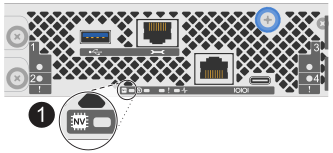

.Steps

. Make sure no I/O operations are happening between the storage system and all connected hosts. For example, you can perform these steps:
** Stop all processes that involve the LUNs mapped from the storage to the hosts.
** Ensure that no applications are writing data to any LUNs mapped from the storage to the hosts.
** Unmount all file systems associated with LUNs on the storage system.
+
NOTE: The exact steps to stop host I/O operations depend on the host operating system and the configuration, which are beyond the scope of these instructions. If you are not sure how to stop host I/O operations in your environment, consider shutting down the host or contact https://mysupport.netapp.com/site/global/dashboard[NetApp Support^].
+
CAUTION: *Possible data loss* -- If you continue this procedure while I/O operations are occurring, you might lose data.

. On each controller, make sure the NV Caching Active (green) LED is off.
+
When the NV Caching Active (green) LED is off, any data in cache memory has been written to the drives and it is safe to continue with this procedure.
+
NOTE: If the NV Caching Active (green) LED is on, cached data is being written to the drives. You must wait for the process to complete and the NV Caching Active (green) LED to turn off. However, if the LED remains on for longer than five minutes, contact https://mysupport.netapp.com/site/global/dashboard[NetApp Support] before continuing with this procedure.
+
The NV Caching Active (green) LED is located next to the NV icon on the controller.
+

+
[cols="1,4"]

|===
a|
image::../media/icon_round_1.png[Callout number 1]
a|
NV icon and NV Caching Active LED on the controller
|===
+

. Confirm operations on the controllers have completed, using SANtricity System Manager:
.. Select *Storage* > *Operations in progress* to see the Overview screen. 
.. Wait for all operations to complete and the Overview screen displays *No operations currently in progress*, before continuing to the next step.

. Delete all defined hosts from the storage system.
+
For instructions, see the https://docs.netapp.com/us-en/e-series-santricity/sm-storage/delete-host-or-host-cluster.html[Delete a host or host cluster in SANtricity System Manager^] procedure.
