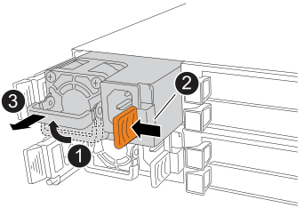

.Steps

. If you are not already grounded, properly ground yourself.

.  Disconnect the power cord from the PSU by opening the power cord retainer, and then unplug the power cord from the PSU.
+
NOTE: The PSU does not have a power switch.
+
. Remove the PSU:
+

+
[cols="1,4"]
|===
a|
image::../media/icon_round_1.png[Callout number 1]
a|
Rotate the PSU handle up, to its horizontal position, and then grasp it.
a|
image::../media/icon_round_2.png[Callout number 2]
a|
With your thumb, press the orange locking tab to release the PSU from the controller.
a|
image::../media/icon_round_3.png[Callout number 3]
a|
Pull the PSU out of the controller while using your other hand to support its weight. 

CAUTION: The PSU is short. Always use two hands to support it when removing it from the controller so that it does not suddenly swing free from the controller and injure you.
|===
+
. Unpack the replacement power supply and set it on a level surface near the storage system.
+
Save all packing materials for use when returning the failed power supply.
+
. Install the replacement PSU:
.. Using both hands, support and align the edges of the PSU with the opening in the controller.
.. Gently push the PSU into the controller until the orange locking tab clicks into place.
+
A PSU will only properly engage with the internal connector and lock in place one way.
+
NOTE: To avoid damaging the internal connector, do not use excessive force when sliding the PSU into the controller.
+
.. Rotate the handle down, so it is out of the way of normal operations.

. Reconnect the power cord to the PSU and secure the power cord with the power cord retainer. 
//+
//Once power is restored to the PSU, the status LED should be green.

. Confirm that the PSU's status is Optimal and that the storage system's Attention LEDs are off.
+
If the status is not Optimal or if any of the Attention LEDs are on, confirm that the power cable is correctly seated and the PSU is installed correctly. If necessary, remove and reinstall the PSU.
+
NOTE: If you cannot resolve the problem, contact https://mysupport.netapp.com/site/global/dashboard[NetApp Support] before continuing with this procedure.

. From SANtricity System Manager, click *Support > Upgrade Center* to ensure that the latest version of SANtricity OS is installed.
+
As needed, install the latest version.

. Return the failed part to NetApp, as described in the RMA instructions shipped with the kit.
+
Contact technical support at https://mysupport.netapp.com/site/global/dashboard[NetApp Support], 888-463-8277 (North America), 00-800-44-638277 (Europe), or +800-800-80-800 (Asia/Pacific) if you need the RMA number or additional help with the replacement procedure.//2025-11-17 ontap-systems-internal/issues/1391
