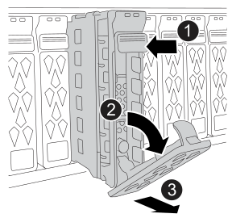

== Step 1: Prepare to replace drive

Prepare for drive replacement by checking the Recovery Guru in SANtricity System Manager and completing any prerequisite steps. Then, you can locate the failed component.

.Steps

. If the Recovery Guru in SANtricity System Manager has notified you of an _impending drive failure_, but the drive has not yet failed, follow the instructions in the Recovery Guru to fail the drive.
. If needed, use SANtricity System Manager to confirm you have a suitable replacement drive.
 .. Select *Hardware*.
 .. Select the failed drive on the shelf graphic.
 .. Click the drive to display its context menu, and then select *View settings*.
 .. Confirm that the replacement drive has a capacity equal to or greater than the drive you are replacing and that it has the features you expect.
+
For example, do not attempt to replace a hard disk drive (HDD) with a solid-state disk (SSD). Similarly, if you are replacing a secure-capable drive, make sure the replacement drive is also secure-capable.
. If needed, use SANtricity System Manager to locate the drive within your storage array: From the drive's context menu, select *Turn on locator light*.
+
The drive's Attention LED (amber) blinks so you can identify which drive to replace.
+
NOTE: If you are replacing a drive in a shelf that has a bezel, you must remove the bezel to see the drive LEDs.

== Step 2: Replace drive

Replace a failed drive with a new one.

NOTE: You should install the replacement drive as soon as possible after removing the failed drive.

.Steps

. Unpack the replacement drive, and set it on a flat, static-free surface near the shelf.
+
Save all packing materials.

. Press the black release button on the failed drive.
+
The latch on the drive springs partially opens, and then the drive releases from the controller.

. Open the cam handle, and slide out the drive slightly.
. Wait 60 seconds for the drive to spin down.
. Remove the failed drive: 
+

+
[cols="1,4"]
|===
a|
image::../media/icon_round_1.png[Callout number 1]
a|
Press the release button on the drive face to open the cam handle.
a|
image::../media/icon_round_2.png[Callout number 2]
a|
Rotate the cam handle downward to disengage the drive from the midplane.
a|
image::../media/icon_round_3.png[Callout number 3]
a|
Slide the drive out of the drive bay using the cam handle and supporting the drive with your other hand. 

When removing a drive, always use two hands to support its weight.

NOTE: Because drives are fragile, minimize handling to avoid damaging them.

|===
+

. Place the drive on an antistatic, cushioned surface away from magnetic fields.
. Wait 60 seconds for the software to recognize that the drive has been removed.
+
NOTE: If you accidentally remove an active drive, wait at least 60 seconds, and then reinstall it. For the recovery procedure, refer to the storage management software.

== Step 3: Install new drive

Install a new drive to replace the failed one. You should install the replacement drive as soon as possible after removing the failed drive.

.Steps

. Insert the replacement drive:
.. Open the cam handle.
.. Using two hands, insert the replacement drive into the open slot, firmly pushing until the drive stops.
.. Close the cam handle so that the drive is fully seated into the midplane and the handle clicks into place.
+
Be sure to close the cam handle slowly so that it aligns correctly with the face of the drive.
+
The green LED on the drive illuminates when the drive is inserted correctly.
+
NOTE: Depending on your configuration, the controller might automatically reconstruct data to the new drive. If the storage system uses hot spare drives, the controller might need to perform a complete reconstruction on the hot spare before it can copy the data to the replaced drive. This reconstruction process increases the time that is required to complete this procedure.

== Step 4: Complete drive replacement

Complete the drive replacement to confirm that the new drive is working correctly.

.Steps

. Check the Power LED and the Attention LED on the replacement drive. (When you first insert a drive, its Attention LED might be on. However, the LED should go off within a minute.)
** Power LED is on or blinking, and the Attention LED is off: Indicates that the new drive is working correctly.
** Power LED is off: Indicates that the drive might not be installed correctly. Remove the drive, wait 60 seconds, and then reinstall it.
** Attention LED is on: Indicates that the new drive might be defective. Replace it with another new drive.
. If the Recovery Guru in SANtricity System Manager still shows an issue, select *Recheck* to ensure the problem has been resolved.
. If the Recovery Guru indicates that drive reconstruction did not start automatically, start reconstruction manually, as follows:
+
NOTE: Perform this operation only when instructed to do so by technical support or the Recovery Guru.

 .. Select *Hardware*.
 .. Click the drive that you replaced.
 .. From the drive's context menu, select *Reconstruct*.
 .. Confirm that you want to perform this operation.
+
When the drive reconstruction completes, the volume group is in an Optimal state.

. Reinstall the bezel.
. Return the failed part to NetApp, as described in the RMA instructions shipped with the kit.
+
Contact technical support at https://mysupport.netapp.com/site/global/dashboard[NetApp Support], 888-463-8277 (North America), 00-800-44-638277 (Europe), or +800-800-80-800 (Asia/Pacific) if you need the RMA number or additional help with the replacement procedure.

.What's next?

Your drive replacement is complete. You can resume normal operations.

