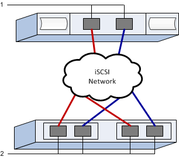

= iSCSI worksheet - Linux
:icons: font
:imagesdir: ../media/

[.lead]
You can use this worksheet to record iSCSI storage configuration information. You need this information to perform provisioning tasks.

== Recommended configuration

Recommended configurations consist of two initiator ports and four target ports with one or more VLANs.

== Target IQN

[options="header"]
|===
| Callout No.| Target port connection| IQN
a|
2
a|
Target port
a|

|===

== Mappings host name

[options="header"]
|===
| Callout No.| Host information| Name and type
a|
1
a|
Mappings host name
a|

a|

a|
Host OS type
a|

|===
