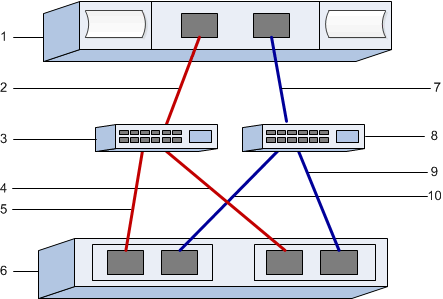

= iSER over InfiniBand worksheet
:icons: font
:imagesdir: ../media/

[.lead]
You can use this worksheet to record iSER over Infiniband storage configuration information. You need this information to perform provisioning tasks.

== iSER over InfiniBand: Host identifiers

NOTE: The software initiator IQN is determined during the task, xref:iser_ib_configure_network_attached_hosts_task.adoc[Configuring storage attached hosts with iSER networking].

Locate and document the initiator IQN from each host. For software initiators, the IQN is typically found in the /etc/iscsi/initiatorname.iscsi file.

[options="header"]
|===
| Callout No.| Host port connections| Software initiator IQN
a|
1
a|
Host (initiator) 1
a|

a|
n/a
a|

a|

a|
n/a
a|

a|

a|
n/a
a|

a|

a|
n/a
a|

a|

|===

== iSER over InfiniBand: Recommended configuration

Recommended configurations consist of two host (initiator) ports and four target ports.

== iSER over InfiniBand: Target IQN

Document the target IQN for the storage array. You will use this information in xref:iser_ib_configure_network_attached_hosts_task.adoc[Configuring storage attached hosts with iSER networking].

Find the Storage Array IQN name using SANtricity: *Storage Array* > *iSER* > *Manage Settings*. This information might be necessary when you create iSER sessions from operating systems that do not support send targets discovery.

[options="header"]
|===
| Callout No.| Array name| Target IQN
a|
6
a|
Array controller (target)
a|

|===

== iSER over InfiniBand: Network configuration

Document the network configuration that will be used for the hosts and storage on the InfiniBand fabric. These instructions assume that two subnets will be used for full redundancy.

Your network administrator can provide the following information. You use this information in the topic, xref:iser_ib_configure_network_attached_hosts_task.adoc[Configuring storage attached hosts with iSER networking].

== Subnet A

Define the subnet to be used.

[options="header"]
|===
| Network Address| Netmask
a|

a|

|===
Document the IQNs to be used by the array ports and each host port.

[options="header"]
|===
| Callout No.| Array controller (target) port connections| IQN
a|
3
a|
Switch
a|
_not applicable_
a|
5
a|
Controller A, port 1
a|

a|
4
a|
Controller B, port 1
a|

a|
2
a|
Host 1, port 1
a|

a|

a|
(Optional) Host 2, port 1
a|

|===

== Subnet B

Define the subnet to be used.

[options="header"]
|===
| Network Address| Netmask
a|

a|

|===
Document the IQNs to be used by the array ports and each host port.

[options="header"]
|===
| Callout No.| Array controller (target) port connections| IQN
a|
8
a|
Switch
a|
_not applicable_
a|
10
a|
Controller A, port 2
a|

a|
9
a|
Controller B, port 2
a|

a|
7
a|
Host 1, port 2
a|

a|

a|
(Optional) Host 2, port 2
a|

|===

== iSER over InfiniBand: Mapping host name

NOTE: The mapping host name is created during the workflow.

[options="header"]
|===
a|
Mapping host name
a|

a|
Host OS type
a|

|===
