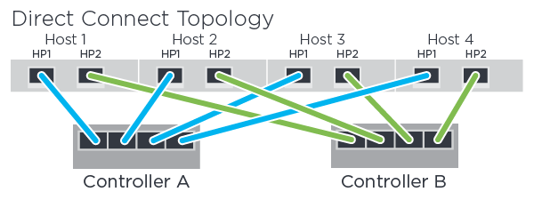

= Record your NVMe over FC configuration
:icons: font
:imagesdir: ../media/

[.lead]
You can generate and print a PDF of this page, and then use the following worksheet to record NVMe over Fibre Channel storage configuration information. You need this information to perform provisioning tasks.

== Direct connect topology

In a direct connect topology, one or more hosts are directly connected to the controller.

* Host 1 HBA Port 1 and Controller A Host port 1
* Host 1 HBA Port 2 and Controller B Host port 1
* Host 2 HBA Port 1 and Controller A Host port 2
* Host 2 HBA Port 2 and Controller B Host port 2
* Host 3 HBA Port 1 and Controller A Host port 3
* Host 3 HBA Port 2 and Controller B Host port 3
* Host 4 HBA Port 1 and Controller A Host port 4
* Host 4 HBA Port 2 and Controller B Host port 4

== Switch connect topology

In a fabric topology, one or more switches are used. See the https://mysupport.netapp.com/matrix[NetApp Interoperability Matrix Tool^] for a list of supported switches.

image::../media/nvme_fc_fabric_topology.png[]

== Host identifiers

Locate and document the initiator NQN from each host.

[options="header"]
|===
| Host port connections| Host NQN
a|
Host (initiator) 1
a|

a|
Host (initiator) 2
a|

|===

== Target NQN

Document the target NQN for the storage array.

[options="header"]
|===
| Array name| Target NQN
a|
Array controller (target)
a|

|===

== Target NQNs

Document the NQNs to be used by the array ports.

[options="header"]
|===
| Array controller (target) port connections| NQN
a|
Controller A, port 1
a|

a|
Controller B, port 1
a|

a|
Controller A, port 2
a|

a|
Controller B, port 2
a|

|===

== Mapping host name

NOTE: The mapping host name is created during the workflow.

|===
a|
Mapping host name a|

a|
Host OS type
a|

a|
|===
