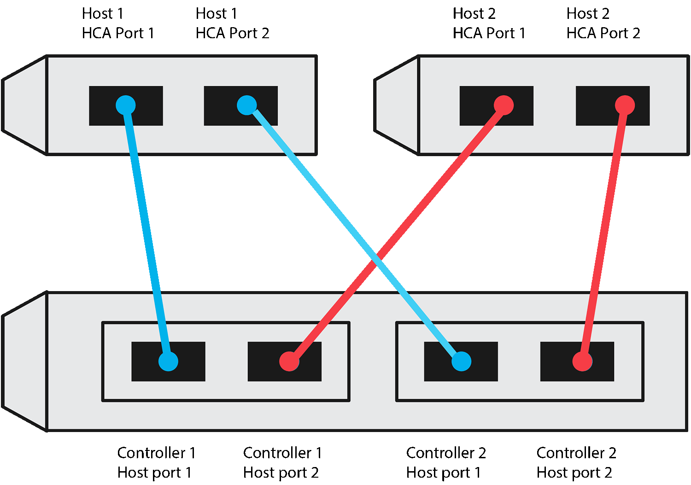
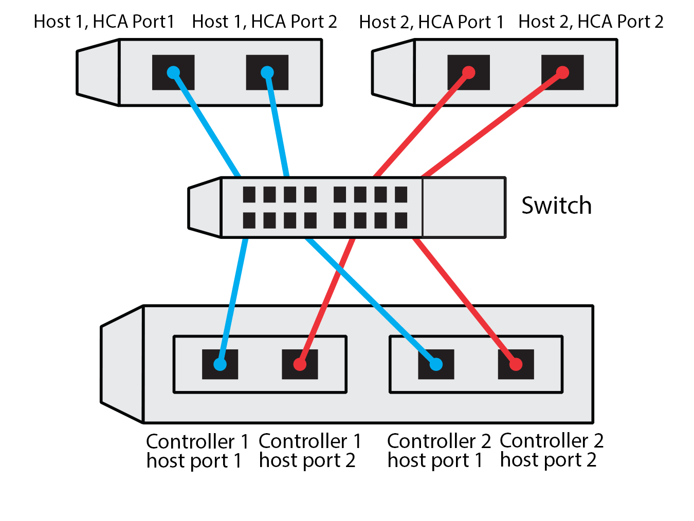

= Record your NVMe over RoCE configuration in E-Series - Linux
:icons: font
:imagesdir: ../media/

[.lead]
You can generate and print a PDF of this page, and then use the following worksheet to record NVMe over RoCE storage configuration information. You need this information to perform provisioning tasks.

== Direct connect topology

In a direct connect topology, one or more hosts are directly connected to the subsystem. In the SANtricity OS 11.50 release, we support a single connection from each host to a subsystem controller, as shown below. In this configuration, one HCA (host channel adapter) port from each host should be on the same subnet as the E-Series controller port it is connected to, but on a different subnet from the other HCA port.

An example configuration that satisfies the requirements consists of four network subnets as follows:

* Subnet 1: Host 1 HCA Port 1 and Controller 1 Host port 1
* Subnet 2: Host 1 HCA Port 2 and Controller 2 Host port 1
* Subnet 3: Host 2 HCA Port 1 and Controller 1 Host port 2
* Subnet 4: Host 2 HCA Port 2 and Controller 2 Host port 2

== Switch connect topology

In a fabric topology, one or more switches are used. Refer to https://mysupport.netapp.com/matrix[NetApp Interoperability Matrix Tool^] for a list of supported switches.

== Host identifiers

Locate and document the initiator NQN from each host.

[options="header"]
|===
| Host port connections| Software initiator NQN
a|
Host (initiator) 1
a|

a|

a|

a|
Host (initiator) 2
a|

a|

a|

a|

a|

|===

== Target NQN

Document the target NQN for the storage array.

[options="header"]
|===
| Array name| Target NQN
a|
Array controller (target)
a|

|===

== Target NQNs

Document the NQNs to be used by the array ports.

[options="header"]
|===
| Array controller (target) port connections| NQN
a|
Controller A, port 1
a|

a|
Controller B, port 1
a|

a|
Controller A, port 2
a|

a|
Controller B, port 2
a|

|===

== Mapping host name

NOTE: The mapping host name is created during the workflow.

|===
a|
Mapping host name a|

a|
Host OS type
a|

a|
|===
