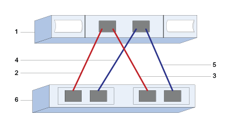

= SAS worksheet - Linux
:icons: font
:imagesdir: ../media/

[.lead]
You can use this worksheet to record SAS storage configuration information. You need this information to perform provisioning tasks.

== Host identifiers

[options="header"]
|===
| Callout No.| Host (initiator) port connections| SAS address
a|
1
a|
Host
a|
_not applicable_
a|
2
a|
Host (initiator) port 1 connected to Controller A, port 1
a|

a|
3
a|
Host (initiator) port 1 connected to Controller B, port 1
a|

a|
4
a|
Host (initiator) port 2 connected to Controller A, port 1
a|

a|
5
a|
Host (initiator) port 2 connected to Controller B, port 1
a|

|===

== Target identifiers

Recommended configurations consist of two target ports.

== Mappings host

|===
a|
Mappings Host Name a|

a|
Host OS Type
a|

|===
