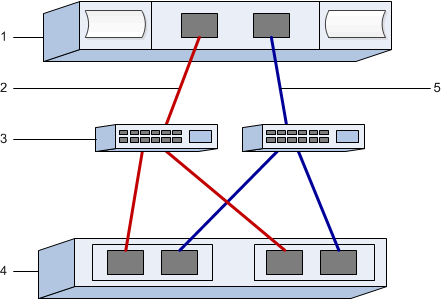

= Record your SRP over InfiniBand configuration in E-Series - Linux
:icons: font
:imagesdir: ../media/

[.lead]
You can generate and print a PDF of this page, and then use the following worksheet to record SRP over InfiniBand storage configuration information. You need this information to perform provisioning tasks.

== Host identifiers

NOTE: The initiator GUIDs are determined in the task, xref:srp-ib-determine-host-port-guids-task.adoc[Determine host port GUIDs and make the recommended settings].

[options="header"]
|===
| Callout No.| Host (initiator) port connections| GUID
a|
1
a|
Host
a|
_not applicable_
a|
3
a|
Switch
a|
_not applicable_
a|
4
a|
Target (storage array)
a|
_not applicable_
a|
2
a|
Host port 1 to IB switch 1 ("A" path)
a|

a|
5
a|
Host port 2 to IB switch 2 ("B" path)
a|

|===

== Recommended configuration

Recommended configurations consist of two initiator ports and four target ports.

== Mapping host name

NOTE: The mapping host name is created during the workflow.

|===
a|
Mapping host name a|

a|
Host OS type
a|

a|
|===
