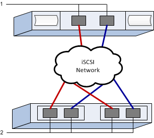

= Perform iSCSI-specific tasks in E-Series - VMware
:experimental:
:icons: font
:imagesdir: ../media/

[.lead]
For the iSCSI protocol, you configure the switches and configure networking on the array side and the host side. Then you verify the IP network connections.

NOTE: Volumes must be set to utilize 512 byte emulation (512e) when using 4096 byte drives to ensure compatibility with VMware. Refer to the SANtricity System Manager online help for more information on setting a volume to use 512-byte emulation (512e).

== Step 1: Record your configuration

You can generate and print a PDF of this page, and then use the following worksheet to record your protocol-specific storage configuration information. You need this information as you perform provisioning tasks.

The illustration shows a host connected to an E-Series storage array separated by VLANs and/or unique subnets. One VLAN/subnet is indicated by the blue line; the other VLAN/subnet is indicated by the red line. Each VLAN/subnet contains at least one initiator port and half of the target ports. Number of host and/or controller ports will vary based on the number of network interfaces and the controller model. You may have more (up to 6 per controller) ports available.

=== Host Mapping Information

|===
a|
Mapping host name
a|
{nbsp} 
a|
Host OS type
a|
{nbsp}
a|
Host NQN
a|
{nbsp}
a|
Target NQN
a|
{nbsp}
a|
{nbsp}
|===

== Step 2: Configure the switches--iSCSI, VMware

You configure the switches according to the vendor's recommendations for iSCSI. These recommendations might include both configuration directives as well as code updates.

.Before you begin

Make sure you have the following:

* Two separate networks for high availability. Make sure that you isolate your iSCSI traffic to separate network segments.
* Enabled send and receive hardware flow control *end-to-end*.
* Disabled priority flow control.
* If appropriate, enable jumbo frames (recommended).

NOTE: Port channels/LACP is not supported on the controller's switch ports. Host-side LACP is not recommended; multipathing provides the same benefits or better.

.Steps
Consult your switch vendor's documentation.

== Step 3: Configure networking--iSCSI VMware

You can set up your iSCSI network in many ways, depending on your data storage requirements. Consult your network administrator for tips on selecting the best configuration for your environment.

.Before you begin

Make sure you have the following:

* Enabled send and receive hardware flow control *end-to-end*.
* Disabled priority flow control.
* If appropriate, enable jumbo frames (recommended).
+
If you are using jumbo frames within the IP SAN for performance reasons, make sure to configure the array, switches, and hosts to use jumbo frames. Consult your operating system and switch documentation for information on how to enable jumbo frames on the hosts and on the switches. To enable jumbo frames on the array, complete the steps in Step 4.

.About this task

While planning your iSCSI networking, remember that the https://configmax.broadcom.com/guest[VMware Configuration Maximums Guide^] states that the maximum supported iSCSI paths to a LUN is 32 and the maximum number of NICs that can be associated or port bound with the software iSCSI stack per server is 8. You must consider this requirement to avoid configuring too many paths.

By default, the VMware iSCSI software initiator creates a single session per iSCSI target when you are not using iSCSI port binding.

NOTE: VMware iSCSI port binding is a feature that forces all bound VMkernel ports to log into all target ports that are accessible on the configured network segments. It is meant to be used with arrays that present a single network address for the iSCSI target. NetApp recommends that iSCSI port binding not be used. For additional information, see https://techdocs.broadcom.com/us/en/vmware-cis/vsphere/vsphere/9-1/vsphere-storage/configuring-iscsi-and-iser-adapters-and-storage-with-esxi/setting-up-network-for-iscsi-and-iser-with-esxi/best-practices-for-configuring-networking-with-software-iscsi.html[best practices for using software iSCSI port binding in ESX/ESXi^]. If the ESXi host is attached to another vendor's storage, NetApp recommends that you use separate iSCSI vmkernel ports to avoid any conflict with port binding.

To ensure a good multipathing configuration, use multiple network segments for the iSCSI network. Place at least one host-side port and at least one port from each array controller on one network segment, and an identical group of host-side and array-side ports on another network segment. Where possible, use multiple Ethernet switches to provide additional redundancy.

.Steps
Consult your switch vendor's documentation.

NOTE: Many network switches have to be configured above 9,000 bytes for IP overhead. Consult your switch documentation for more information.

== Step 4: Configure array-side networking--iSCSI, VMware

You use the SANtricity System Manager GUI to configure iSCSI networking on the array side.

.Before you begin

Make sure you have the following:

* The IP address or domain name for one of the storage array controllers.
* Password for the System Manager GUI, or Role-Based Access Control (RBAC) or LDAP and a directory service is configured for the appropriate security access to the storage array. See the SANtricity System Manager online help for more information about Access Management.

.About this task

This task describes how to access the iSCSI port configuration from the Hardware page. You can also access the configuration from menu:System[Settings > Configure iSCSI ports].

NOTE: For additional information on how to set up the array-side networking on your VMware configuration, see the following technical report: https://www.netapp.com/pdf.html?item=/media/17017-tr4789.pdf[VMware Configuration Guide for E-Series SANtricity iSCSI Integration with ESXi 6.x and 7.x^].

.Steps

. From your browser, enter the following URL: `+https://<DomainNameOrIPAddress>+`
+
`IPAddress` is the address for one of the storage array controllers.
+
The first time SANtricity System Manager is opened on an array that has not been configured, the Set Administrator Password prompt appears. Role-based access management configures four local roles: admin, support, security, and monitor. The latter three roles have random passwords that cannot be guessed. After you set a password for the admin role, you can change all of the passwords using the admin credentials. See the SANtricity System Manager online help for more information on the four local user roles.

. Enter the System Manager password for the admin role in the Set Administrator Password and Confirm Password fields, and then click *Set Password*.
+
The Setup wizard launches if there are no pools, volume groups, workloads, or notifications configured.

. Close the Setup wizard.
+
You will use the wizard later to complete additional setup tasks.

. Select *Hardware*.
. If the graphic shows the drives, click *Show back of shelf*.
+
The graphic changes to show the controllers instead of the drives.

. Click the controller with the iSCSI ports you want to configure.
+
The controller's context menu appears.

. Select *Configure iSCSI ports*.
+
The Configure iSCSI Ports dialog box opens.

. In the drop-down list, select the port you want to configure, and then click *Next*.
. Select the configuration port settings, and then click *Next*.
+
To see all port settings, click the *Show more port settings* link on the right of the dialog box.
+
[options="header"]
|===
| Port Setting| Description
a|
Configured ethernet port speed
a|
Select the desired speed.    The options that appear in the drop-down list depend on the maximum speed that your network can support (for example, 25 Gbps).

NOTE: The iSCSI host interface cards available on the controllers do not auto-negotiate speeds. You must set the speed for each port to either 1 Gb, 10 Gb, or 25 Gb. All ports must be set to the same speed.
a|
Enable IPv4 / Enable IPv6
a|
Select one or both options to enable support for IPv4 and IPv6 networks.
a|
TCP listening port     (Available by clicking *Show more port settings*.)
a|
If necessary, enter a new port number.

The listening port is the TCP port number that the controller uses to listen for iSCSI logins from host iSCSI initiators. The default listening port is 3260. You must enter 3260 or a value between 49152 and 65535.
a|
MTU size     (Available by clicking *Show more port settings*.)
a|
If necessary, enter a new size in bytes for the Maximum Transmission Unit (MTU).

The default Maximum Transmission Unit (MTU) size is 1500 bytes per frame. You must enter a value between 1500 and 9000.
To enable jumbo frames, set this value to 9000 bytes.
a|
Enable ICMP PING responses
a|
Select this option to enable the Internet Control Message Protocol (ICMP). The operating systems of networked computers use this protocol to send messages. These ICMP messages determine whether a host is reachable and how long it takes to get packets to and from that host.
|===
If you selected *Enable IPv4*, a dialog box opens for selecting IPv4 settings after you click *Next*. If you selected *Enable IPv6*, a dialog box opens for selecting IPv6 settings after you click *Next*. If you selected both options, the dialog box for IPv4 settings opens first, and then after you click *Next*, the dialog box for IPv6 settings opens.

. Configure the IPv4 and/or IPv6 settings, either automatically or manually. To see all port settings, click the *Show more settings* link on the right of the dialog box.
+
[options="header"]
|===
| Port setting| Description
a|
Automatically obtain configuration
a|
Select this option to obtain the configuration automatically.
a|
Manually specify static configuration
a|
Select this option, and then enter a static address in the fields. For IPv4, include the network subnet mask and gateway. For IPv6, include the routable IP address and router IP address.
|===

. Click *Finish*.
. Close System Manager.

== Step 5: Configure host-side networking--iSCSI

Configuring iSCSI networking on the host side enables the VMware iSCSI initiator to establish a session with the array.

.About this task

This task configures iSCSI networking on the host side and establishes iSCSI sessions with the storage array.

After you complete this task, the host is configured with a single vSwitch containing both VMkernel ports and both VMNICs.

For additional information on configuring iSCSI networking for VMware, see https://techdocs.broadcom.com/us/en/vmware-cis/vsphere/vsphere/9-1/vsphere-storage/configuring-iscsi-and-iser-adapters-and-storage-with-esxi.html[Configuring iSCSI Adapters and Storage with ESXi^].

NOTE: Record the iSCSI Qualified Name (IQN) during this process from the added software iSCSI adapter. This will be needed later when configuring host mappings.

.Before you begin

Make sure you have the following:

* Switch(es) configured that will be used to carry iSCSI storage traffic.
* Send and receive hardware flow control *end-to-end* enabled on the switch.
* Priority flow control disabled on the switch.
* Array-side iSCSI configuration completed.
* At least two host NIC ports for iSCSI traffic.

.Steps

. Use either the vSphere Client or vSphere Web Client to perform the host-side configuration. See https://techdocs.broadcom.com/us/en/vmware-cis/vsphere/vsphere/9-1/vsphere-storage/configuring-iscsi-and-iser-adapters-and-storage-with-esxi.html[Configuring iSCSI Adapters and Storage with ESXi^].
+
The interfaces vary in functionality and the exact workflow will vary.

. Set up the network for iSCSI. See https://techdocs.broadcom.com/us/en/vmware-cis/vsphere/vsphere/9-1/vsphere-storage/configuring-iscsi-and-iser-adapters-and-storage-with-esxi/setting-up-network-for-iscsi-and-iser-with-esxi.html[Setting Up Network for iSCSI with ESX^].
.. It is recommended not to use port binding. VMware iSCSI port binding is a feature that forces all bound VMkernel ports to log into all target ports that are accessible on the configured network segments. It is meant to be used with arrays that present a single network address for the iSCSI target. NetApp recommends that iSCSI port binding not be used. For additional information, see https://techdocs.broadcom.com/us/en/vmware-cis/vsphere/vsphere/9-1/vsphere-storage/configuring-iscsi-and-iser-adapters-and-storage-with-esxi/setting-up-network-for-iscsi-and-iser-with-esxi/best-practices-for-configuring-networking-with-software-iscsi.html[best practices for using software iSCSI port binding in ESX/ESXi^]. If the ESXi host is attached to another vendor's storage, NetApp recommends that you use separate iSCSI vmkernel ports to avoid any conflict with port binding.
.. NetApp recommends multiple adapter mappings on a vSphere Standard Switch, utilizing Active/Standby adapters for redundancy. See https://techdocs.broadcom.com/us/en/vmware-cis/vsphere/vsphere/9-1/vsphere-storage/configuring-iscsi-and-iser-adapters-and-storage-with-esxi/setting-up-network-for-iscsi-and-iser-with-esxi/multiple-network-adapters-in-iscsi-or-iser-configuration.html[Multiple Network Adapters in iSCSI Configuration^].
.. Enable Jumbo Frames with iSCSI, if desired. See https://techdocs.broadcom.com/us/en/vmware-cis/vsphere/vsphere/9-1/vsphere-storage/configuring-iscsi-and-iser-adapters-and-storage-with-esxi/using-jumbo-frames-with-iscsi-and-iser.html[Using Jumbo Frames with iSCSI on ESX^].
. Add a software iSCSI adapter. See https://techdocs.broadcom.com/us/en/vmware-cis/vsphere/vsphere/9-1/vsphere-storage/configuring-iscsi-and-iser-adapters-and-storage-with-esxi/configure-the-software-iscsi-adapter-with-esxi/add-or-remove-the-software-iscsi-adapter.html[Add or Remove the Software iSCSI Adapter^].
.. Record the host IQN and add an iSCSI alias (optional). See https://techdocs.broadcom.com/us/en/vmware-cis/vsphere/vsphere/9-1/vsphere-storage/configuring-iscsi-and-iser-adapters-and-storage-with-esxi/modify-general-properties-for-iscsi-and-iser-adapters-on-esxi-hosts.html[Modify General Properties for iSCSI on ESX Hosts^].
.. Configure CHAP parameters, if using CHAP secrets. See https://techdocs.broadcom.com/us/en/vmware-cis/vsphere/vsphere/9-1/vsphere-storage/configuring-iscsi-and-iser-adapters-and-storage-with-esxi/configuring-chap-parameters-for-iscsi-or-iser-storage-adapters-with-esxi.html[Configuring CHAP Parameters for iSCSI Adapters on ESX Host^].

After successfully adding, the connections can be viewed from the Storage Adapters view on vSphere Client. If unsuccessful, skip to step 6 to verify communication to the ports and correct any connection settings.

== Step 6: Verify IP network connections--iSCSI, VMware

You verify Internet Protocol (IP) network connections by using ping tests to ensure the host and array are able to communicate.

.Steps

. On the host, run one of the following commands, depending on whether jumbo frames are enabled:
 ** If jumbo frames are not enabled, run this command:
+
----
vmkping <iSCSI_target_IP_address\>
----

 ** If jumbo frames are enabled, run the ping command with a payload size of 8,972 bytes. The IP and ICMP combined headers are 28 bytes, which when added to the payload, equals 9,000 bytes. The -s switch sets the `packet size` bit. The -d switch sets the DF (Don't Fragment) bit on the IPv4 packet. These options allow jumbo frames of 9,000 bytes to be successfully transmitted between the iSCSI initiator and the target.
+
----
vmkping -s 8972 -d <iSCSI_target_IP_address\>
----
+
In this example, the iSCSI target IP address is `192.0.2.8`.
+
----
vmkping -s 8972 -d 192.0.2.8
Pinging 192.0.2.8 with 8972 bytes of data:
Reply from 192.0.2.8: bytes=8972 time=2ms TTL=64
Reply from 192.0.2.8: bytes=8972 time=2ms TTL=64
Reply from 192.0.2.8: bytes=8972 time=2ms TTL=64
Reply from 192.0.2.8: bytes=8972 time=2ms TTL=64
Ping statistics for 192.0.2.8:
  Packets: Sent = 4, Received = 4, Lost = 0 (0% loss),
Approximate round trip times in milliseconds:
  Minimum = 2ms, Maximum = 2ms, Average = 2ms
----
. Issue a `vmkping` command from each host's initiator address (the IP address of the host Ethernet port used for iSCSI) to each controller iSCSI port. Perform this action from each host server in the configuration, changing the IP addresses as necessary.
+
NOTE: If the command fails with the message `sendto() failed (Message too long)`, verify the MTU size (jumbo frame support) for the Ethernet interfaces on the host server, storage controller, and switch ports.

. If step 5 discovery was unsuccessful, return to the iSCSI host-side networking configuration procedure to finish session discovery.
