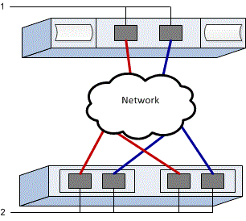

= Perform NVMe over TCP-specific tasks in E-Series - VMware
:icons: font
:imagesdir: ../media/

[.lead]
For the NVMe over TCP protocol, you configure the switches and determine the host NVMe Qualified Name (NQN).

NOTE: Volumes must be set to utilize 512 byte emulation (512e) when using 4096 byte drives to ensure compatibility with VMware. Refer to the SANtricity System Manager online help for more information on setting a volume to use 512-byte emulation (512e).

== Step 1: Record your configuration

You can generate and print a PDF of this page, and then use the following worksheet to record your protocol-specific storage configuration information. You need this information as you perform provisioning tasks.

The illustration shows a host connected to an E-Series storage array separated by VLANs and/or unique subnets. One VLAN/subnet is indicated by the blue line; the other VLAN/subnet is indicated by the red line. Each VLAN/subnet contains at least one initiator port and half of the target ports. Number of host and/or controller ports will vary based on the number of network interfaces and the controller model. You may have more (up to 6 per controller) ports available.

=== Host Mapping Information

|===
a|
Mapping host name
a|
{nbsp} 
a|
Host OS type
a|
{nbsp}
a|
Host NQN
a|
{nbsp}
a|
Target NQN
a|
{nbsp}
a|
{nbsp}
|===

== Step 2: Configure the NVMe/TCP switches
You configure the switches according to the vendor's recommendations for NVMe over TCP. These recommendations might include both configuration directives as well as code updates.

.About this task
This task describes the general steps for configuring the switches for NVMe over TCP. For specific instructions, see your switch vendor's documentation.

.Before you begin

Make sure you have the following:

* Two separate networks for high availability. Make sure that you isolate your NVMe over TCP traffic to separate network segments.

.Steps
Consult your switch vendor's documentation.

== Step 3: Configure networking - NVMe/TCP, VMware
You can set up your NVMe over TCP network in many ways, depending on your data storage requirements. Consult your network administrator for tips on selecting the best configuration for your environment.

.About this task
This task describes the general steps for configuring the network for NVMe over TCP. For specific instructions, see your switch vendor's documentation.

.Before you begin

Make sure you have the following:

* Switch configured for TCP traffic.

While planning your NVMe over TCP networking, remember that the https://configmax.broadcom.com/guest[VMware Configuration Maximums Guide^] states that the maximum supported TCP NVMe initiator ports per server is 2. You must consider this requirement to avoid configuring too many paths.

To ensure a good multipathing configuration, use multiple network segments for the NVMe over TCP network. Place at least one host-side port and at least one port from each array controller on one network segment, and an identical group of host-side and array-side ports on another network segment. Where possible, use multiple Ethernet switches to provide additional redundancy.

.Steps
Consult your switch vendor's documentation.

== Step 4: Configure array-side networking - NVMe/TCP, VMware
You use the SANtricity System Manager interface to configure NVMe over TCP networking on the array side.

.About this task

This task describes how to access the NVMe over TCP port configuration from the *Controllers & components* page under the SANtricity System Manager. You can also access the configuration from the *Configure NVMe over TCP ports* page within the SANtricity System Manager.

.Before you begin

Make sure you have the following:

* The IP address or domain name for one of the storage array controllers.
* Password for the System Manager GUI, or Role-Based Access Control (RBAC) or LDAP and a directory service is configured for the appropriate security access to the storage array. See the SANtricity System Manager online help for more information about link:https://docs.netapp.com/us-en/e-series-santricity/um-certificates/overview-access-management-um.html[Access Management^].

.Steps
. From your browser, enter the following URL: https://<DomainNameOrIPAddress>
+
`IPAddress` is the address for one of the storage array controllers.
+
The first time SANtricity System Manager is opened on an array that has not been configured, the Set Administrator Password prompt appears. Role-based access management configures four local roles: admin, support, security, and monitor. The latter three roles have random passwords that cannot be guessed. After you set a password for the admin role, you can change all of the passwords using the admin credentials. See the SANtricity System Manager online help for more information on the four local user roles.

. Enter the System Manager password for the admin role in the Set Administrator Password and Confirm Password fields, and then click *Set Password*.
+
The Setup wizard launches if there are no pools, volume groups, workloads, or notifications configured.

. Close the Setup wizard.
+
You will use the wizard later to complete additional setup tasks.

. Select *Hardware* > *Controllers and components*.

. Click the controller with the NVMe over TCP ports you want to configure.
+
The controller's context menu appears.

. Select *Configure NVMe over TCP ports*.
+
The Configure NVMe over TCP Ports dialog box opens.

. In the drop-down list, select the port you want to configure, and then click *Next*.

. Select the configuration port settings, and then click *Next*.
+
To see all port settings, click the *Show more port settings* link on the right of the dialog box.
+
[options="header"]
|===
| Port Setting| Description
a|
Configured ethernet port speed
a|
Select the desired speed. The options that appear in the drop-down list depend on the maximum speed that your network can support (for example, 200 Gb/s).
a|
Enable IPv4 / Enable IPv6
a|
Select one or both options to enable support for IPv4 and IPv6 networks.
a|
MTU size (Available by clicking Show more port settings.)
a|
If necessary, enter a new size in bytes for the Maximum Transmission Unit (MTU).

The default Maximum Transmission Unit (MTU) size is 4200 bytes per frame. You must enter a value between 1500 and 9000.
|===
If you selected *Enable IPv4*, a dialog box opens for selecting IPv4 settings after you click *Next*. If you selected *Enable IPv6*, a dialog box opens for selecting IPv6 settings after you click *Next*. If you selected both options, the dialog box for IPv4 settings opens first, and then after you click *Next*, the dialog box for IPv6 settings opens.
+
Configure the IPv4 and/or IPv6 settings, either automatically or manually. To see all port settings, click the *Show more settings* link on the right of the dialog box.
+
[options="header"]
|===
| Port setting| Description
a|
Automatically obtain configuration
a|
Select this option to obtain the configuration automatically.
a|
Manually specify static configuration
a|
Select this option, and then enter a static address in the fields. For IPv4, include the network subnet mask and gateway. For IPv6, include the routable IP address and router IP address.
|===

. Click *Finish*.

. Close System Manager.

== Step 5: Configure host-side networking—​NVMe over TCP, VMware

Configuring NVMe over TCP networking on the host side enables the VMware NVMe over TCP storage adapter initiator to establish a session with the array.

.Steps

. Identify TCP Network Adapters and record the vmnic paired uplink.
+
Network adapters on the host are named vmnicN, where N is a unique number identifying the network adapter, for example, vmnic0, vmnic1, and so forth. The physical adapters can be viewed under Networking from the ESXi host or from the Configure tab with the ESXi host selected from the inventory of a hosting vCenter.

. Configure VMkernel port binding for the TCP adapter using a vSphere standard switch.
+
For more information, see link:https://techdocs.broadcom.com/us/en/vmware-cis/vsphere/vsphere/9-1/vsphere-storage/about-vmware-nvme-storage/configuring-nvme-over-tcp-on-esxi/configure-vmkernel-binding-for-the-tcp-adapter.html[Configure VMkernel Binding for the TCP Adapter^].

. Add the software NVMe over TCP adapter.
+
For more information, see link:https://techdocs.broadcom.com/us/en/vmware-cis/vsphere/vsphere/9-1/vsphere-storage/about-vmware-nvme-storage/configuring-nvme-over-tcp-on-esxi/configure-vmkernel-binding-for-the-tcp-adapter/configure-vmkernel-binding-for-the-tcp-adapter-with-a-vsphere-standard-switch.html[Add Software NVMe over RDMA or NVMe over TCP Adapters^].

. Add NVMe Controllers for NVMe over TCP.
+
IO queue size is limited on E-Series for NVMe over TCP at 128. VMware does not allow setting of the IO queue size via vSphere Client so this can only be achieved using esxcli. ESXi shell access will need to be enabled for this step. To enable, see https://knowledge.broadcom.com/external/article/311213/using-esxi-shell-in-esxi.html[Using ESXi Shell in ESXi^].

SSH into the `ESXi shell` and run the following, making sure the IO queue size value is set to 128 with `-Q 128`, replacing vmhba<##> with the vmhba number for the NVMe over TCP port, the <IP> with the IP address of the target port, and <TargetNQN> with the E-Series array target NQN:
+
----
# esxcli nvme fabrics connect -a vmhba<##> -i <IP> -s <TargetNQN> -p 4420  -Q 128
----
+

This must be performed for each connected target port on the controllers. Example with 2 controllers having 4 target ports each:
+
----
# esxcli nvme fabrics connect -a vmhba65 -i 192.29.11.111 -s nqn.1992-08.com.netapp:EF80.6d039ea0005d29640000000068ddbfec -p 4420  -Q 128
# esxcli nvme fabrics connect -a vmhba65 -i 192.29.11.112 -s nqn.1992-08.com.netapp:EF80.6d039ea0005d29640000000068ddbfec -p 4420  -Q 128
# esxcli nvme fabrics connect -a vmhba65 -i 192.29.11.113 -s nqn.1992-08.com.netapp:EF80.6d039ea0005d29640000000068ddbfec -p 4420  -Q 128
# esxcli nvme fabrics connect -a vmhba65 -i 192.29.11.114 -s nqn.1992-08.com.netapp:EF80.6d039ea0005d29640000000068ddbfec -p 4420  -Q 128
# esxcli nvme fabrics connect -a vmhba66 -i 192.29.12.111 -s nqn.1992-08.com.netapp:EF80.6d039ea0005d29640000000068ddbfec -p 4420  -Q 128
# esxcli nvme fabrics connect -a vmhba66 -i 192.29.12.112 -s nqn.1992-08.com.netapp:EF80.6d039ea0005d29640000000068ddbfec -p 4420  -Q 128
# esxcli nvme fabrics connect -a vmhba66 -i 192.29.12.113 -s nqn.1992-08.com.netapp:EF80.6d039ea0005d29640000000068ddbfec -p 4420  -Q 128
# esxcli nvme fabrics connect -a vmhba66 -i 192.29.12.114 -s nqn.1992-08.com.netapp:EF80.6d039ea0005d29640000000068ddbfec -p 4420  -Q 128
----
+

After successfully adding, the connections can be viewed from the Storage Adapters view on vSphere Client. If unsuccessful, continue to step 6 to verify communication to the ports and correct any connection settings.

NOTE: The Host NQN can be acquired via esxcli with the command `esxcli nvme info get`. This will be needed later when configuring host mappings.

== Step 6: Verify IP network connections - ​NVMe over TCP, VMware

You verify Internet Protocol (IP) network connections by using ping tests to ensure the host and array are able to communicate.

.Steps

. On the host, run the following command:
+
----
vmkping <NVMe over TCP_target_IP_address\>
----
+
In this example, the NVMe over TCP target IP address is 192.29.11.111.
+
----
vmkping -d 192.29.11.111
PING 192.29.11.111 (192.29.11.111): 56 data bytes
64 bytes from 192.29.11.111: icmp_seq=0 ttl=64 time=0.902 ms
64 bytes from 192.29.11.111: icmp_seq=1 ttl=64 time=0.406 ms
64 bytes from 192.29.11.111: icmp_seq=2 ttl=64 time=0.855 ms
--- 192.29.11.111 ping statistics ---
3 packets transmitted, 3 packets received, 0% packet loss
round-trip min/avg/max = 0.406/0.721/0.902 ms
----

. Issue a `vmkping` command from each host's initiator address (the IP address of the host Ethernet port used for NVMe over TCP) to each controller NVMe over TCP port. Perform this action from each host server in the configuration, changing the IP addresses as necessary.
+
NOTE: If the command fails with the message `sendto() failed (Message too long)`, verify the MTU size for the Ethernet interfaces on the host server, storage controller, and switch ports.

. If step 5 discovery was unsuccessful, return to the NVMe over TCP host-side networking configuration procedure to finish adding target controllers.
