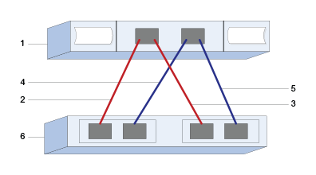

= Perform SAS-specific tasks
:icons: font
:imagesdir: ../media/

[.lead]
For the SAS protocol, you determine host port addresses and make the settings recommended in the Notes column of the http://mysupport.netapp.com/matrix[NetApp Interoperability Matrix Tool (IMT)].

== Step 1: Determining SAS host identifiers - Windows

[.lead]
For the SAS protocol, you find the SAS addresses using the HBA utility, then use the HBA BIOS to make the appropriate configuration settings.

===== Before You Begin

Guidelines for HBA utilities:

* Most HBA vendors offer an HBA utility. Depending on your host operating system and CPU, use either the LSI-sas2flash(6G) or sas3flash(12G) utility.
* Host I/O ports might automatically register if the host context agent is installed.

===== Steps

. Download the LSI-sas2flash(6G) or sas3flash(12G) utility from your HBA vendor's web site.
. Install the utility.
. Use the HBA BIOS to select the appropriate settings for your configuration.
+
See the Notes column of the http://mysupport.netapp.com/matrix[NetApp Interoperability Matrix Tool] for recommendations.

== Step 2: Recording SAS-specific information for Windows

[.lead]
Record your protocol-specific storage configuration information on the SAS worksheet. You need this information to perform provisioning tasks.

== Step 3: SAS worksheet - Windows

[.lead]
You can use this worksheet to record SAS storage configuration information. You need this information to perform provisioning tasks.

=== Host Identifiers

[options="header"]
|===
| Callout No.| Host (initiator) port connections| SAS address
a|
1
a|
Host
a|
_not applicable_
a|
2
a|
Host (initiator) port 1 connected to Controller A, port 1
a|

a|
3
a|
Host (initiator) port 1 connected to Controller B, port 1
a|

a|
4
a|
Host (initiator) port 2 connected to Controller A, port 1
a|

a|
5
a|
Host (initiator) port 2 connected to Controller B, port 1
a|

|===

=== Target Identifiers

Recommended configurations consist of two target ports.

=== Mappings Host

|===
a|
Mapping host name a|

a|
Host OS type
a|

a|
|===
