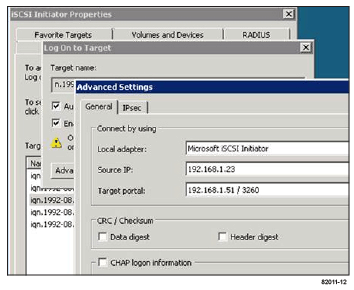

= Perform iSCSI-specific tasks
:experimental:
:icons: font
:imagesdir: ../media/

[.lead]
For the iSCSI protocol, you configure the switches and configure networking on the array side and the host side. Then you verify the IP network connections.

== Configuring the switches - iSCSI, Windows

[.lead]
You configure the switches according to the vendor's recommendations for iSCSI. These recommendations might include both configuration directives as well as code updates.

You must ensure the following:

* You have two separate networks for high availability. Make sure that you isolate your iSCSI traffic to separate network segmentsby using VLANs or two separate networks.
* You have enabled send and receive hardware flow control *end to end*.
* You have disabled priority flow control.
* If appropriate, you have enabled jumbo frames.

NOTE: Port channels/LACP is not supported on the controller's switch ports. Host-side LACP is not recommended; multipathing provides the same, and in some cases better, benefits.

== Configuring networking - iSCSI Windows

[.lead]
You can set up your iSCSI network in many ways, depending on your data storage requirements.

Consult your network administrator for tips on selecting the best configuration for your environment.

An effective strategy for configuring the iSCSI network with basic redundancy is to connect each host port and one port from each controller to separate switches and partition each set of host and controller ports on separate network segments using VLANs.

You must enable send and receive hardware flow control *end to end*. You must disable priority flow control.

If you are using jumbo frames within the IP SAN for performance reasons, make sure to configure the array, switches, and hosts to use jumbo frames. Consult your operating system and switch documentation for information on how to enable jumbo frames on the hosts and on the switches. To enable jumbo frames on the array, complete the steps in _Configuring array-side networking--iSCSI_.

NOTE: Many network switches have to be configured above 9,000 bytes for IP overhead. Consult your switch documentation for more information.

== Configuring array-side networking - iSCSI, Windows

[.lead]
You use the SANtricity System Manager GUI to configure iSCSI networking on the array side.

* You must know the IP address or domain name for one of the storage array controllers.
* You or your system administrator must have set up a password for the System Manager GUI, or you must configured Role-Based Access Control (RBAC) or LDAP and a directory service for the appropriate security access to the storage array. See the _SANtricity System Manager online help_ for more information about Access Management.

This task describes how to access the iSCSI port configuration from the Hardware page. You can also access the configuration from menu:System[Settings > Configure iSCSI ports].

. From your browser, enter the following URL: `https://<DomainNameOrIPAddress>`
+
IPAddress is the address for one of the storage array controllers.
+
The first time SANtricity System Manager is opened on an array that has not been configured, the Set Administrator Password prompt appears. Role-based access management configures four local roles: admin, support, security, and monitor. The latter three roles have random passwords that cannot be guessed. After you set a password for the admin role you can change all of the passwords using the admin credentials. See _SANtricity System Manager online help_ for more information on the four local user roles.

. Enter the System Manager password for the admin role in the Set Administrator Password and Confirm Password fields, and then select the *Set Password* button.
+
When you open System Manager and no pools, volumes groups, workloads, or notifications have been configured, the Setup wizard launches.

. Close the Setup wizard.
+
You will use the wizard later to complete additional setup tasks.

. Select *Hardware*.
. If the graphic shows the drives, click *Show back of shelf*.
+
The graphic changes to show the controllers instead of the drives.

. Click the controller with the iSCSI ports you want to configure.
+
The controller's context menu appears.

== Configuring host-side networking--iSCSI

[.lead]
You must configure iSCSI networking on the host side so that the Microsoft iSCSI Initiator can establish sessions with the array.

* You have fully configured the switches that will be used to carry iSCSI storage traffic.
* You must have enabled send and receive hardware flow control *end to end* and disabled priority flow control.
* You have completed the array side iSCSI configuration.
* You must know the IP address of each port on the controller.

These instructions assume that two NIC ports will be used for iSCSI traffic.

. Disable unused network adapter protocols.
+
These protocols include, but are not limited to, QoS, File and Print Sharing, and NetBIOS.

. Execute `> iscsicpl.exe` from a terminal window on the host to open the *iSCSI Initiator Properties* dialog box.
. On the **Discovery**tab, select *Discover Portal*, and then enter the IP address of one of the iSCSI target ports.
. On the **Targets**tab, select the first target portal you discovered and then select *Connect*.
. Select *Enable multi-path*, select *Add this connection to the list of Favorite Targets*, and then select**Advanced**.
. For *Local adapter*, select *Microsoft iSCSI Initiator*.
. For *Initiator IP*, select the IP address of a port on the same subnet or VLAN as one of the iSCSI targets.
. For *Target IP*, select the IP address of a port on the same subnet as the *Initiator IP* selected in the step above.
. Retain the default values for the remaining check boxes, and then select**OK**.
. Select**OK** again as you return to the *Connect to Target* dialog box.
. Repeat this procedure for each initiator port and session (logical path) to the storage array that you want to establish.
+

== Verifying IP network connections - iSCSI, Windows

[.lead]
You verify Internet Protocol (IP) network connections by using ping tests to ensure the host and array are able to communicate.

. Select *Start* > *All Programs* > *Accessories* > *Command Prompt*, and use the Windows CLI to run one of the following commands, depending on whether jumbo frames are enabled:
 ** If jumbo frames are not enabled, run this command:
+
----
ping -s <hostIP\> <targetIP\>
----

 ** If jumbo frames are enabled, run the ping command with a payload size of 8,972 bytes. The IP and ICMP combined headers are 28 bytes, which when added to the payload, equals 9,000 bytes. The -f switch sets the `don’t fragment (DF)` bit. The -l switch allows you to set the size. These options allow jumbo frames of 9,000 bytes to be successfully transmitted between the iSCSI initiator and the target.
+
----
ping -l 8972 -f <iSCSI_target_IP_address\>
----

+
In this example, the iSCSI target IP address is `192.0.2.8`.
+
----
C:\>ping -l 8972 -f 192.0.2.8
Pinging 192.0.2.8 with 8972 bytes of data:
Reply from 192.0.2.8: bytes=8972 time=2ms TTL=64
Reply from 192.0.2.8: bytes=8972 time=2ms TTL=64
Reply from 192.0.2.8: bytes=8972 time=2ms TTL=64
Reply from 192.0.2.8: bytes=8972 time=2ms TTL=64
Ping statistics for 192.0.2.8:
  Packets: Sent = 4, Received = 4, Lost = 0 (0% loss),
Approximate round trip times in milli-seconds:
  Minimum = 2ms, Maximum = 2ms, Average = 2ms
----
. Issue a ping command from each host's initiator address (the IP address of the host Ethernet port used for iSCSI) to each controller iSCSI port. Perform this action from each host server in the configuration, changing the IP addresses as necessary.
+
NOTE: If the command fails (for example, returns `Packet needs to be fragmented but DF set`), verify the MTU size (jumbo frame support) for the Ethernet interfaces on the host server, storage controller, and switch ports.

== Recording iSCSI-specific information for Windows

[.lead]
Select the iSCSI worksheet to record your protocol-specific storage configuration information. You need this information to perform provisioning tasks.

== iSCSI worksheet - Windows

[.lead]
You can use this worksheet to record iSCSI storage configuration information. You need this information to perform provisioning tasks.

=== Recommended configuration

Recommended configurations consist of two initiator ports and four target ports with one or more VLANs.

image::../media/50001_01.gif[]
