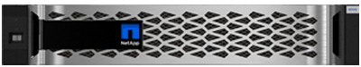

= Learn about E-Series systems
:icons: font
:imagesdir: ../media/

[.lead]
Learn about E-Series systems, which include integrated hardware and software for your organization's data storage needs.

== E-Series terminology

[.lead]
Learn more about the terms used in E-Series.

|===
| Term| Description
a|
controller
a|
A controller consists of a board, firmware, and software. It controls the drives and implements the functions.
a|
duplex/simplex configurations
a|
Duplex is a two-controller module configuration within the storage array. Simplex is a single-controller module configuration.

a|
HDD
a|
Hard disk drives (HDDs) are data storage devices that use rotating metal platters with a magnetic coating.
a|
HIC
a|
A host interface card (HIC) connects the array to the host. It can optionally be installed within a controller canister.

a|
IB
a|
InfiniBand (IB) is a communications standard for data transmission between high-performance servers and storage systems.
a|
IOPS
a|
IOPS is input/output operations per second.
a|
mirroring
a|
Mirroring is the replication of data volumes onto separate storage arrays to ensure continuous availability.
a|
pool
a|
A pool is a set of drives that is logically grouped. You can use a pool to create one or more volumes accessible to a host.
a|
power/fan canister
a|
A power/fan canister is an assembly that slides into a shelf. It includes a power supply and an integrated fan.
a|
rack unit (U)
a|
A rack unit (abbreviated U) is a unit of measure defined as 44.50 millimetres (1.75 in).
a|
SAS
a|
Serial Attached SCSI (SAS) is a point-to-point serial protocol that links controllers directly to disk drives.
a|
RoCE
a|
RDMA over Converged Ethernet (RoCE) is a network protocol that allows remote direct memory access (RDMA) over an Ethernet network.
a|
shelf
a|
A shelf is an enclosure installed in a cabinet or rack. It contains the hardware components for the storage array. There are two types of shelves: a controller shelf and a drive shelf. A controller shelf includes controllers and drives. A drive shelf includes input/output modules (IOMs) and drives.
a|
snapshot
a|
A snapshot image is a logical copy of volume data, captured at a particular point-in-time. Like a restore point, snapshot images allow you to roll back to a known good data set.
a|
SSD
a|
Solid-state disks (SSDs) are data storage devices that use solid state memory (flash) to store data persistently. SSDs emulate conventional hard drives, and are available with the same interfaces that hard drives use.
a|
storage array
a|
A storage array includes shelves, controllers, drives, software, and firmware.
a|
volume
a|
A volume is a container in which applications, databases, and file systems store data. It is the logical component created for the host to access storage on the storage array.
a|
workload
a|
A workload is a storage object that supports an application. For some applications, System Manager configures the workload to contain volumes with similar underlying volume characteristics. These volume characteristics are optimized based on the type of application the workload supports.

|===

== E-Series hardware overview

[.lead]
E-Series storage arrays are available in several configurations and models.

A storage array includes shelves, controllers, drives, software, and firmware. The array can be installed in a rack or cabinet, with customizable hardware for one or two controllers, in a 12-, 24-, or 60-drive shelf. You can connect the storage array to a SAN from multiple interface types and to a variety of host operating systems.

E-Series arrays are available in the following models:

* E2800 series -- entry-level hybrid
* EF280 series -- entry-level all flash
* EF300 series -- entry-level all flash, all NVMe
* E5700 series -- midrange hybrid
* EF570 series -- midrange all flash
* EF600 series -- midrange all flash, all NVMe

=== E2800 models

|===
a|
*Rack sizes:*

a|

* 2U12 (2 rack units; 12 drives)
* 2U24 (2 rack units; 24 drives)
+
image::../media/e2800_2u_front.gif[]

* 4U60 (4 rack units; 60 drives)
+
image::../media/e2860_front.gif[]

a|
*Drives:*

a|
Supports the following drive types:

* 3.5" NL-SAS (up to 180)
* 2.5" SAS SSD (up to 120)
* 2.5" SAS HDD (up to 180)

a|
*Interfaces:*

a|
Available with the following interfaces:

* 12Gb SAS
* 10Gb or 25Gb iSCSI
* 16Gb or 32Gb Fibre Channel

|===

=== EF280 models

|===
a|
*Rack sizes:*

a|
2U24 (2 rack units; 24 drives)

a|
*Drives:*

a|
Supports up to 96 SSD 2.5" drives
a|
*Interfaces:*

a|
Available with the following interfaces:

* 12Gb SAS
* 10Gb or 25Gb iSCSI
* 16Gb or 32Gb Fibre Channel

|===

=== EF300 models

|===
a|
*Rack sizes:*

a|
2U24 (2 rack units; 24 drives)

a|
*Drives and HICs:*

a|
Supports up to 24 NVMe SSDs, with a single host interface card (HIC) per controller.
a|
*Interfaces:*

a|
Available with the following interfaces:

* 25Gb iSCSI
* 32Gb NVMe / Fibre Channel
* 32Gb SCSI / Fibre Channel
* 100Gb iSER / IB
* 100Gb SRP / IB
* 100Gb NVMe / IB
* 100Gb NVMe / RoCE

|===

=== E5700 models

|===
a|
*Rack sizes:*

a|

* 2U24 (2 rack units; 24 drives)
+
image::../media/e2800_2u_front.gif[]

* 4U60 (4 rack units; 60 drives)
+
image::../media/e2860_front.gif[]

a|
*Drives:*

a|
Supports up to 480 of the following drive types:

* 3.5" NL-SAS drives
* 2.5" SAS SSD drives
* 2.5" SAS HDD drives

a|
*Interfaces:*

a|
Available with the following interfaces:

* 12Gb SAS
* 10Gb or 25Gb iSCSI
* 16Gb or 32Gb Fibre Channel
* 32Gb NVMe / Fibre Channel
* 100Gb iSER / IB
* 100Gb SRP / IB
* 100Gb NVMe / IB
* 100Gb NVMe / RoCE

|===

=== EF570 models

|===
a|
*Rack sizes:*

a|
2U24 (2 rack units; 24 drives)

a|
*Drives:*

a|
Supports up to 120 SSD 2.5" drives
a|
*Interfaces:*

a|
Available with the following interfaces:

* 12Gb SAS
* 10Gb or 25Gb iSCSI
* 16Gb or 32Gb Fibre Channel
* 32Gb NVMe / Fibre Channel
* 100Gb iSER / IB
* 100Gb SRP / IB
* 100Gb NVMe / IB
* 100Gb NVMe / RoCE

|===

=== EF600 models

|===
a|
*Rack sizes:*

a|
2U24 (2 rack units; 24 drives)

a|
*Drives and HICs*

a|
Supports up to 24 NVMe SSDs, with two host interface cards (HICs) per controller.
a|
*Interfaces:*

a|
Available with the following interfaces:

* 25Gb iSCSI
* 32Gb NVMe / Fibre Channel
* 32Gb SCSI / Fibre Channel
* 100Gb iSER / IB
* 100Gb SRP / IB
* 100Gb NVMe / IB
* 100Gb NVMe / RoCE
* 200Gb iSER / IB
* 200Gb NVMe / IB
* 200Gb NVMe / RoCE

|===

== E-Series shelf types

[.lead]
E-Series systems are available in a variety of shelf sizes.

|===
a|
*DE212C:*

* 2u12 (2 rack units; 12 drives)
* 3.5" HDDs and/or 2.5" SSDs (with adapter)
* E2800 controllers only

a|
image:../media/e2812_front.gif[]
a|
_**_

*DE224C:*

* 2u24 (2 rack units; 24 drives)
* 2.5" HDD and/or 2.5" SSD drives
* E2800, EF280, E5700, and EF570 controllers

a|
image:../media/e2824_front.gif[]
a|
*DE460C:*

* 4u60 (4 rack units; 60 drives)
* 3.5" and 2.5" drives (NL-SAS, SAS, and SSD)
* E2800 and E5700 controllers

a|
image:../media/de460c.gif[]
a|
*NE224:*

* 2u24 (2 rack units; 24 drives)
* 2.5" NVMe SSD drives
* EF300 and EF600 controllers

a|
image:../media/ne224.gif[]
|===

== SANtricity software overview

[.lead]
E-Series systems include SANtricity software for storage provisioning and other tasks.

SANtricity software consists of these management interfaces:

* System Manager -- a web-based interface used for managing one controller in a storage array.
* Unified Manager -- a web-based interface used for viewing and managing all storage arrays in your network.
* Web Services Proxy -- a REST API used for viewing and managing all storage arrays in your network.
* Command line interface (CLI) -- a software application for configuring and monitoring storage arrays.

NOTE: EF600 and EF300 storage arrays do not support mirroring, thin volumes, or SSD Cache features.

=== SANtricity System Manager

System Manager is web-based management software embedded on each controller. To access the user interface, point a browser to the controller's IP address. A setup wizard helps you get started with system configuration.

System Manager offers a variety of management features, including:

|===
a|
*Performance* image:../media/sam1130_icon_performance.gif[]

a|
View up to 30 days of performance data, including I/O latency, IOPS, CPU utilization, and throughput.

a|
*Storage* image:../media/sam1130_icon_volumes.gif[]

a|
Provision storage using pools or volume groups, and create application workloads.
a|
*Data protection* image:../media/sam1130_icon_async_mirroring.gif[]

a|
Perform backup and disaster recovery using snapshots, volume copy, and remote mirroring.
a|
*Hardware* image:../media/sam1130_icon_controllers.gif[]

a|
Check component status and perform some functions related to those components, such as assigning hot spare drives.
a|
*Alerts* image:../media/sam1130_icon_alerts.gif[]

a|
Notify administrators about important events occurring on the storage array. Alerts can be sent through email, SNMP traps, and syslog.
a|
*Access Management* 

a|
Configure user authentication that requires users to log in to the system with assigned credentials.
a|
*System Settings* image:../media/sam1130_icon_settings.gif[]

a|
Configure other system performance features, such as SSD cache and autoload balancing.
a|
*Support* image:../media/sam1130_icon_support.gif[]

a|
View diagnostic data, manage upgrades, and configure AutoSupport, which monitors the health of a storage array and sends automatic dispatches to technical support.
|===

=== SANtricity Unified Manager

Unified Manager is web-based software used for managing your entire domain. From a central view, you can see status for all newer E-Series and EF-Series arrays, such as the E2800, EF280, EF300, E5700, EF570, and EF600. You can also perform batch operations on selected storage arrays.

Unified Manager is installed on a management server along with the Web Services Proxy. To access Unified Manager, you open a browser and enter the URL pointing to the server where the Web Services Proxy is installed.

Unified Manager offers a variety of management features, including:

|===
a|
*Discover storage arrays* image:../media/artboard_9.png[]

a|
Find and add the storage arrays you want to manage in your organization's network. You can then view the status of all storage arrays from a single page.
a|
*Launch* 

a|
Open an instance of System Manager to perform individual management operations on a particular storage array.
a|
*Import Settings* image:../media/sam1130_icon_system.gif[]

a|
Perform a batch import from one storage array to multiple arrays, including settings for alerts, AutoSupport, and directory services.
a|
*Mirroring* image:../media/sam1130_icon_async_mirroring.gif[]

a|
Configure asynchronous or synchronous mirrored pairs between two storage arrays.
a|
*Manage Groups* image:../media/artboard_10.png[]

a|
Organize storage arrays into groups for easier management.
a|
*Upgrade Center* 

a|
Upgrade the SANtricity OS software on multiple storage arrays.
a|
*Certificates* image:../media/sam1140_icon_certs.gif[]

a|
Create certificate signing requests (CSRs), import certificates, and manage existing certificates for multiple storage arrays.
a|
*Access Management* 

a|
Configure user authentication that requires users to log in to Unified Manager with assigned credentials.
|===

=== SANtricity Web Services Proxy

The Web Services Proxy is a RESTful API server that can manage hundreds of new and legacy E-Series arrays. The proxy is installed separately on a Windows or Linux server.

Web Services includes API documentation that allows you to directly interact with the REST API. To access the Web Services API documentation, you open a browser and enter the URL pointing to the server where the Web Services Proxy is installed.

=== Command line interface (CLI)

The command line interface (CLI) is a software application that provides a way to configure and monitor storage arrays. Using the CLI, you can run commands from an operating system prompt, such as the DOS C: prompt, a Linux operating system path, or a Solaris operating system path.

== E-Series videos

[.lead]
Access video demos to learn more about E-Series systems.

=== E-Series: Fast, Simple, Reliable Storage

[.lead]
This video highlights the key benefits of using NetApp E-Series systems versus using commodity servers for storage.

https://www.youtube.com/embed/FjFkU2z_hIo?rel=0[NetApp video: Key benefits of using NetApp E-Series systems versus using commodity servers for storage]

=== System Manager: Easy Setup and Configuration

[.lead]
This Technical Demo shows how the web-based SANtricity System Manager interface enables easy set-up and configuration of the NetApp E2800.

https://www.youtube.com/embed/I0W0AjKpCO8?rel=0[NetApp video: SANtricity System Manager: Easy Setup and Configuration]
