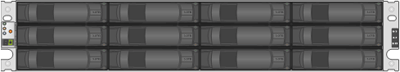
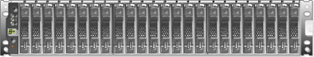
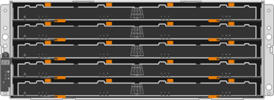
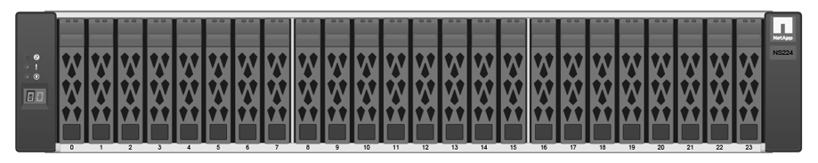

= E-Series shelf types
:icons: font
:imagesdir: ../media/

[.lead]
E-Series systems are available in a variety of shelf sizes.

|===
a|
*DE212C:*

* 2u12 (2 rack units; 12 drives)
* 3.5" HDDs and/or 2.5" SSDs (with adapter)
* E2800 controllers only

a|

a|
_**_

*DE224C:*

* 2u24 (2 rack units; 24 drives)
* 2.5" HDD and/or 2.5" SSD drives
* E2800, EF280, E5700, and EF570 controllers

a|

a|
*DE460C:*

* 4u60 (4 rack units; 60 drives)
* 3.5" and 2.5" drives (NL-SAS, SAS, and SSD)
* E2800 and E5700 controllers

a|

a|
*NE224:*

* 2u24 (2 rack units; 24 drives)
* 2.5" NVMe SSD drives
* EF300 and EF600 controllers

a|

|===
