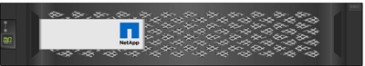
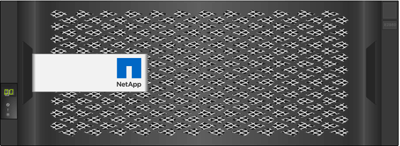
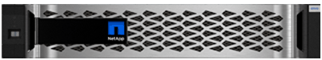
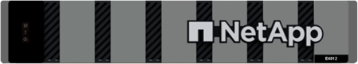
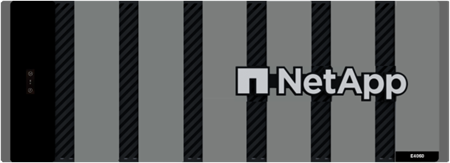

= E-Series hardware overview
:icons: font
:imagesdir: ../media/

[.lead]
E-Series storage arrays are available in several configurations and models. 

A storage array includes shelves, controllers, drives, software, and firmware. The array can be installed in a rack or cabinet, with customizable hardware for one or two controllers, in a 12-, 24-, or 60-drive shelf. You can connect the storage array to a SAN from multiple interface types and to a variety of host operating systems.

E-Series arrays are available in the following models:

* E2800 series -- entry-level hybrid
* EF280 series -- entry-level all flash
* EF300 series -- entry-level all flash, all NVMe
* E4000 series -- entry-level hybrid
* E5700 series -- midrange hybrid
* EF570 series -- midrange all flash
* EF600 series -- midrange all flash, all NVMe
* EF300C series -- entry-level all flash, all NVMe
* EF600C series -- midrange all flash, all NVMe

NOTE: For SANtricity OS 11.80GA and greater, all USB ports are disabled on the E2800, EF280, E5700, EF570, EF600/EF600C, and EF300/EF300C arrays. 

[role="tabbed-block"]
====

.E2800 models
--

Rack sizes::
+
* 2U12 (2 rack units; 12 drives)
* 2U24 (2 rack units; 24 drives)
+

* 4U60 (4 rack units; 60 drives)
+

Drives::
+
Supports the following drive types:
+
* 3.5" NL-SAS (up to 180)
* 2.5" SAS SSD (up to 120)
* 2.5" SAS HDD (up to 180)

Interfaces::
+
Available with the following interfaces:
+
* 12Gb SAS
* 10Gb or 25Gb iSCSI
* 16Gb or 32Gb Fibre Channel

--

.EF280 models
--

Rack sizes::
+
2U24 (2 rack units; 24 drives)
+

Drives::
+
Supports up to 96 SSD 2.5" drives

Interfaces::
+
Available with the following interfaces:
+
* 12Gb SAS
* 10Gb or 25Gb iSCSI
* 16Gb or 32Gb Fibre Channel

--

.EF300 models
--

Rack sizes::
+
2U24 (2 rack units; 24 drives)
+

Drives::
* NVMe SSD drives: Up to 24 NVMe SSD drives in the controller shelf.
* NL-SAS drives with expansion shelves: Any mixture of DE212C and DE460C shelves not to exceed a total of 240 NL-SAS drive slots and 4 expansion shelves unless only DE212C shelves are used, then 8 DE212C shelves are allowed. For example, 4 DE460C shelves, or 8 DE212C shelves, or 2 DE460C shelves plus 2 DE212 shelves.
* SAS SSD drives with expansion shelves: Any mixture of DE212C, DE224C, and DE460C shelves not to exceed a total of 96 SAS SSD drive slots and 4 expansion shelves unless only DE212C shelves are used, then 8 DE212C shelves are allowed. For example, 1 DE460C shelf plus 1 DE224C shelf plus 1 DE212C shelf, or 4 DE224C shelves, or 8 DE212C shelves.
* Support for an optional SAS expansion card, allowing for SAS expansion shelf connections.
* Support for one host interface card per controller.

+
NOTE: For SANtricity OS 11.80GA and greater, the EF300 supports expansion shelf configurations with no drives in the base tray. When using this configuration, ensure the drives are populated within the expansion shelf and properly connected to the base tray before powering on the system.   

Interfaces::
+
Available with the following interfaces:
+
* 25Gb iSCSI
* 32Gb NVMe / Fibre Channel
* 32Gb SCSI / Fibre Channel
* 100Gb iSER / IB
* 100Gb SRP / IB
* 100Gb NVMe / IB
* 100Gb NVMe / RoCE

--

.EF300C models
--

Rack sizes::
+
2U24 (2 rack units; 24 drives)
+

Drives::
* Support for 30TB or 60TB capacity NVMe SSD drives.
** Compatible for Dynamic Disk Pool use only with no legacy RAID support.  
* NVMe SSD drives: Up to 24 NVMe SSD drives in the controller shelf.
** No support for expansion shelf configurations.
* Support for one host interface card per controller.
* A single disk pool is created automatically if there are not enough unassigned drives during system boot. 

Interfaces::
+
Available with the following interfaces:
+
* 25Gb iSCSI
* 32Gb NVMe / Fibre Channel
* 32Gb SCSI / Fibre Channel
* 100Gb iSER / IB
* 100Gb SRP / IB
* 100Gb NVMe / IB
* 100Gb NVMe / RoCE

--

.E5700 models

--

Rack sizes::
+
* 2U24 (2 rack units; 24 drives)
+

+
* 4U60 (4 rack units; 60 drives)
+

Drives::
+
Supports up to 480 of the following drive types:
+
* 3.5" NL-SAS drives
* 2.5" SAS SSD drives
* 2.5" SAS HDD drives

Interfaces::
+
Available with the following interfaces:
+
* 12Gb SAS
* 10Gb or 25Gb iSCSI
* 16Gb or 32Gb Fibre Channel
* 32Gb NVMe / Fibre Channel
* 100Gb iSER / IB
* 100Gb SRP / IB
* 100Gb NVMe / IB
* 100Gb NVMe / RoCE

--

.EF570 models
--

Rack sizes::
+
2U24 (2 rack units; 24 drives)
+

Drives::
+
Supports up to 120 SSD 2.5" drives

Interfaces::
+
Available with the following interfaces:
+
* 12Gb SAS
* 10Gb or 25Gb iSCSI
* 16Gb or 32Gb Fibre Channel
* 32Gb NVMe / Fibre Channel
* 100Gb iSER / IB
* 100Gb SRP / IB
* 100Gb NVMe / IB
* 100Gb NVMe / RoCE

--

.EF600 models
--

Rack sizes::
+
2U24 (2 rack units; 24 drives)
+

Drives::
+
* NVMe SSD drives: Up to 24 NVMe SSD drives in the controller shelf.
* NL-SAS drives with expansion shelves: Any mixture of DE212C and DE460C shelves not to exceed a total of 420 NL-SAS drive slots and 7 expansion shelves unless only DE212C shelves are used, then 8 DE212C shelves are allowed. For example, 7 DE460C shelves, or 8 DE212C shelves, or 5 DE460C shelves plus 2 DE212 shelves.
* SAS SSD drives with expansion shelves: Any mixture of DE212C, DE224C, and DE460C shelves not to exceed a total of 96 SAS SSD drive slots and 7 expansion shelves unless only DE212C shelves are used, then 8 DE212C shelves are allowed. For example, 1 DE460C shelf plus 1 DE224C shelf plus 1 DE212C shelf, or 4 DE224C shelves, or 8 DE212C shelves. 
* Support for two host interface cards per controller. 
** Alternatively, support for one 200Gb IB host interface card per controller. 
* Support for an optional SAS expansion card, allowing for SAS expansion shelf connections.
** SAS expansion is only supported on configurations with one host interface card per controller.  

+
NOTE: For SANtricity OS 11.80GA and greater, the EF600 supports expansion shelf configurations with no drives in the base tray. When using this configuration, ensure the drives are populated within the expansion shelf and properly connected to the base tray before powering on the system.

Interfaces::
+
Available with the following interfaces:
+
* 25Gb iSCSI
* 32Gb NVMe / Fibre Channel
* 32Gb SCSI / Fibre Channel
* 100Gb iSER / IB
* 100Gb SRP / IB
* 100Gb NVMe / IB
* 100Gb NVMe / RoCE
* 200Gb iSER / IB
* 200Gb NVMe / IB
* 200Gb NVMe / RoCE

--

.EF600C models
--

Rack sizes::
+
2U24 (2 rack units; 24 drives)
+

Drives::
+
* Support for 30TB or 60TB capacity NVMe SSD drives.
** Compatible for Dynamic Disk Pool use only with no legacy RAID support.  
* NVMe SSD drives: Up to 24 NVMe SSD drives in the controller shelf.
* Support for two host interface cards per controller. 
** Alternatively, support for one 200Gb IB host interface card per controller. 
** No support for expansion shelf configurations.
* A single disk pool is created automatically if there are not enough unassigned drives during system boot. 

Interfaces::
+
Available with the following interfaces:
+
* 25Gb iSCSI
* 32Gb NVMe / Fibre Channel
* 32Gb SCSI / Fibre Channel
* 100Gb iSER / IB
* 100Gb SRP / IB
* 100Gb NVMe / IB
* 100Gb NVMe / RoCE
* 200Gb iSER / IB
* 200Gb NVMe / IB
* 200Gb NVMe / RoCE

--

.E4000 models
--

Rack sizes::
+
* 2U12 (2 rack units; 12 drives)
+

* 4U60 (4 rack units; 60 drives)
+

Drives::
+
Supports the following drive types:
+
* 3.5" NL-SAS (up to 300)
* 2.5" SAS SSD (up to 120)

Interfaces::
+
Available with the following interfaces:
+
* 12Gb SAS
* 1 GB or 10Gbase-T iSCSI
* 1Gb, 10Gb, or 25Gb iSCSI
* 8Gb, 16Gb, or 32Gb FC
* 12gb SAS

--
====