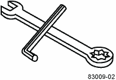
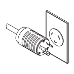
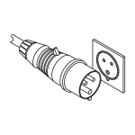
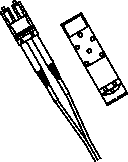

= Gather required tools and equipment
:icons: font
:imagesdir: ../media/

[.lead]
Before installing the 3040 40U cabinet, make sure you have required tools and equipment.

. Gather all items listed in the following table.
+
[options="header"]
|===
|  | Item| Included with the cabinet
a|

a|
*3/4-in. wrench* (supplied in the shipping crate) -- To raise and lower the leveling feet under the cabinet.

*1/4-in. Allen wrench* -- To raise and lower the stability foot in the front of the cabinet.
a|

a|
*NEMA L6-30*

.2+a|
*AC power cords* -- To connect the cabinet to external power sources (wall plugs).

-   The NEMA L6-30 connectors are for use in the USA and Canada.
-   The IEC-60309 connectors are for use worldwide, except for USA and Canada.
**Note:** Each PDU must be connected to an independent power source.

.2+a|

a|
**IEC-60309**

a|

a|
**SAS cables** \(optional\) – Two cables are included with each drive tray, while host side cables must be purchased separately.

**Communication cables** \(optional\) – To attach the tray to the host.

Refer to the appropriate controller-drive tray installation guide for additional required items.

a|

a|

a|
**Mountable cable spools** – Installed along both sides of the vertical power distribution outlets to accommodate excess cable length and cable routing. Two cable spools are included with each controller-drive tray. Cable spools are also shipped with standalone drive trays.

a|

a|

a|
**Shears** – To cut the metal bands on the shipping crate.

a|

a|

a|
**Forklift** (optional) – To remove the cabinet from the shipping pallet.

a|

a|

a|
**Front panel kits** (optional) – To cover the empty bays at the front of the cabinet.

a|

a|

a|
**Antistatic bags** (optional) – To protect components that are removed during the installation procedure for the cabinet.

a|

|===
