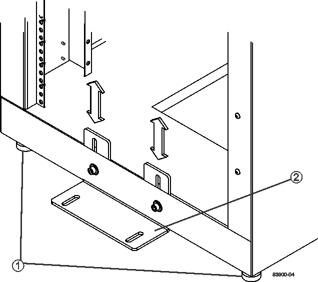
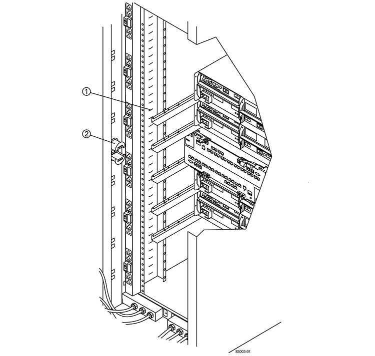
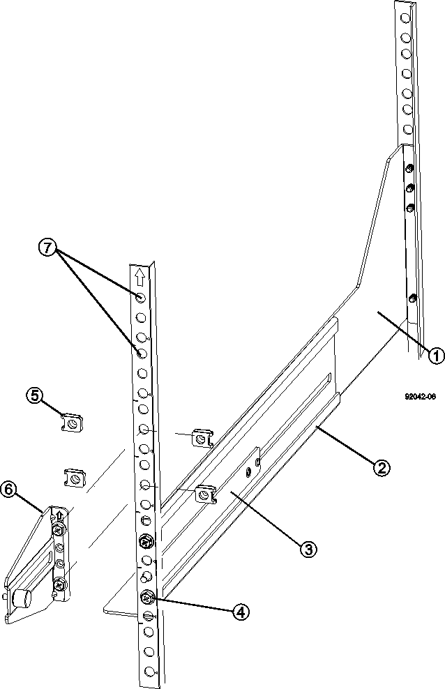
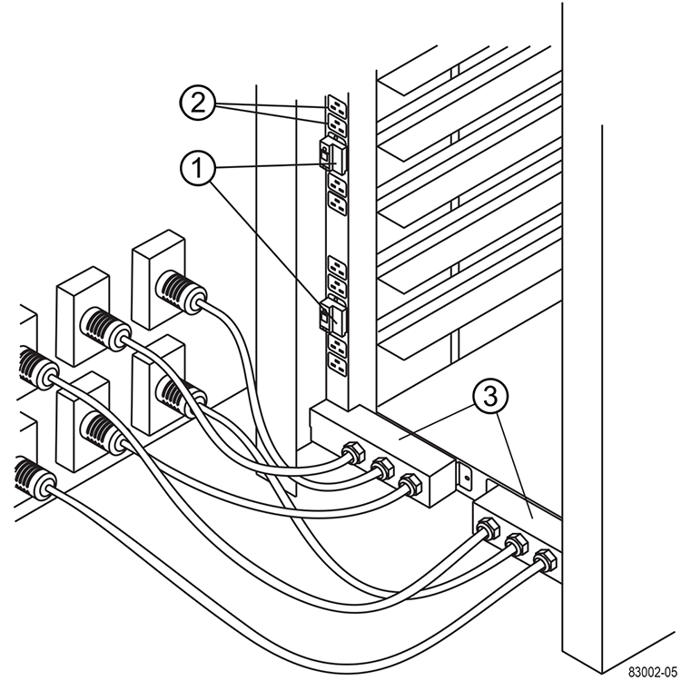

= Complete cabinet installation
:icons: font
:imagesdir: ../media/

[.lead]
After you move the cabinet, lower the leveling feet and the stability foot, reinstall the components you removed, install other required components, and connect the cabinet to power.

== Lower leveling feet and stability foot

[.lead]
You stabilize the cabinet by adjusting its feet. The leveling feet support the cabinet off the casters. The stability foot prevents the cabinet from falling over after it is placed in its permanent location

. Lower the leveling feet to support the cabinet off the casters.
+
The leveling feet are located near each bottom corner of the cabinet.

. Make sure that the cabinet is a level as possible.
+
The following figure provides a close-up view of the stability foot and the leveling feet.
+

+
[options="header"]
|===
    a|
1.
a|
Leveling feet
a|
2.
a|
Stability foot
|===

== Reinstall trays

[.lead]
After you move the cabinet, you can reinstall the trays in their original locations.

Be sure to install the trays in their original locations.

CAUTION:

_Do not_ install the following trays in the top of the cabinet over your head. When fully-populated, each of these trays weighs over 100 kg (220 lb). If installed in the top of the cabinet, the trays create a top-heavy cabinet that can become easily unbalanced:

* DE6600 drive tray
* E2660 controller-drive tray
* E2760 controller-drive tray
* E5460 controller-drive tray
* E5560 controller-drive tray
* E5660 controller-drive tray

. Reinstall all of the trays in their original locations in the cabinet.
+
WARNING: *Risk of bodily injury* -- An empty tray weighs approximately 56.7 kg (125 lb). Three persons are required to safely move an empty tray. If the tray is populated with components, a mechanized lift is required to safely move the tray.

. Reinstall all of the components in their original locations in the trays.
+
To prevent address conflicts and loss of data access, replace all components in the same tray and in the same location in the tray.

. Reinstall all cables to their original locations in the trays.
. Route the interface cables to the cabinet.
. Route the main power cords from the cabinet to the two external power sources. _Do not_ plug in the power cords at this time.

== Install cable spools and tie wraps

[.lead]
After you reinstall the trays, install the cable spools and tie wraps. The cable spools and tie wraps accommodate excess cable length and cable routing for the controllers and the trays.

. Install the cable spools and the tie wraps along both sides of the vertical power distribution outlets.
+

+
[options="header"]
|===
    a|
1.
a|
Tie wrap location
a|
2.
a|
Cable spool
|===

== Install additional trays

[.lead]
If needed, you can install additional trays. You must cover unused positions for trays to assure correct air flow.

. If you have additional trays that must be installed, install the mounting hardware for these trays.
. If the front of the cabinet is not completely filled with trays, use front panel kits to cover the empty spaces above or below the installed trays.
+
Covering the empty spaces is necessary so that the correct airflow through the cabinet is maintained.

. Power on the trays.

== Install additional mounting rails

[.lead]
If you are installing controller-drive trays, or drive trays that were shipped separately (not already installed in the cabinet), you might need to install additional mounting rails in the cabinet.

. Determine the location for the mounting rails.
 ** *Above an existing tray* -- Position the mounting rails immediately above the top tray in the cabinet.
 ** *Beneath an existing tray* -- Position the mounting rails with enough clearance to hold the tray being installed:
  *** 8.9 cm (3.5 in.) for 2U controller-drive trays or drive trays
  *** 17.8 cm (7 in.) for 4U controller-drive trays or drive trays
. Use the measurement markers on the right-front and left-front vertical supports to attach the mounting rails to the same position on each side of the cabinet.
+

+
[options="header"]
|===
    a|
1.
a|
Front adjustable rail
a|
2.
a|
Rear adjustable rail
a|
3.
a|
Adjustment plate and screws
a|
4.
a|
Rail mounting M5×10mm screws
a|
5.
a|
Clip nuts
a|
6.
a|
Rear hold down bracket
a|
7.
a|
Vertical support
|===
*Note:* The clip nuts and the rear hold down bracket are not used when the rails are installed in a 3040 cabinet.

. Place the rear adjustable rail on the vertical support.
. On the rear adjustable rail, align the adjustable rail holes in front of the holes in the vertical support.
. Attach two M5×10mm screws.
 .. Attach the screws through the vertical support rail and the rear adjustable rail.
 .. Tighten the screws.
. Place the front adjustable rail on the vertical support.
. On the front adjustable rail, align the adjustable rail holes in front of the holes in the vertical support.
. Attach two M5×10mm screws.
 .. Attach one screw through the vertical support rail and the bottom hole of the front adjustable rail.
 .. Attach one screw through the vertical support rail and the middle of the top three holes in the front adjustable rail.
 .. Tighten the screws.

+
NOTE: The remaining two screw holes are used to mount the tray.
. Repeat step link:complete_cabinet_install_task.md#V666987[complete_cabinet_install_task.md#V666987] through step link:complete_cabinet_install_task.md#V1811275[complete_cabinet_install_task.md#V1811275] to attach the second rail on the other side of the cabinet.
. Install each tray using the applicable tray installation instructions.
. Choose one of the following options:
 ** If all positions for trays are full, power-on the trays.
 ** If not all positions for trays are full, use front panel kits to cover the empty spaces above or below the installed trays.

== Connect the cabinet to power

[.lead]
To complete the cabinet installation, power on the cabinet components.

While the trays perform the power-on procedure, the LEDs on the front and the rear of the trays blink. Depending on your configuration, it can take several minutes to complete the power-on procedure.

. Turn off the power to all components in the cabinet.
. Turn all 12 circuit breakers to their off (down) position.
. Plug each of the six NEMA L6-30 connectors (USA and Canada) or the six IEC 60309 connectors (worldwide, except for USA and Canada) into an available electrical outlet.
+
NOTE: You must connect each PDU to an independent power source outside of the cabinet.

. Turn all 12 circuit breakers to their on (up) position.
+

+
[options="header"]
|===
    a|
1.
a|
Circuit breakers
a|
2.
a|
Electrical outlets
a|
3.
a|
Power entry boxes
|===

. Turn on the power to all drive trays in the cabinet.
+
IMPORTANT: Wait 30 seconds after turning on the drive trays before you turn on the power to the controller-drive trays.

. Wait 30 seconds after turning on the drive trays, and then turn on the power to all controller-drive trays in the cabinet.

The cabinet installation is complete. You can resume normal operations.
