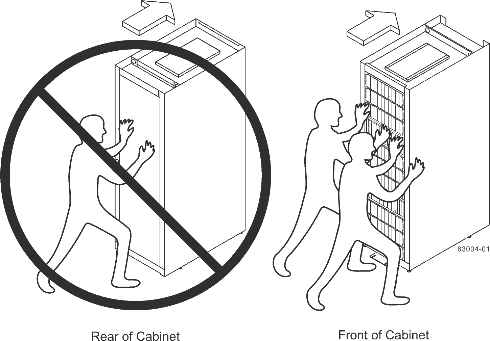

= Move cabinet to its permanent location
:icons: font
:imagesdir: ../media/

[.lead]
The 3040 40U cabinet has heavy-duty casters that enable you to move the cabinet to its permanent location.

===== Before you begin

* Review the instructions for rolling the cabinet off the pallet without the use of a forklift.
+
Shipping crates provide built-in ramps and instructions. Refer to the unpacking instructions included on the front of the shipping crate.

* Evaluate all of the ramps between the loading dock and the cabinet's final destination.
+
You must evaluate all ramps to make sure that the cabinet's center of gravity (when the cabinet is on a ramp and sitting at an angle) does not extend beyond the cabinet's footprint.

NOTE: Many of the cabinets are populated with drive trays. This situation results in most of the weight in the front portion of the cabinet, making the center of gravity closer to the front.

===== Steps

. Remove the top-most devices in your cabinet to make sure that the cabinet is safely transported to its final location. This is especially important if any ramp has an incline or a decline greater than 10 degrees.
. Move the cabinet to its permanent location using the correct method shown in the following figure. Make sure that you push on the front of the cabinet, not the rear.
+

