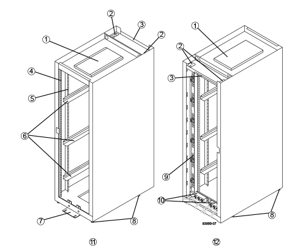

= Overview and specifications
:icons: font
:imagesdir: ../media/

[.lead]
This section describes the power requirements and maximum weights for the following E-Series and EF-Series controller-drive trays and expansion drive trays.

* E2612, E2624, and E2660 controller-drive trays
* E2712, E2724, and E2760 controller-drive trays
* E5412, E5424, and E5460 controller-drive trays
* E5512, E5524, and E5560 controller-drive trays
* E5612, E5624, and E5660 controller-drive trays
* EF540, EF550, and EF560 flash arrays
* DE1600, DE5600, and DE6600 drive trays

Specifications are not provided for the following controller shelves and drive shelves, which can also be installed in the cabinet.

* E2812, E2824, and E5724 controller shelves
* DE212C and DE224C drive shelves

For specifications for the SAS-3 controller shelves and drive shelves listed above, refer to the https://hwu.netapp.com[NetApp Hardware Universe].

== Cabinet features

[.lead]
The model 3040 40U cabinet has these standard features:

* A rear door that can be latched and locked
* Standard Electronic Industry Association (EIA) support rails that provide mounting holes for installing devices into a standard 48.3-cm (19-in.) wide cabinet
* Four roller casters and four adjustable leveling feet that are located beneath the cabinet for moving the cabinet and then leveling the cabinet in its final location
* A stability foot that stabilizes the cabinet after it is installed in its permanent location
* Access openings for interface cables
* Two AC power distribution units (PDUs) that provide integrated power connection and power handling capacity

The following figures show a front view (left) and a rear view (right) of the cabinet.

|===
a| 1. a| Ventilation cover
a|
2.
a|
Interface cable access openings
a|
3.
a|
Rear plate
a|
4.
a|
EIA support rails
a|
5.
a|
Vertical support rails
a|
6.
a|
Cabinet mounting rails
a|
7.
a|
Stability foot
a|
8.
a|
Adjustable leveling feet
a|
9.
a|
Power distribution unit (one of two)
a|
10.
a|
AC power entry boxes
a|
11.
a|
Front of the cabinet
a|
12.
a|
Rear of the cabinet
|===
*Warning:* *Risk of bodily injury* -- If the bottom half of the cabinet is empty, do not install components in the top half of the cabinet. If the top half of the cabinet is too heavy for the bottom half, the cabinet might fall and cause bodily injury. Always install a component in the lowest available position in the cabinet.

WARNING: *Risk of bodily injury* -- Only move a populated cabinet with a forklift or adequate help from other persons. Always push the cabinet from the front to prevent it from falling over. A fully populated cabinet can weigh more than 2000 lb (909 kg). The cabinet is difficult to move, even on a flat surface. If you must move the cabinet along an inclined surface, remove the components from the top half of the cabinet, and make sure that you have adequate help.

NOTE: You cannot install E2860 or E5760 controller shelves or a DE460C drive shelf into a 3040 40U cabinet.

NOTE: If a 3040 cabinet is fully populated with DE6600 trays, it weighs more than 2756 lb (1250.1 kg).

== Power requirements and heat dissipation

[.lead]
The cabinet includes the following specifications for power and heat dissipation.

=== Power rating

The 3040 40U cabinet is rated at 200 VAC to 240 VAC at 50 Hz to 60 Hz, and operates to ±10 percent of that range.

=== Power distribution units (PDUs)

The cabinet includes two identical AC power distribution units (PDUs), with each PDU providing up to 72A of usable power. The PDUs are mounted vertically at the back of the cabinet, and each PDU includes six 12A power banks. Each power bank contains four IEC 60320-C19 power outlets and a 15A circuit breaker. Each PDU has a total of 24 outlets and 6 circuit breakers.

Each of the two PDUs has three power entry boxes, which are located at the bottom of the cabinet. Each power entry box provides power to eight of the power outlets, as follows:

* Power entry box 1, which has power cord C1, supplies power to the bottom eight outlets
* Power entry box 2, which has power cord C2, supplies power to the middle eight outlets
* Power entry box 3, which has power cord C3, supplies power to the top eight outlets

The power entry boxes are labeled C1, C2, and C3 where the power cords connect to the modules.

=== Power calculations and heat calculations for the cabinet

[options="header"]
|===
| Component| kVA| Watts| BTU/Hr
a|
Cabinet PDU (72A PDUs)
a|
14.4
a|
14400
a|
49176
a|
Cabinet PDU/12A bank (72A PDUs)
a|
2.40*
a|
2400*
a|
8196*
a|
E2612 controller-drive tray
a|
0.437
a|
433
a|
1476
a|
E2624 controller-drive tray
a|
0.487
a|
482
a|
1644
a|
E2660 controller-drive tray
a|
1.128
a|
1117
a|
3810
a|
E2712 controller-drive tray
a|
0.516
a|
511
a|
1744
a|
E2724 controller-drive tray
a|
0.561
a|
555
a|
1894
a|
E2760 controller-drive tray
a|
1.205
a|
1193
a|
4072
a|
E5412 controller-drive tray
a|
0.558
a|
552
a|
1883
a|
E5424 controller-drive tray and the EF540 flash array
a|
0.607
a|
601
a|
2051
a|
E5460 controller-drive tray
a|
1.254
a|
1242
a|
4237
a|
E5512 controller-drive tray
a|
0.587
a|
581
a|
1982
a|
E5524 controller-drive tray and the EF550 flash array
a|
0.637
a|
630
a|
2150
a|
E5560 controller-drive tray
a|
1.285
a|
1272
a|
4342
a|
E5612 controller-drive tray
a|
0.625
a|
619
a|
2111
a|
E5624 controller-drive tray and the EF560 flash array
a|
0.675
a|
668
a|
2279
a|
E5660 controller-drive tray
a|
1.325
a|
1312
a|
4477
a|
DE1600 drive tray
a|
0.325
a|
322
a|
1099
a|
DE5600 drive tray
a|
0.375
a|
371
a|
1267
a|
DE6600 drive tray
a|
0.1.011
a|
1001
a|
3415
a|
* The maximum ratings at 200 VAC. The BTU calculation is based on the maximum current rating that the power distribution unit can provide.
|===

== Maximum number of trays

[.lead]
The maximum number of trays that you can install in a 3040 40U cabinet depends on the height of each tray in rack units (U).

=== Tray heights in rack units (U)

Each rack unit is 1.75 inches (4.45 cm). For example, you can install up to ten 4U trays, up to twenty 2U trays, or a combination of 2U and 4U trays, up to 40U.

[options="header"]
|===
| Tray| Rack units (U)
a|
E2x12 or E2x24 controller-drive tray
a|
2U
a|
E2x60 controller-drive tray
a|
4U
a|
E5x12 or E5x24 controller-drive tray
a|
2U
a|
E5x60 controller-drive tray
a|
4U
a|
EF5x0 Flash Array
a|
2U
a|
DE1600 drive tray
a|
2U
a|
DE5600 drive tray
a|
2U
a|
DE6600 drive tray
a|
4U
|===
