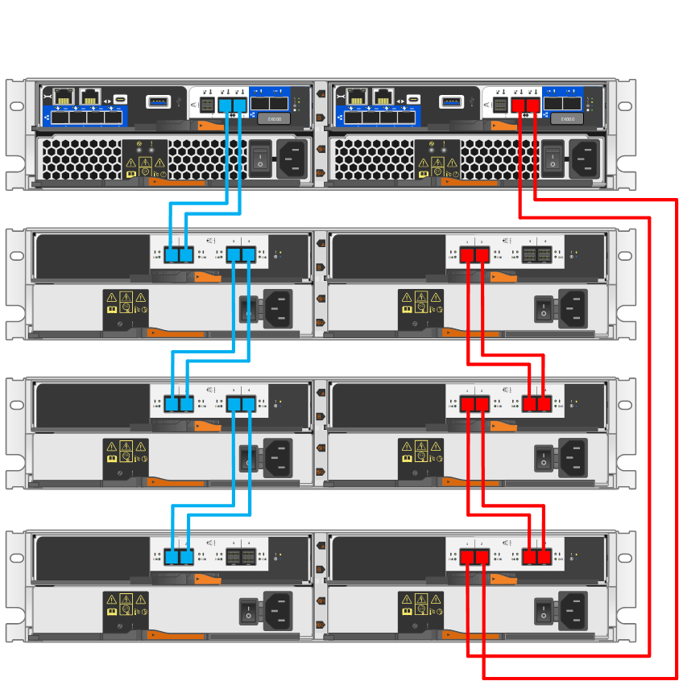
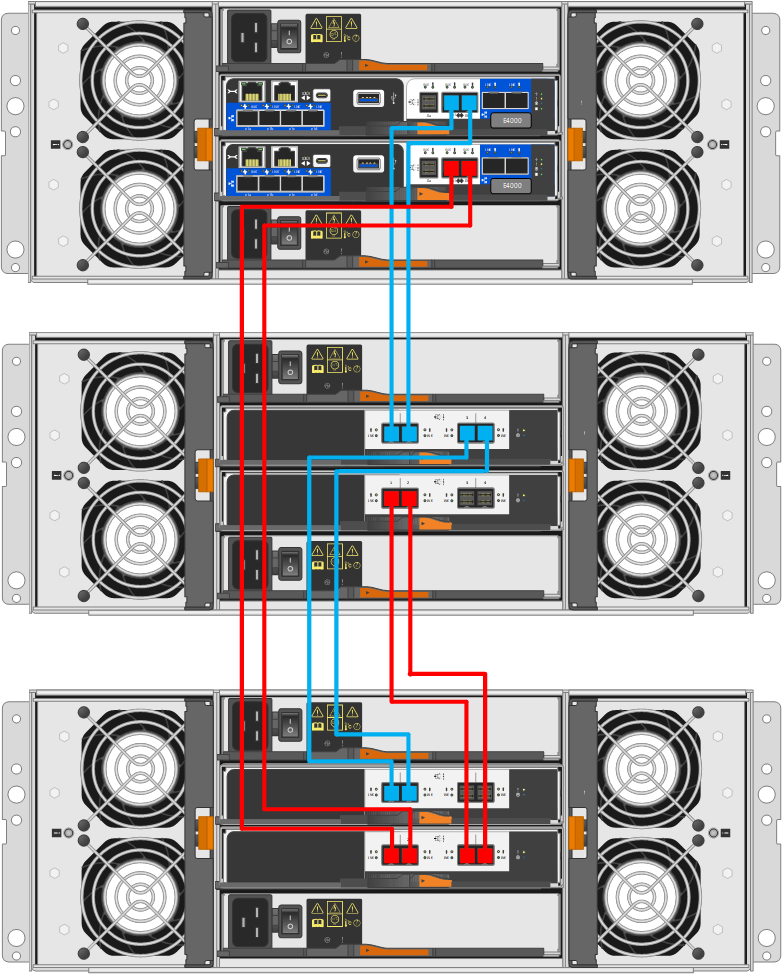

= Cable controller shelf to drive shelf (E-Series)
:icons: font
:imagesdir: ../media/

[.lead]
You must connect each controller in the controller shelf to an I/O module (IOM) in a drive shelf.

This procedure applies to IOM12 and IOM12B drive shelves.

NOTE: IOM12B modules are only supported on SANtricity OS 11.70.2 onward. Ensure your controller's firmware has been updated before installing or upgrading to an IOM12B.

NOTE: This procedure is for like-for-like shelf IOM hot-swaps or replacements. This means you can only replace an IOM12 module with another IOM12 module or replace an IOM12B module with another IOM12B module. (Your shelf can have two IOM12 modules or have two IOM12B modules.)

If you are cabling an older controller shelf to a DE212C, DE224C, or DE460, see https://mysupport.netapp.com/ecm/ecm_download_file/ECMLP2859057[Adding IOM Drive Shelves to an Existing E27XX, E56XX, or EF560 Controller Shelf^].

== Cabling E2800 and E5700

The following information applies to cabling an E2800, E2800B, EF280, E5700, EF5700B, or EF570 controller shelf to a DE212C, DE224C, or DE460 drive shelf.

[role="tabbed-block"]
====

.12-drive or 24-drive shelf
--

You can cable your controller shelf to one or more 12-drive or 24-drive shelves.

The following image shows a representation of the controller shelf and the drive shelves. To locate the ports on your model, see https://hwu.netapp.com/Controller/Index?platformTypeId=2357027[Hardware Universe^].

image::../media/12_24_cabling.png[A controller shelf and 12-drive or 24-drive shelves]

--

.60-drive shelf
--

You can cable your controller shelf to one or more 60-drive shelves.

The following image shows a representation of the controller shelf and the drive shelves. To locate the ports on your model, see https://hwu.netapp.com/Controller/Index?platformTypeId=2357027[Hardware Universe^].

image::../media/60_cabling.png[A controller shelf and 60-drive shelves]

--
====

== Cabling EF300 and EF600

The following information applies to cabling an EF300, EF600, EF300C, or EF600C controller shelf to a DE212C, DE224C, or DE460 drive shelf.

.Before you begin

Before cabling an EF300 or EF600, make sure the firmware is updated to the latest version. To update the firmware, follow the instructions in  link:../upgrade-santricity/index.html[Upgrading SANtricity OS^].

[role="tabbed-block"]
====

.12-drive or 24-drive shelf
--

You can cable your controller shelf to one or more 12-drive or 24-drive shelves.

The following image shows a representation of the controller shelf and the drive shelves. To locate the ports on your model, see https://hwu.netapp.com/Controller/Index?platformTypeId=2357027[Hardware Universe^].

image::../media/ef_to_de224c_four_shelves.png[A controller shelf and 12-drive or 24-drive shelves]

--

.60-drive shelf
--

You can cable your controller shelf to one or more 60-drive shelves.

The following image shows a representation of the controller shelf and the drive shelves. To locate the ports on your model, see https://hwu.netapp.com/Controller/Index?platformTypeId=2357027[Hardware Universe^].

image::../media/ef_to_de460c.png[A controller shelf and 60-drive shelves]

--
====

== Cabling E4000

The following information applies to cabling an E4000 controller shelf to a DE212C, DE224C, or DE460 drive shelf.

[role="tabbed-block"]
====

.12-drive shelf
--

You can cable your controller shelf to one or more 12-drive shelves.

--

.60-drive shelf
--

You can cable your controller shelf to one or more 60-drive shelves.

--
====