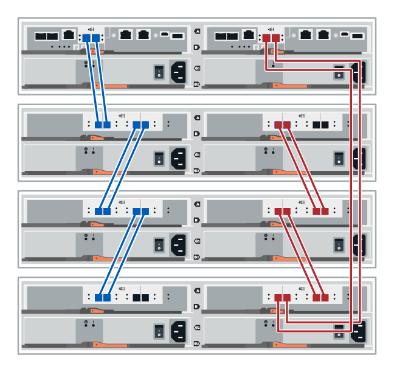
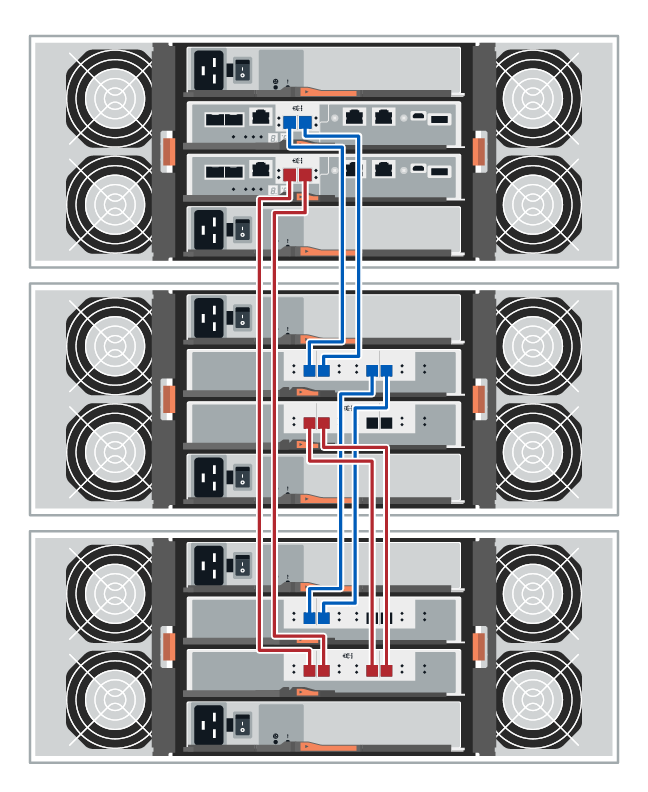
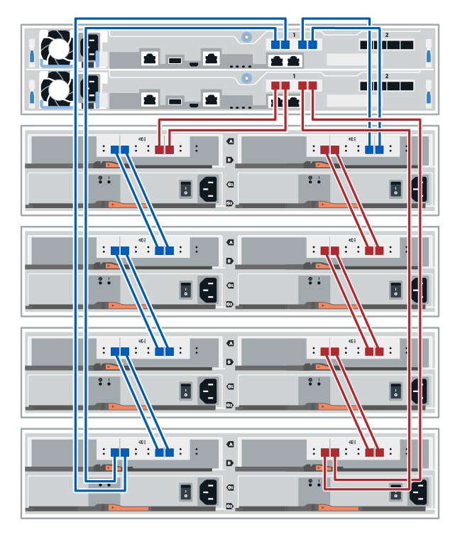
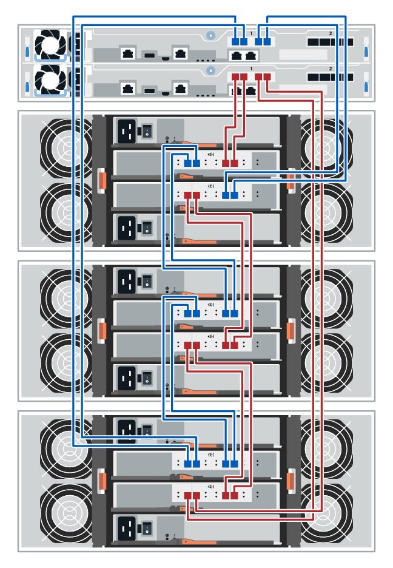

= Drive shelf cabling
:icons: font
:imagesdir: ../media/

[.lead]
You must connect each controller in the controller shelf to an I/O module (IOM) in a drive shelf.

NOTE: This procedure applies to IOM12 and IOM12B drive shelves.

If you are cabling an older controller shelf to a DE212C, DE224C, or DE460, see https://mysupport.netapp.com/ecm/ecm_download_file/ECMLP2859057[Adding IOM Drive Shelves to an Existing E27XX, E56XX, or EF560 Controller Shelf^].

== Cabling E2800 and E5700

The following information applies to cabling an E5700, EF570, E2800, or EF280 controller shelf to a DE212C, DE224C, or DE460 drive shelf.

=== Cabling a 12-drive or 24-drive shelf

You can cable your controller shelf to one or more 12-drive or 24-drive shelves.

The following image shows a representation of the controller shelf and the drive shelves. To locate the ports on your model, see https://hwu.netapp.com/Controller/Index?platformTypeId=2357027[Hardware Universe^].

==== A controller shelf and 12-drive or 24-drive shelves

=== Cabling a 60-drive shelf

You can cable your controller shelf to one or more 60-drive shelves.

The following image shows a representation of the controller shelf and the drive shelves. To locate the ports on your model, see https://hwu.netapp.com/Controller/Index?platformTypeId=2357027[Hardware Universe^].

==== A controller shelf and 60-drive shelves

== Cabling EF300

The following information applies to cabling an EF300 controller shelf to a DE212C, DE224C, or DE460 drive shelf.

.Before you begin

Before cabling the EF300, make sure the firmware is updated to the latest version. To update the firmware, follow the instructions in  link:../upgrade-santricity/index.html[Upgrading SANtricity OS^].

=== Cabling a 12-drive or 24-drive shelf

You can cable your controller shelf to one or more 12-drive or 24-drive shelves.

The following image shows a representation of the controller shelf and the drive shelves. To locate the ports on your model, see https://hwu.netapp.com/Controller/Index?platformTypeId=2357027[Hardware Universe^].

==== A controller shelf and 12-drive or 24-drive shelves

=== Cabling a 60-drive shelf

You can cable your controller shelf to one or more 60-drive shelves.

The following image shows a representation of the controller shelf and the drive shelves. To locate the ports on your model, see https://hwu.netapp.com/Controller/Index?platformTypeId=2357027[Hardware Universe^].

==== A controller shelf and 60-drive shelves

