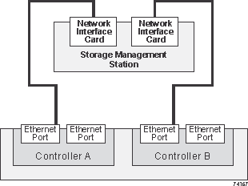
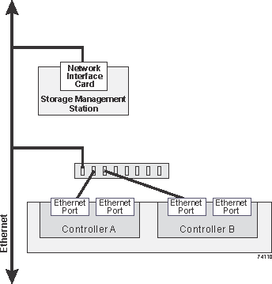

= Ethernet cabling for a management station - E-Series
:icons: font
:imagesdir: ../media/

[.lead]
You can connect your storage system to an Ethernet network for out-of-band storage array management. You must use Ethernet cables for all storage array management connections.

[NOTE]
====
Some storage systems have only one out-of-band Ethernet management port on each controller.

For cabling instructions specific to your storage system, see link:../getting-started/getup-run-concept.html[Quick start for E-Series^] and click the link for your specific storage system.
====

== Direct topology

A direct topology connects your controller directly to an Ethernet network.

You must connect management port 1 on each controller for out-of-band management and leave port 2 available for access to the storage array by technical support.

.Direct storage management connections

== Fabric topology

A fabric topology uses a switch to connect your controller to an Ethernet network.

You must connect management port 1 on each controller for out-of-band management and leave port 2 available for access to the storage array by technical support.

.Fabric storage management connections

