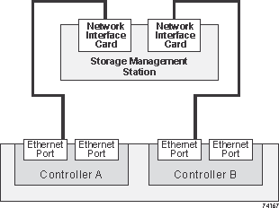
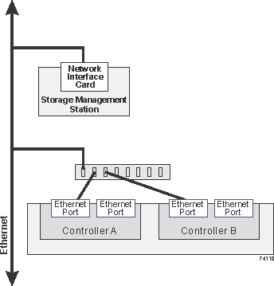

= Ethernet cabling for a management station
:icons: font
:imagesdir: ../media/

[.lead]
You can connect your storage system to an Ethernet network for out-of-band storage array management. You must use Ethernet cables for all storage array management connections.

== Direct topology

[.lead]
A direct topology connects your controller directly to an Ethernet network.

You must connect management port 1 on each controller for out-of-band management and leave port 2 available for access to the storage array by technical support.

=== Direct storage management connections

== Fabric topology

[.lead]
A fabric topology uses a switch to connect your controller to an Ethernet network.

You must connect management port 1 on each controller for out-of-band management and leave port 2 available for access to the storage array by technical support.

=== Fabric storage management connections

