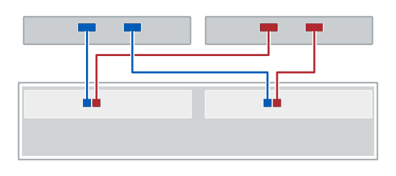
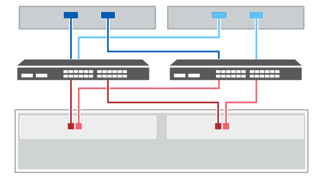

= Host cabling
:icons: font
:imagesdir: ../media/

[.lead]
You can cable a host directly to a controller or use switches to connect a host to a controller.

== Cabling for a direct-attached topology

[.lead]
A topology that connects host adapters directly to controllers in your storage system.

The following figure shows an example connection. To help ensure maximum performance, use all available host adapter ports.

=== Two hosts and two controllers

image:../media/legend_icon_01_inst-hw-cabling.gif[] Connect each host adapter port directly to the host ports on the controllers.

== Cabling for a switch topology

[.lead]
A topology that uses switches to connect hosts to the controllers in your storage system must support the connection type used between the host and the controller.

The following figure shows an example connection.

For switches that provide provisioning capability, it is recommended to isolate each initiator and target pair.

=== Two hosts and two switches

image:../media/legend_icon_01_inst-hw-cabling.gif[]Connect each host adapter directly to the switch.

image:../media/legend_icon_02_inst-hw-cabling.gif[] Connect each switch directly to the host ports on the controllers. To help ensure maximum performance, use all available host adapter ports.
