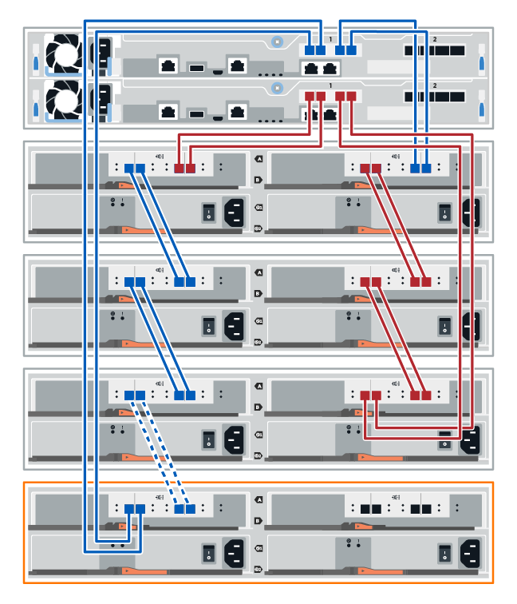

= Hot adding a drive shelf
:icons: font
:imagesdir: ../media/

[.lead]
You can add a new drive shelf while power is still applied to the other components of the storage system. You can configure, reconfigure, add, or relocate storage system capacity without interrupting user access to data.

Due to the complexity of this procedure, the following is recommended:

* Read all steps before beginning the procedure.
* Ensure hot adding a drive shelf is the procedure you need.

This procedure applies to hot adding a DE212C, DE224C, or DE460C drive shelf to an E5700, EF570, E2800, EF280, or EF300 controller shelf.

If you are cabling an older controller shelf to a DE212C, DE224C, or DE460, see https://mysupport.netapp.com/ecm/ecm_download_file/ECMLP2859057[Adding IOM Drive Shelves to an Existing E27XX, E56XX, or EF560 Controller Shelf].

IMPORTANT: To maintain system integrity, you must follow the procedure exactly in the order presented.

== Step 1: Prepare to add the drive shelf

[.lead]
Before you hot add a drive shelf, you must check for critical events and check the status of the IOMs.

===== Before you begin

* The power source for your storage system must be able to accommodate the power requirements of the new drive shelf. For the power specification for your drive shelf, see the https://hwu.netapp.com/Controller/Index?platformTypeId=2357027[Hardware Universe].
* The cabling pattern for the existing storage system must match one of the applicable schemes shown in this procedure.

===== Steps

. In SANtricity System Manager, select *Support* > *Support Center* > *Diagnostics*.
. Select *Collect Support Data*.
+
The Collect Support Data dialog box appears.

. Click *Collect*.
+
The file is saved in the Downloads folder for your browser with the name support-data.7z. The data is not automatically sent to technical support.

. Select *Support* > *Event Log*.
+
The Event Log page displays the event data.

. Select the heading of the *Priority* column to sort critical events to the top of the list.
. Review the system critical events for events that have occurred in the last two to three weeks, and verify that any recent critical events have been resolved or otherwise addressed.
+
NOTE: If unresolved critical events have occurred within the previous two to three weeks, stop the procedure and contact technical support. Continue the procedure only when the issue is resolved.

. Select *Hardware*.
. Select the *IOMs (ESMs)* icon.
+
image::../media/sam1130_ss_hardware_iom_icon.gif[]
+
The Shelf Component Settings dialog box appears with the *IOMs (ESMs)* tab selected.

. Make sure that the status shown for each IOM/ESM is _Optimal_.
. Click *Show more settings*.
. Confirm that the following conditions exist:
 ** The number of ESMs/IOMs detected matches the number of ESMs/IOMs installed in the system and that for each drive shelf.
 ** Both of the ESMs/IOMs show that communication is OK.
 ** The data rate is 12Gb/s for DE212C, DE224C, and DE460C drive shelves or 6 Gb/s for other drive trays.

== Step 2: Install the drive shelf and apply power

[.lead]
You install a new drive shelf or a previously installed drive shelf, turn on the power, and check for any LEDs that require attention.

===== Steps

. If you are installing a drive shelf that has previously been installed in a storage system, remove the drives. The drives must be installed one at a time later in this procedure.
+
If the installation history of the drive shelf that you are installing is unknown, you should assume that it has been previously installed in a storage system.

. Install the drive shelf in the rack that holds the storage system components.
+
IMPORTANT: See the installation instructions for your model for the full procedure for physical installation and power cabling. The installation instructions for your model includes notes and warnings that you must take into account to safely install a drive shelf.

. Power on the new drive shelf, and confirm that no amber attention LEDs are illuminated on the drive shelf. If possible, resolve any fault conditions before you continue with this procedure.

== Step 3: Cable your system

[.lead]
If you are cabling an older controller shelf to a DE212C, DE224C, or DE460, see https://mysupport.netapp.com/ecm/ecm_download_file/ECMLP2859057[Adding IOM Drive Shelves to an Existing E27XX, E56XX, or EF560 Controller Shelf].

=== Connect the drive shelf--E2800 and E5700

[.lead]
You connect the drive shelf to controller A, confirm IOM status, and then connect the drive shelf to controller B.

===== Steps

. Connect the drive shelf to controller A.
+
The following figure shows an example connection between an additional drive shelf and controller A. To locate the ports on your model, see the https://hwu.netapp.com/Controller/Index?platformTypeId=2357027[Hardware Universe].
+
image::../media/hot_e5700_0.png[]
+
image::../media/hot_e5700_1.png[]

. In SANtricity System Manager, click *Hardware*.
+
NOTE: At this point in the procedure, you have only one active path to the controller shelf.

. Scroll down, as necessary, to see all the drive shelves in the new storage system. If the new drive shelf is not displayed, resolve the connection issue.
. Select the *ESMs/IOMs* icon for the new drive shelf.
+
image::../media/sam1130_ss_hardware_iom_icon.gif[]
+
The *Shelf Component Settings* dialog box appears.

. Select the *ESMs/IOMs* tab in the *Shelf Component Settings* dialog box.
. Select *Show more options*, and verify the following:
 ** IOM/ESM A is listed.
 ** Current data rate is 12 Gbps for a SAS-3 drive shelf.
 ** Card communications is OK.
. Disconnect all expansion cables from controller B.
. Connect the drive shelf to controller B.
+
The following figure shows an example connection between an additional drive shelf and controller B. To locate the ports on your model, see the https://hwu.netapp.com/Controller/Index?platformTypeId=2357027[Hardware Universe].
+
image::../media/hot_e5700_2.png[]

. If it is not already selected, select the *ESMs/IOMs* tab in the *Shelf Component Settings* dialog box, and then select *Show more options*. Verify that Card communications is *YES*.
+
NOTE: Optimal status indicates that the loss of redundancy error associated with the new drive shelf has been resolved and the storage system is stabilized.

=== Connect the drive shelf--EF300

[.lead]
You connect the drive shelf to controller A, confirm IOM status, and then connect the drive shelf to controller B.

===== Before you begin

* You have updated your firmware to the latest version. To update your firmware, follow the instructions in the link:../upgrade-santricity/index.html[Upgrading SANtricity OS].

===== Steps

. Disconnect both of the A-side controller cables from IOM12 ports one and two from previous last shelf in the stack and then connect them to the new shelf IOM12 ports one and two.
+
image::../media/de224c_sides.png[]

. Connect the cables to A-side IOM12 ports three and four from the new shelf to previous last shelf IOM12 ports one and two.
+
The following figure shows an example connection for A side between an additional drive shelf and the previous last shelf. To locate the ports on your model, see the https://hwu.netapp.com/Controller/Index?platformTypeId=2357027[Hardware Universe].
+
image::../media/hot_ef_0.png[]
+

. In SANtricity System Manager, click *Hardware*.
+
NOTE: At this point in the procedure, you have only one active path to the controller shelf.

. Scroll down, as necessary, to see all the drive shelves in the new storage system. If the new drive shelf is not displayed, resolve the connection issue.
. Select the *ESMs/IOMs* icon for the new drive shelf.
+
image::../media/sam1130_ss_hardware_iom_icon.gif[]
+
The *Shelf Component Settings* dialog box appears.

. Select the *ESMs/IOMs* tab in the *Shelf Component Settings* dialog box.
. Select *Show more options*, and verify the following:
 ** IOM/ESM A is listed.
 ** Current data rate is 12 Gbps for a SAS-3 drive shelf.
 ** Card communications is OK.
. Disconnect both the B-side controller cables from IOM12 ports one and two from the previous last shelf in the stack then connect them to the new shelf IOM12 ports one and two.
. Connect the cables to B-side IOM12 ports three and four from the new shelf to the previous last shelf IOM12 ports one and two.
+
The following figure shows an example connection for B side between an additional drive shelf and the previous last shelf. To locate the ports on your model, see the https://hwu.netapp.com/Controller/Index?platformTypeId=2357027[Hardware Universe].
+
image::../media/hot_ef_2.png[]

. If it is not already selected, select the *ESMs/IOMs* tab in the *Shelf Component Settings* dialog box, and then select *Show more options*. Verify that Card communications is *YES*.
+
NOTE: Optimal status indicates that the loss of redundancy error associated with the new drive shelf has been resolved and the storage system is stabilized.

== Step 4: Complete hot add

[.lead]
You complete the hot add by checking for any errors and confirming that the newly added drive shelf uses the latest firmware.

===== Steps

. In SANtricity System Manager, click *Home*.
. If the link labeled *Recover from problems* appears at the center top of the page, click the link, and resolve any issues indicated in the Recovery Guru.
. In SANtricity System Manager, click *Hardware*, and scroll down, as necessary, to see the newly added drive shelf.
. For drives that were previously installed in a different storage system, add one drive at time to the newly installed drive shelf. Wait for each drive to be recognized before you insert the next drive.
+
When a drive is recognized by the storage system, the representation of the drive slot in the *Hardware* page displays as a blue rectangle.

. Select *Support* > *Support Center* > *Support Resources* tab.
. Click the *Software and Firmware Inventory* link, and check which versions of the IOM/ESM firmware and the drive firmware are installed on the new drive shelf.
+
NOTE: You might need to scroll down the page to locate this link.

. If necessary, upgrade the drive firmware.
+
IOM/ESM firmware automatically upgrades to the latest version unless you have disabled the upgrade feature.

The hot add procedure is complete. You can resume normal operations.
