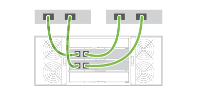
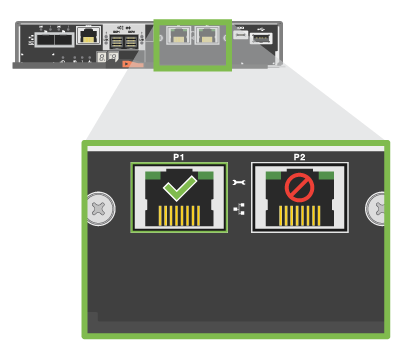
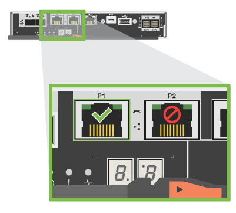

= Complete storage system setup and configuration
:icons: font
:imagesdir: ../media/

[.lead]
Learn how to cable the controllers to your network and complete storage system setup and configuration.

== Step 1: Cable the data hosts

Cable the system according to your network topology.

NOTE: If you are using AIX®, you must install the E-Series multipath driver on the host before connecting it to the array.

=== Option 1: Direct-attach topology

The following example shows cabling to the data hosts using a direct-attach topology.

.Example A: Direct-attach topology

|===
a|
 a|

. Connect each host adapter directly to the host ports on the controllers.

|===

=== Option 2: Fabric topology

The following example shows cabling to the data hosts using a fabric topology.

.Example B: Fabric topology

|===
a|
 a|

. Connect each host adapter directly to the switch.
. Connect each switch directly to the host ports on the controllers.

|===

== Step 2: Connect and configure the management connection

You can configure the controller management ports using one of two options: using a DHCP server or using a static IP address.

=== Option 1: DHCP server

Learn how to configure the management ports with a DHCP server.

.Before you begin

* Configure your DHCP server to associate an IP address, subnet mask, and gateway address as a permanent lease for each controller.
* Obtain the assigned IP addresses you will use to connect to the storage system from your network administrator.

.Steps

. Connect an Ethernet cable to each controller's management port, and connect the other end to your network.
+
|===
a|
 a|
Ethernet cables (if ordered)
|===
+
The following figures show examples of the controller's management port location:
+
|===
a|

E2800 controller P1 Management Port a|

E5700 controller P1 Management Port
|===

. Open a browser and connect to the storage system using one of the controller IP addresses provided to you by your network administrator.

=== Option 2: Static IP address

[.lead]
Learn how to configure the management ports manually by entering the IP address and the subnet mask.

.Before you begin

* Obtain the controllers`' IP address, subnet mask, gateway address, and DNS and NTP server information from your network administrator.
* Make sure the laptop you are using is not receiving network configuration from a DHCP server.

.Steps

. Using an Ethernet cable, connect controller A's management port to the Ethernet port on a laptop.
+
|===
a|
 a|
Ethernet cables (if ordered)
|===
+
The following figures show examples of the controller's management port location:
+
|===
a|

E2800 controller P1 Management Port a|

E5700 controller P1 Management Port
|===
+
. Open a browser and use the default IP address (169.254.128.101) to establish a connection to the controller. The controller sends back a self-signed certificate. The browser informs you that the connection is not secure.
. Follow the browser's instructions to proceed and launch SANtricity System Manager.
+
NOTE: If you are unable to establish a connection, verify that you are not receiving network configuration from a DHCP server.
+
. Set the storage system's password to login.
. Use the network settings provided by your network administrator in the *Configure Network Settings* wizard to configure controller A's network settings, and then select *Finish*.
+
NOTE: Because you reset the IP address, System Manager loses connection to the controller.
+
. Disconnect your laptop from the storage system, and connect the management port on controller A to your network.
. Open a browser on a computer connected to your network, and enter controller A's newly configured IP address.
+
NOTE: If you lose the connection to controller A, you can connect an ethernet cable to controller B to reestablish connection to controller A through controller B (169.254.128.102).
+
. Log in using the password you set previously.
+
The Configure Network Settings wizard will appear.
+
. Use the network settings provided by your network administrator in the *Configure Network Settings* wizard to configure controller B's network settings, and then select *Finish*.
. Connect controller B to your network.
. Validate controller B's network settings by entering controller B's newly configured IP address in a browser.
+
NOTE: If you lose the connection to controller B, you can use your previously validated connection to controller A to reestablish connection to controller B through controller A.

== Step 3: Configure storage system

After you have installed your hardware, use the SANtricity software to configure and manage your storage system.

.Before you begin

* Configure your management ports.
* Verify and record your password and IP addresses.

.Steps

. Use the SANtricity software to configure and manage your storage arrays.
. In the simplest network configuration, connect your controller to a web browser and use SANtricity System Manager for managing a single E2800 or E5700 series storage array.

|===
a|
 a|
For accessing System Manager, use the same IP addresses that you used to configure your management ports.

|===
