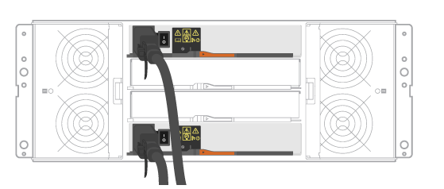
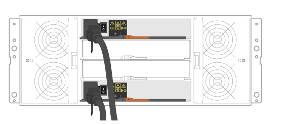

= Connect the power cables - E5724, EF570, EF280, E2812, E2824, DE212C, and DE224C
:icons: font
:imagesdir: ../media/

[.lead]
Learn how to attach the power cables and power on the drive shelves.

.Before you begin

* Install your hardware.
* Take anti-static precautions.

This procedure applies to IOM12, IOM12B, and IOM12C drive shelves.

NOTE: IOM12C modules are only supported on SANtricity OS 11.90R3 onward. Ensure your controller's firmware has been updated before installing or upgrading to an IOM12C.

NOTE: This procedure is for like-for-like shelf IOM hot-swaps or replacements. This means you can only replace an IOM12 module with another IOM12 module or replace an IOM12C module with another IOM12C module. (Your shelf can have two IOM12 modules or have two IOM12C modules.)

.Steps

. Cable the shelves.
+
Cable the system according to your configuration. If you need more cabling options than the examples shown, see link:../install-hw-cabling/index.html[Cabling].
+
For the examples shown, you need the following cables:
+
|===
a|
image:../media/sas_cable.png["SAS cable"] a|
*SAS cables*
|===
+

.Example A: E5700 controller shelf with three DE212C/DE224 disk shelves in a standard SAS configuration.
+

+
 .. Cable controller A to IOM A of the first drive shelf.
 .. Cable IOM A of the first drive shelf to IOM A of the second drive shelf.
 .. Cable IOM A of the second drive shelf to IOM A of the third drive shelf.
 .. Cable controller B to IOM B of the third drive shelf.
 .. Cable IOM B of the second drive shelf to IOM B of the third drive shelf.
 .. Cable IOM B of the first drive shelf to IOM B of the second drive shelf.

+
.Example B: An E5700 controller shelf with one DE212C/DE224 disk shelf in a standard SAS configuration.
+

+
.. Cable controller A to IOM A.
.. Cable controller B to IOM B.

. Power the drive shelves.
+
You need the following cables:
+
|===
a|
image:../media/power_cable_inst-hw-e2800-e5700.png["Power cables"] a|
*Power cables*
|===
CAUTION: Confirm the drive shelf power switches are off.

 .. Connect the two power cables for each shelf to different power distribution units (PDUs) in the cabinet or rack.
 .. If you have drive shelves, turn on their two power switches first. Wait 2 minutes before applying power to the controller shelf.
 .. Turn on the two power switches on the controller shelf.
 .. Check the LEDs and seven-segment display on each controller.
+
During boot, the seven-segment display shows the repeating sequence of OS, Sd, blank to indicate the controller is performing start-of-day processing. After the controller has booted up, the shelf ID is displayed.

+
|===
a|*Example: Power connections are on the rear of the shelf.*
image:../media/trafford_power.png["Power shelf connections"]

|===
