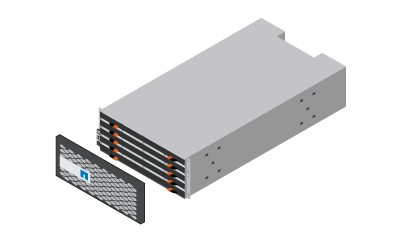
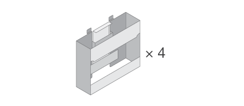
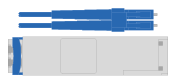
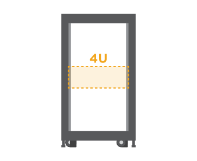

= Prepare for installation
:icons: font
:imagesdir: ../media/

[.lead]
Follow these steps to prepare for installation of your E2860, E5760, or DE460 series storage system.

.Steps

. Create an account and register your hardware at http://mysupport.netapp.com/[mysupport.netapp.com^].
. Ensure that the following items are in the box that you received.
+
|===
a|
 a|
Shelf, bezel, and rackmount hardware
a|

a|
Shelf handles x4
|===
The following table identifies the types of cables you might receive. If you receive a cable not listed in the table, see https://hwu.netapp.com/[Hardware Universe^] to locate the cable and identify its use.
+
[options="header"]
|===
| Connector type| Cable type| Use
a|
image:../media/cable_ethernet_inst-hw-e2800-e5700.png[]
a|
Ethernet cables

(if ordered)
a|
Management connection
a|

a|
I/O cables

(if ordered)
a|
Cabling the data hosts
a|

a|
Power cables

x2 per shelf

(if ordered)
a|
Powering up the storage system
a|
image:../media/sas_cable.png[]
a|
SAS cables    (Included only with the drive shelves)
a|
Cabling the shelves
|===

. Ensure that you provide the following items.
+
|===
a|
 a|
Phillips #2 screwdriver
a|

a|
Flashlight
a|

a|
ESD strap
a|

a|
4U rack space: A standard 19 in. (48.30 cm) rack to fit 4U shelves of the following dimensions.

*Depth*: 38.25 in. (97.16 cm)

*Width*: 17.66 in. (44.86 cm)

*Height*: 6.87 in. (17.46 cm)

*Max Weight*: 250 lb (113 kg)
a|
image:../media/management_station_inst-hw-e2800-e5700_g60b3.png[]
a|
A supported browser for the management software:

* Google Chrome (version 47 and later)
* Microsoft Internet Explorer (version 11 and later)
* Microsoft Edge (EdgeHTML 12 and later)
* Mozilla Firefox (version 31 and later)
* Safari (version 9 and later)

|===
