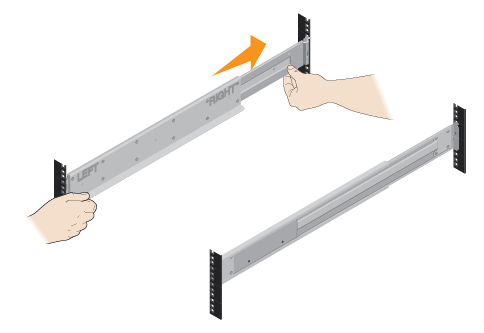

= Install the hardware
:icons: font
:imagesdir: ../media/

[.lead]
You install your storage system in a two-post rack or a NetApp system cabinet, as applicable.

* You have registered your hardware at http://mysupport.netapp.com/[mysupport.netapp.com].
* You have prepared a flat, static-free work area.
* You have taken anti-static precautions.

. Unpack the hardware.
 .. Unpack the contents and inventory the contained hardware against the packing slip.
 .. Before proceeding, read through all the instructions.
. Before installing the hardware, ensure that you have an ESD wristband or that you have taken other antistatic precautions.
. Install the rails.
+
NOTE: For square hole cabinets, you must first install the provided cage nuts to secure the front and rear of the shelf with screws.
+
|===
a|
If instructions were included with your rack-mounting hardware, refer to them for detailed information on how to install the rails.

NOTE: For online instructions for installing SuperRails, see http://docs.netapp.com/platstor/index.jsp?topic=%2Fcom.netapp.doc.hw-rail-superrail%2Fhome.html[AFF and FAS System Documentation Center].
a|

|===

. Install the shelf.
+
|===
a|

 .. If lifting the shelf by hand, attach the four lift handles. Push up on each handle until it clicks into place.
+
CAUTION: An empty shelf weighs approximately 132 lb (60 kg). A mechanized lift or four people using lift handles are required to safely move an empty shelf.

 .. Supporting the shelf from the bottom, slide it into the cabinet. If the lift handles are used, remove them one set at a time as the shelf slides into the cabinet. To remove the handles, pull back on the release latch, push down, then pull away from the shelf.

a|
image:../media/4_person_lift_source.png[]
|===

. Secure the shelf.
+
|===
a|
For more information, see the instructions for the rack-mounting hardware.

 ** Insert screws into the first and third holes from the top of the shelf on both sides to secure it to the front of the cabinet.
 ** Place two back brackets on each side of the upper rear section of the shelf. Insert screws into the first and third holes of each bracket to secure the back of the cabinet.

a|
image:../media/secure_shelf_inst-hw-e2800-e5700.png[]
|===

. Install the drives.
+
|===
a|

 .. Wrap the strap end of the ESD wristband around your wrist, and secure the clip end to a metal ground to prevent static discharges.
 .. Starting at the front left slot of the top drawer, install each drive by gently positioning into the drive slot and lowering the raised drive handle until it clicks into place.
+
NOTE: If you are installing fewer than 60 drives, if you have solid-state drives (SSDs), or if your drives have different capacities:

  *** Maintain a minimum of 20 drives per shelf. Install drives in the front four slots in each drawer first, for adequate airflow for cooling.
  *** Distribute any remaining drives across the drawers. If possible, install an equal number of each type of drive in each drawer to allow for the creation of Drawer Loss Protected volume groups or disk pools.
  *** Distribute any SSDs evenly across the drawers.

 .. Carefully slide the drawer back in by pushing the center and gently closing both latches.
 .. Attach the front bezel.

a|
image:../media/install_faceplate_2_0_inst-hw-e2800-e5700.png
a|
*Attention:* Risk of equipment damage -- Stop pushing the drawer if you feel binding. Use the release levers at the front of the drawer to slide the drawer back out. Then, carefully reinsert the drawer into the slot.
|===
