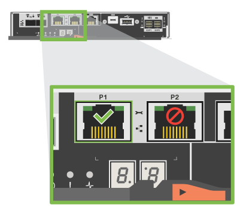

= Installation and Setup Instructions for E5724, EF570, EF280, E2812, E2824, DE212C, and DE224C
:icons: font
:imagesdir: ../media/

[.lead]
These instructions describe how to install and set up your new storage system and provide links to additional content.

== Prepare for installation

[.lead]
To install your E5724, EF570, EF280, E2812, E2824, DE212C, and DE224C series storage system, you need to create an account and register your hardware. You also need to inventory the appropriate number and type of cables for your storage system and provide some key items required for the hardware installation process.

. Create an account and register your hardware at http://mysupport.netapp.com/[mysupport.netapp.com].
. Ensure that the following items are in the box that you received.
+
|===
a|
image:../media/trafford_overview.png[]
a|
Shelf with drives installed     (bezel packaged separately)
a|
image:../media/superrails.png[]
a|
Rack-mount hardware
|===
The following table identifies the types of cables you might receive. If you receive a cable not listed in the table, see https://hwu.netapp.com/[Hardware Universe] to locate the cable and identify its use.
+
|===
| Connector type| Cable type| Use
a|
image:../media/cable_ethernet.png[]
a|
    Ethernet cables
+
(if ordered)
a|
Management connection
a|
image:../media/cable_io.png[]
a|
    I/O cables
+
(if ordered)
a|
Cabling the data hosts
a|
image:../media/cable_power.png[]
a|
Power cables    (if ordered)
a|
Powering up the storage system
a|
image:../media/sas_cable.png[]
a|
SAS cables included only with the drive shelves
a|
SAS cables
|===

. Ensure that you provide the following items.
+
|===
a|
image:../media/screwdriver.png[]
a|
Phillips #2 screwdriver
a|
image:../media/flashlight.png[]
a|
Flashlight
a|
image:../media/wrist_strap.png[]
a|
ESD strap
a|
image:../media/2u_rackspace.png[]
a|
    2U rack space: A standard 19 in. (48.30 cm) rack to fit 2U shelves of the following dimensions.
+
*Depth*: 19.0 in. (48.3 cm)
+
*Width*: 17.6 in. (44.7 cm)
+
*Height*: 3.34 in. (8.48 cm)
+
*Shelf*: 24-drive
+
*Max Weight*: 60.5 lb (27.4 kg)
a|
image:../media/management_station.png[]
a|
    A supported browser for the management software
+
|===

== Install the hardware

[.lead]
You install your storage system in a two-post rack or a NetApp system cabinet, as applicable.

* You have registered your hardware at http://mysupport.netapp.com/[mysupport.netapp.com].
* You have prepared a flat, static-free work area.
* You have taken anti-static precautions.

. Unpack the hardware.
+
Unpack the contents and inventory the contained hardware against the packing slip. Read through all the instructions before proceeding.

. Install the rails.
+
If included with your rack-mounting hardware, refer to the enclosed instructions for detailed information on how to install the rails. Rail instructions are also available through the E-Series Documentation Center at docs.netapp.com/ess-11/index.jsp under Hardware installation and upgrade >> Installing rack-mounting hardware.
+
NOTE: Install hardware from the bottom of the rack or cabinet up to the top to prevent the equipment from toppling over.
+
|===
a|
    If instructions were included with your rack-mounting hardware, refer to them for detailed information on how to install the rails.
+
NOTE: For online instructions for installing SuperRails, see http://docs.netapp.com/platstor/index.jsp?topic=%2Fcom.netapp.doc.hw-rail-superrail%2Fhome.html[AFF and FAS System Documentation Center].
a|
image:../media/install_rails.png[]
|===

. Install the shelf.
+
NOTE: CAUTION: When fully loaded with drives, each shelf weighs approximately 64 lb (29 kg). Two persons or mechanical lift are required to safely move the shelf.
+
|===
a|

 .. Starting with the shelf you want at the bottom of the cabinet, place the back of the shelf (the end with the connectors) on the rails.
 .. Supporting the shelf from the bottom, slide it into the cabinet.

a|
image:../media/4_person_lift_source.png[]
|===

. Secure the shelf.
+
Secure the shelf to the rack as directed in the instructions for the rack-mounting hardware.
+
|===
a|
    For more information, see the instructions for the rack-mounting hardware.

 ** Insert screws into the first and third holes from the top of the shelf on both sides to secure it to the front of the cabinet.
 ** Place two back brackets on each side of the upper rear section of the shelf. Insert screws into the first and third holes of each bracket to secure the back of the cabinet.

a|
image:../media/trafford_secure.png[]
|===

. Install the bezel or end caps.
+
|===
a|

 .. Position the front bezel in front of the controller shelf so that the holes at each end align with the fasteners on the controller shelf.
 .. Snap the bezel into place.
 .. If you have optional drive shelves, position the left end cap in front of the drive shelf so that the holes in the end cap align with the fasteners on the left side of the shelf.
 .. Snap the end cap into place.
 .. Repeat the above steps for the right end cap.

a|
image:../media/trafford_overview.png[]
|===

== Connect the cables

[.lead]
You attach the power cables and power on the drive shelves.

* You have installed your hardware.
* You have taken anti-static precautions.

. Cable the Shelves
+
Cable the system according to your configuration. Examples are shown in this section. For more cabling options, see Cabling E-Series Hardware.
+
http://docs.netapp.com/ess-11/index.jsp[Cabling E-Series Hardware]
+
For the examples shown in this section you will need the following cables:
+
|===
a|
image:../media/sas_cable.png[]
a|
*SAS cables*
|===
|===
a|

 .. Cable controller A to IOM A of the first drive shelf.
 .. Cable IOM A of the first drive shelf to IOM A of the second drive shelf.
 .. Cable IOM A of the second drive shelf to IOM A of the third drive shelf.
 .. Cable controller B to IOM B of the third drive shelf.
 .. Cable IOM B of the second drive shelf to IOM B of the third drive shelf.
 .. Cable IOM B of the first drive shelf to IOM B of the second drive shelf.

a|
image:../media/trafford_power.png[]     Example A: An E5700 controller shelf with three DE212C/DE224 disk shelves in a standard SAS configuration.
+
|===
|===
a|

 .. Cable controller A to IOM A.
 .. Cable controller B to IOM B.

a|
image:../media/trafford_power.png[]     Example B: An E5700 controller shelf with one DE212C/DE224 disk shelf in a standard SAS configuration.
+
|===

. Power the Drive Shelves
+
You will need the following cables:
+
|===
a|
image:../media/power_cable.png[]
a|
*Power cables*
|===
CAUTION:
+
Confirm the drive shelf power switches are off.

 .. Connect the two power cables for each shelf to different power distribution units (PDUs) in the cabinet or rack.
 .. If you have drive shelves, turn on their two power switches first. Wait 2 minutes before applying power to the controller shelf.
 .. Turn on the two power switches on the controller shelf.
 .. Check the LEDs and seven-segment display on each controller.
+
During boot, the seven-segment display shows the repeating sequence of OS, Sd, blank to indicate the controller is performing start-of-day processing. After the controller has booted up, the shelf ID is displayed.

+
|===
a|
image:../media/trafford_power.png[]     Example: Power connections are on the rear of the shelf.
+
|===

== Complete storage system setup and configuration

[.lead]
You cable the controllers to your network to complete storage system setup and configuration.

=== Cable the data hosts

[.lead]
Cable the system according to your network topology.

NOTE: If you are using AIX®, you must install the E-Series multipath driver on the host before connecting it to the array.

==== Direct Attach Topology

[.lead]
The following example shows cabling the data hosts using a direct-attach topology.

===== Example A: Direct-attach topology

|===
a|
image:../media/trafford_direct.png[]
a|

. Connect each host adapter directly to the host ports on the controllers.

|===

==== Fabric Topology

[.lead]
The following example shows cabling the data hosts using a fabric topology.

===== Example B: Fabric topology

|===
a|
image:../media/trafford_direct.png[]
a|

. Connect each host adapter directly to the switch.
. Connect each switch directly to the host ports on the controllers.

|===

=== Connect and configure the management connection

[.lead]
You can configure you controller management ports with a DHCP server, or using static IP addresses.

Make sure you have obtained the network configuration information from your network administrator for the controllers (IP address, subnet mask, gateway, and DNS and NTP server information).

==== Option 1: Management port configuration with DHCP

[.lead]
You can configure the management ports with a DHCP server.

* Your DHCP server is configured to associate an IP address, subnet mask, and gateway address as a permanent lease for each controller.
* You have obtained the assigned IP addresses you will use to connect to the storage system from your network administrator.

. Connect an Ethernet cable to each controller's management port, and connect the other end to your network.
+
|===
a|
image:../media/cable_ethernet.png[]
a|
Ethernet cables (if ordered)
|===
The following figure shows an example of the controller's management port location:
+
|===
a|
image:../media/e2800_mgmt_ports.png[]     E2800 controller P1 Management Port
a|
     E5700 controller P1 Management Port
+
|===

. Open a browser and connect to the storage system using one of the controller IP addresses provided to you by your network administrator.

==== Option 2: Management port configuration with static IP addresses

[.lead]
You configure the management ports manually by entering the IP address and the subnet mask.

* You have obtained the controllers`' IP address, subnet mask, gateway address, and DNS and NTP server information from your network administrator.
* You have ensured that the laptop you are using is not receiving network configuration from a DHCP server.

. Using an Ethernet cable, connect controller A's management port to the Ethernet port on a laptop.
+
|===
a|
image:../media/cable_ethernet.png[]
a|
Ethernet cables (if ordered)
|===
The following figure shows an example of the controller's management port location:
+
|===
a|
image:../media/e2800_mgmt_ports.png[]     E2800 controller P1 Management Port
a|
     E5700 controller P1 Management Port
+
|===

. Open a browser and use the default IP address (169.254.128.101) to establish a connection to the controller. The controller sends back a self-signed certificate. The browser informs you that the connection is not secure.
. Follow the browser's instructions to proceed and launch SANtricity System Manager.
+
NOTE: If you are unable to establish a connection, verify that you are not receiving network configuration from a DHCP server.

. Set the storage system's password to login.
. Use the network settings provided by your network administrator in the *Configure Network Settings* wizard to configure controller A's network settings, and then select Finish.
+
NOTE: Because you reset the IP address, System Manager loses connection to the controller.

. Disconnect your laptop from the storage system, and connect the management port on controller A to your network.
. Open a browser on a computer connected to your network, and enter controller A's newly configured IP address.
+
IMPORTANT: If you lose the connection to controller A, you can connect an ethernet cable to controller B to reestablish connection to controller A through controller B (169.254.128.102).

. Log in using the password you set previously.
+
The Configure Network Settings wizard will appear.

. Use the network settings provided by your network administrator in the *Configure Network Settings* wizard to configure controller B's network settings, and then select Finish.
. Connect controller B to your network.
. Validate controller B's network settings by entering controller B's newly configured IP address in a browser.
+
IMPORTANT: If you lose the connection to controller B, you can use your previously validated connection to controller A to reestablish connection to controller B through controller A.

=== After installing the hardware

[.lead]
After you have installed your hardware, use the SANtricity software to configure and manage your storage system.

* You have configured your management ports and have verified and recorded your password and IP addresses.

. Use the SANtricity software to configure and manage your storage arrays.
. In the simplest network configuration, connect your controller to a web browser and use SANtricity System Manager for managing a single E2800 or E5700 series storage array.

|===
a|
image:../media/management_station.png[]
a|

* NOTE: You use the same IP addresses that you used to configure your management ports to access SANtricity System Manager.

|===
