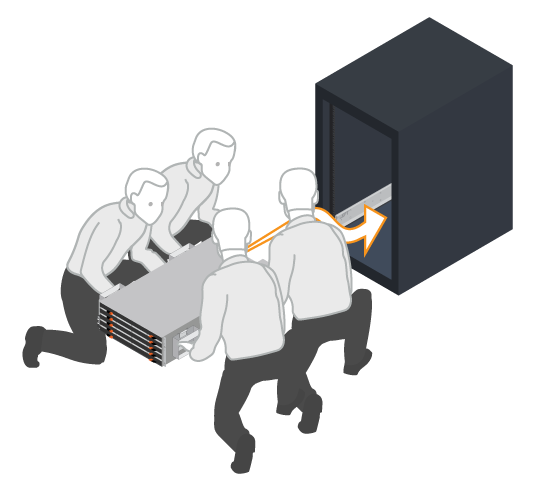
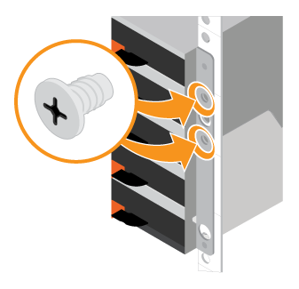

= Install hardware (E4012)
:icons: font
:imagesdir: ../media/

[.lead]
Learn how to install a E4012, DE212C, or DE224C storage system in a two-post rack or a NetApp system cabinet.

.Before you begin

Make sure you do the following:

* Register your hardware at http://mysupport.netapp.com/[NetApp Support^].
* Prepare a flat, static-free work area.
* Obtain an ESD wristband and take anti-static precautions.

.Steps

. Unpack the hardware contents, and then inventory the contained hardware against the packing slip.

. Install the rails.
+
If instructions were included with your rack-mounting hardware, refer to them for detailed information on how to install the rails. For additional rack-mounting instructions, see link:../rackmount-hardware.html[Rack-mount hardware].
+
NOTE: Install hardware from the bottom of the rack or cabinet up to the top to prevent the equipment from toppling over.
+

image:../media/install_rails_inst-hw-e2800-e5700.png[]

. Install the shelf.
+
CAUTION: When fully loaded with drives, each shelf weighs approximately 64 lb (20 kg). Two people or a mechanical lift are required to safely move the shelf.
+

.. Starting with the shelf you want at the bottom of the cabinet, place the back of the shelf (the end with the connectors) on the rails.
.. Supporting the shelf from the bottom, slide it into the cabinet.

. Secure the shelf.
+
Secure the shelf to the rack as directed in link:../rackmount-hardware.html[Rack-mount hardware].
+
 .. Insert screws into the first and third holes from the top of the shelf on both sides to secure it to the front of the cabinet.
 .. Place two back brackets on each side of the upper rear section of the shelf. Insert screws into the first and third holes of each bracket to secure the back of the cabinet.
+

+

. Install the bezel or end caps.
+

 .. Position the front bezel in front of the controller shelf so that the holes at each end align with the fasteners on the controller shelf.
 .. Snap the bezel into place.
 .. If you have optional drive shelves, position the left end cap in front of the drive shelf so that the holes in the end cap align with the fasteners on the left side of the shelf.
 .. Snap the end cap into place.
 .. Repeat the above steps for the right end cap.

