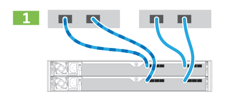
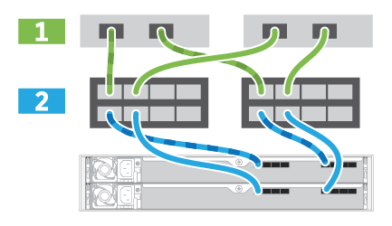

= Cable the hardware - EF50, EF50C, EF80, and EF80C
:icons: font
:imagesdir: ../media/

[.lead]
After you install your EF50, EF50C, EF80, or EF80C storage system hardware, cable the mirroring and data host network connections for the controllers.

== Step 1: Cable the mirroring connections

Cable the controllers to each other to enable the inter-controller communication for caching.

.About this task
The cabling for the mirroring connections is the same for EF50, EF50C, EF80, and EF80C storage systems.

Lisa note: is the same for all EF50/80 systems. So show generic graphic of system back.

== Step 2: Cable the data host network connections

Cable the data host connections for your storage system according to your network topology.

.About this task
EF50 and EF50C storage system data host cabling is different from the EF80 and EF80C storage system data host cabling.

NOTE: Host ports on the bottom left-side (e1a, e1b, e1c, and e1d) and upper right-side (e0a and e0b) of the controller can be used for data host cabling.

[role="tabbed-block"]
====

.Option 1: Direct-attach topology
--

The following example shows cabling to the data hosts using a direct-attach topology.

Lisa: I do like the very generic rear view of the system used in EF600. Just show HICs in the slots that are cabled to host network:

image:../media/drw_e4012_direct_topology_ieops-2156.svg[E4012 Direct Topology, width=1000px]

. Connect each host HBA port to the host ports on the controllers (e1a, e1b, e1c, and e1d or e0a and e0b).

NOTE: For additional cabling diagram examples, see https://docs.netapp.com/us-en/e-series/install-hw-cabling/host-cable-task.html#cabling-for-a-direct-attached-topology[Host Cabling^].

--

.Option 2: Fabric topology
--

The following example shows cabling to the data hosts using a fabric topology.

Lisa: I do like the very generic rear view of the system used in EF600. Just show HICs in the slots that are cabled thru switches to the host network:

image:../media/drw_e4012_fabric_topology_ieops-2157.svg[E4012 Fabric Topology, width=1000px]

. Connect each host adapter directly to the switch.
. Connect each switch directly to the host ports on the controllers (e1a, e1b, e1c, and e1d or e0a and e0b).

--
====

