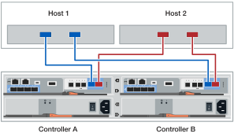
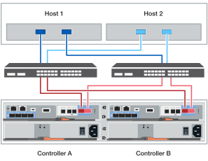

= Cable the hardware - EF50, EF50C, EF80, and EF80C
:icons: font
:imagesdir: ../media/

[.lead]
After you install your EF50, EF50C, EF80, or EF80C storage system hardware, cable the mirroring and data host network connections for the controllers.

.About this task

* The cabling graphics have arrow icons showing the proper orientation (up or down) of the cable connector pull-tab when inserting a connector into a port.
+
As you insert the connector, you should feel it click into place; if you do not feel it click, remove it, turn it over and try again.
+
image:../media/drw_cable_pull_tab_direction_ieops-1699.svg[Cable pull tab direction]

== Step 1: Cable the mirroring connections

Cable the controllers to each other to enable mirroring (the inter-controller communication for caching).

.About this task
The cabling for the mirroring connections is the same for EF50, EF50C, EF80, and EF80C storage systems.

.Steps

. Connect the controllers together:
.. Cable controller A port e4a to controller B port e4a. 
.. Cable controller A port e4b to controller B port e4b.
+
*100 or 200 GbE Ethernet cables?*
+
image::../media/oie_cable100_gbe_qsfp28.png[100 or 200 GbE Ethernet cable used for mirroring connections]
+
image:../media/drw_ef50-ef50c-ef80-ef80c_mirroring_2p_100gbe_ieops-2659.svg[ef50 ef50c ef80 ef80c controller to controller mirroring connections]

== Step 2: Cable the data host network connections

Cable the data host connections for your storage system according to your network topology: direct-attached or fabric-attached.

.About this task
Depending on your storage system model, the type of host interface cards (HICs) installed can be Ethernet or Fibre Channel (FC).

[NOTE]
====
The data host cabling examples show storage systems with the maximum number of supported host I/O modules. 

If your storage system has fewer host I/O modules installed, you can ignore the cabling to the additional host HICs and only cable to the installed host HICs.

If you do not see your configuration here, go to link:https://hwu.netapp.com[NetApp Hardware Universe^] for comprehensive configuration and slot priority information to cable your storage system.
====

//open tabbed block 

[role="tabbed-block"]
=====
.Direct-attached topology cabling
--

The following examples show cabling to the data hosts using a direct-attached topology.

.EF80 or EF80C with three 2-port 200 GbE HICs
[%collapsible]
====

.About this task
The cabling example shows data host I/O modules in slots 1, 2, and 3. This is the maximum number of data host I/O modules supported for the EF80 and EF80C storage systems. However, only the data host I/O module in slot 1 is required; data host I/O modules in slot 2 and slot 3 are both optional.

.Steps

. Cable the data host connections so that each host has a connection to each controller:
. Or Cable the data host connections so that each host HBA port (two ports on each host) has a connection to host ports on each controller:
.. Cable host 1 to controller A port exx.
.. Cable host 1 to controller B port exx.
.. Cable host 2 to controller A port exx.
.. Cable host 2 to controller B port exx.
+
*200 GbE cables*
+
image::../media/oie_cable_sfp_gbe_copper.png[200 GbE cable]
+

====

.EF80 or EF80C with three 4-port 64Gb FC HICs
[%collapsible]
====

.About this task
The cabling example shows data host I/O modules in slots 1, 2, and 3. This is the maximum number of data host I/O modules supported for the EF80 and EF80C storage systems. However, only the data host I/O module in slot 1 is required; data host I/O modules in slot 2 and slot 3 are both optional.

.Steps

. Cable the data host connections so that each host has a connection to each controller:
.. Cable host 1 to controller A port exx.
.. Cable host 1 to controller B port exx.
.. Cable host 2 to controller A port exx.
.. Cable host 2 to controller B port exx.
+
*64 Gb/s FC cables*
+
image:../media/oie_cable_sfp_gbe_copper.png[64 Gb fc cable]
+

====

.EF50 or EF50C with three 4-port 64Gb FC HICs
[%collapsible]
====

.About this task
The cabling example shows data host I/O modules in slots 1 and 2. This is the maximum number of data host I/O modules supported for the EF50 and EF50C storage systems. However, only the data host I/O module in slot 1 is required; the data host I/O module in slot 2 is optional.

.Steps

. Cable the data host connections so that each host has a connection to each controller:
.. Cable host 1 to controller A port exx.
.. Cable host 1 to controller B port exx.
.. Cable host 2 to controller A port exx.
.. Cable host 2 to controller B port exx.
+
*64 Gb/s FC cables*
+
image:../media/oie_cable_sfp_gbe_copper.png[64 Gb fc cable]
+

====

--
.Fabric-attached topology cabling
--

The following examples show cabling to the data hosts using a fabric-attached topology.

.About this task

The following data host network connection rules are exemplified in the data host cabling steps in this procedure. These rules apply to the EF50, EF50C, EF80, and EF80C storage systems:

* A storage system has two Client Domains, which must be separated for redundancy by having the two hosts (Host 1 and Host 2) connected to two different switches (Switch 1 and Switch 2). 
+
In the host cabling steps in this procedure, Client Domain A connections are shown in blue and Client Domain B connections are shown in red. 
+
Switch 1 is in Client Domain A and Switch 2 is in Client Domain B.
+
Switch 1 connections to the controller HICs always connect to the 'a' and 'c' ports on each host HIC. Switch 2 connections to the controller HICs always connect to the 'b' and 'd' ports on each host HIC.

* Each host (Host 1 and Host 2) has three two-port HBAs. The HBA 'a' ports connect together and the HBA 'b' ports connect together. These connections make a total of six connections for HBA 'a' ports and for HBA 'b' ports.

* The host HBA 'a' ports connect to Switch 1 through one cable. The host HBA 'b' ports connect to Switch 2 through one cable.

* Each switch (Switch A and Switch B) has one cable connection (4:1 breakout cable) to the cluster of blue or red cabling to the HICs on each controller. These connections make a total of 12 connections for the blue and for the red cabling.

** Switch 1 connections to the controller HICs always connect to the 'a' and 'c' ports on each host HIC and are shown in blue. Switch 2 connections to the controller HICs always connect to the 'b' and 'd' ports on each host HIC and are shown in red.

** Switch 1 (blue cabling) always connects to the cluster of cabling that is cabled to 'a' and 'c' ports on each host HIC.

** Switch 2 (red cabling) always connects to the cluster of cabling that is cabled to 'b' and 'd' ports on each host HIC.

.EF80 or EF80C with three 2-port 200 GbE HICs
[%collapsible]
====

.About this task
The cabling example shows data host I/O modules in slots 1, 2, and 3. This is the maximum number of data host I/O modules supported for the EF80 and EF80C storage systems. However, only the data host I/O module in slot 1 is required; data host I/O modules in slot 2 and slot 3 are both optional.

.Steps

. Connect each host to each switch.
+
You can use any ports on the hosts and switches.
+
.. Cable Host 1 to each switch.
.. Cable Host 2 to each switch.
+
You can use the following table for the host to switch cabling or use the cabling graphic:
+
image:../media/drw_ef50-ef50c-ef80-ef80c_host_to_switch_table_ieops-xxxx.svg[host to switch cabling in table format]
+
. Connect each switch to each controller:
.. Cable switch 1 to controller A port exx.
.. Cable switch 1 to controller B port exx.
.. Cable switch 2 to controller A port exx.
.. Cable switch 2 to controller B port exx.
+
You can use the following table for the switch to controller cabling or use the cabling graphic:
+
image:../media/drw_ef80-ef80c_switch_to_controller_table_2p_200gbe_3hic_fabric_ieops-xxxx.svg[ef80 and ef80c switch to controller cabling in table format for 2p 200gbe 3 hic fabric]
+
*200 GbE cables?*
+
image::../media/oie_cable_sfp_gbe_copper.png[200 GbE cable]
+

====

.EF80 or EF80C with three 4-port 64Gb FC HICs
[%collapsible]
====

.About this task
The cabling example shows data host I/O modules in slots 1, 2, and 3. This is the maximum number of data host I/O modules supported for the EF80 and EF80C storage systems. However, only the data host I/O module in slot 1 is required; data host I/O modules in slot 2 and slot 3 are both optional.

.Steps

. Connect each host to each switch.
+
You can use any ports on the hosts and switches.
+
.. Cable Host 1 to each switch.
.. Cable Host 2 to each switch.
+
You can use the following table for the host to switch cabling or use the cabling graphic:
+
image:../media/drw_ef50-ef50c-ef80-ef80c_host_to_switch_table_ieops-xxxx.svg[host to switch cabling in table format]
+
. Connect each switch to each controller:
.. Cable switch 1 to controller A port exx.
.. Cable switch 1 to controller B port exx.
.. Cable switch 2 to controller A port exx.
.. Cable switch 2 to controller B port exx.
+
You can use the following table for the switch to controller cabling or use the cabling graphic:
+
image:../media/drw_ef80-ef80c_switch_to_controller_table_4p_64gb_fc_3hic_fabric_ieops-xxxx.svg[ef80 and ef80c switch to controller cabling in table format for 4p 64gb fc 3 hic fabric]
+
*64 Gb/s FC cables*
+
image:../media/oie_cable_sfp_gbe_copper.png[64 Gb fc cable]
+

====

.EF50 or EF50C with two 4-port 64Gb FC HICs
[%collapsible]
====

.About this task
The cabling example shows data host I/O modules in slots 1 and 2. This is the maximum number of data host I/O modules supported for the EF50 and EF50C storage systems. However, only the data host I/O module in slot 1 is required; the data host I/O module in slot 2 is optional.

.Steps

. Connect each host to each switch.
+
You can use any ports on the hosts and switches.
+
.. Cable Host 1 to each switch.
.. Cable Host 2 to each switch.
+
You can use the following table for the host to switch cabling or use the cabling graphic:
+
image:../media/drw_ef50-ef50c-ef80-ef80c_host_to_switch_table_ieops-xxxx.svg[host to switch cabling in table format]
+
. Connect each switch to each controller:
.. Cable switch 1 to controller A port exx.
.. Cable switch 1 to controller B port exx.
.. Cable switch 2 to controller A port exx.
.. Cable switch 2 to controller B port exx.
+
You can use the following table for the switch to controller cabling or use the cabling graphic:
+
image:../media/drw_ef50-ef50c_switch_to_controller_table_4p_64gb_fc_2hic_fabric_ieops-xxxx.svg[ef50 and ef50c switch to controller cabling in table format for 4p 64gb fc 2 hic fabric]
+
*64 Gb/s FC cables*
+
image:../media/oie_cable_sfp_gbe_copper.png[64 Gb fc cable]
+

====
--
=====
//closed tabbed block

.What's next?

After you’ve cabled the mirroring and data host connections for your storage system, you link:install-power-hardware.html[power on your storage system].