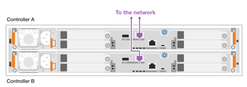
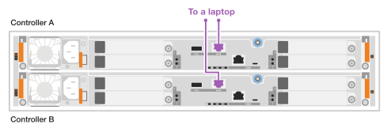

= Complete storage system setup - EF50, EF50C, EF80, and EF80C
:icons: font
:imagesdir: ../media/

[.lead]
Cable and configure the controller management ports, and then configure and manage your EF50, EF50C, EF80, or EF80C storage system.

== Step 1: Cable and configure the management ports

You can configure the controller management ports using a DHCP server or a static IP address.

[role="tabbed-block"]
====

.Option 1: DHCP server

--

Configure the management ports using a DHCP server.

.Before you begin

* Configure your DHCP server to associate an IP address, subnet mask, and gateway address as a permanent lease for each controller.
* Obtain the assigned IP addresses to connect to the storage system from your network administrator.

.Steps

. Connect an Ethernet cable to each controller's management port, and connect the other end to your network.
+

. Open a browser and connect to the storage system using one of the controller IP addresses provided to you by your network administrator.

--

.Option 2: Static IP address
--

Configure the management ports manually by entering the IP address and the subnet mask.

.Before you begin

* Obtain the controllers' IP address, subnet mask, gateway address, and DNS and NTP server information from your network administrator.
* Make sure the laptop you are using is not receiving network configuration from a DHCP server.

.Steps

. Using an Ethernet cable, connect controller A's management port to the Ethernet port on a laptop.
+

. Open a browser and use the default IP address (169.254.128.101) to establish a connection to the controller. The controller sends back a self-signed certificate. The browser informs you that the connection is not secure.
. Follow the browser's instructions to proceed and launch SANtricity System Manager. If you are unable to establish a connection, verify that you are not receiving network configuration from a DHCP server.
. Set the storage system's password to login.
. Use the network settings provided by your network administrator in the *Configure Network Settings* wizard to configure controller A's network settings, and then select *Finish*.
+
NOTE: Because you reset the IP address, System Manager loses connection to the controller.

. Disconnect the ethernet cable from the storage system, and connect the management port on controller A to your network.
. Open a browser on a computer connected to your network, and enter controller A's newly configured IP address. 
+
NOTE: If you lose the connection to controller A, you can connect an ethernet cable to controller B to reestablish connection to controller A through controller B (169.254.128.102).

. Log in using the password you set previously. The Configure Network Settings wizard will appear.

. Use the network settings provided by your network administrator in the *Configure Network Settings* wizard to configure controller B's network settings, and then select *Finish*.
. Connect controller B to your network.
. Validate controller B's network settings by entering controller B's newly configured IP address in a browser.
+
NOTE: If you lose the connection to controller B, you can use your previously validated connection to controller A to reestablish connection to controller B through controller A.

--
====
== Step 2: Configure storage system

After you have installed your EF50, EF50C, EF80, or EF80C storage system, use SANtricity System Manager to configure and manage your storage system.

.Before You Begin

* Cable and configure your management ports.
* Verify and record your password and IP addresses.

.Steps

. Connect your controller to a web browser.

. Access SANtricity System Manager using the same IP addresses that you used to configure your management ports.

. Use SANtricity System Manager to manage your storage system. 
+
You can refer to the online help included with SANtricity System Manager.

. Use SANtricity System Manager to manage your storage system.
