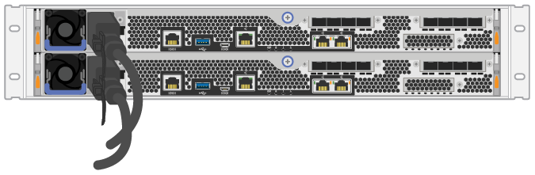

= Power on the hardware - EF50, EF50C, EF80, and EF80C
:icons: font
:imagesdir: ../media/

[.lead]
Attach the power cables and power on your EF50, EF50C, EF80, or EF80C storage system.

.Before you begin

* Install your hardware.
* Take anti-static precautions.

.Steps

. Plug in the power cables, one to each controller (EF600 pictured below).
+
|===
a|
image:../media/power_cable_inst-hw-ef600.png["Power cables"] a|
*Power cables*
|===
+
|===
a|

|===

. Connect the two power cables, one from each controller, to two separate power distribution units (PDUs) in the cabinet or rack.
+
CAUTION: Accessing a EF300 or EF600 controller canister from the shelf can be blocked by third-party PDUs. Do not use power outlets directly behind the controller canister.

. Allow the controller to boot for five minutes before completing the storage system set up and configuration.

.Result

The controller boots automatically. The LEDs flash on and the fans start to indicate that the controller is powering on.

NOTE: Fans are very loud when they first power on.

