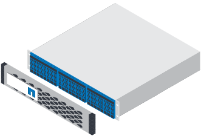
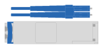

= Prepare to install - EF50, EF50C, EF80, and EF80C
:icons: font
:imagesdir: ../media/

[.lead]
Prepare to install your EF50, EF50C, EF80, or EF80C storage system by getting the site ready, unpacking the boxes and comparing the contents to the packing slip, and registering the storage system to access support benefits.

.Steps

. Use https://hwu.netapp.com[NetApp Hardware Universe^] to confirm that your site meets the environmental and electrical requirements for your storage system.

. Make sure you have adequate cabinet or rack space for your storage system and any switches.
+
If needed, see https://hwu.netapp.com[NetApp Hardware Universe^] for the exact dimensions of your storage system.
+
** 2U for a storage system
** 1U for most switches

. Create an account and register your hardware at http://mysupport.netapp.com/[NetApp Support^].
. Ensure the following items are in the box you received:
+
|===
a|
 a|
Controller shelf with drives installed (bezel packaged separately)
a|
image:../media/superrails_inst-hw-ef600.png["Rack-mount hardware"]
a|
Rack-mount hardware
|===
The following table identifies the types of cables you might receive. If you receive a cable not listed in the table, see https://hwu.netapp.com/[Hardware Universe] to locate the cable and identify its use.
+
[options="header"]
|===
| Connector type| Cable type| Use
a|

a|
RJ-45 Ethernet cables
a|
Management connection
a|

a|
I/O cables
a|
Cabling the data hosts
a|

a|
Power cables
a|
Cabling each controller to a power source
|===

. Make sure you have a supported browser for the management software:

*** Google Chrome (version 89 and later)
*** Microsoft Edge (version 90 and later)
*** Mozilla Firefox (version 80 and later)
*** Safari (version 14 and later)

. Obtain the additional items needed for installation:

** A philips #2 screwdriver
** A flashlight
** An ESD strap

OR use ONTAP-side content as a base and update with above E-Series content as needed

== Step 1: Prepare the site
To install your storage system, ensure that the site and the cabinet or rack that you plan to use meet specifications for your configuration.

.Steps

. Use https://hwu.netapp.com[NetApp Hardware Universe^] to confirm that your site meets the environmental and electrical requirements for your storage system.

. Make sure you have adequate cabinet or rack space for your storage system and any switches?:
+
** 2U for a storage system
** 1U for most switches?

[start=3]

. Install any required network switches?

+

See the https://docs.netapp.com/us-en/ontap-systems-switches/index.html[Switch documentation^] for installation instructions and link:https://hwu.netapp.com[NetApp Hardware Universe^] for compatibility information.

== Step 2: Unpack the boxes
After you've ensured that the site and the cabinet or rack that you plan to use for your storage system meet the required specifications, unpack all boxes and compare the contents to the items on the packing slip.

.Steps

. Carefully open all the boxes and lay out the contents in an organized manner.

. Compare the contents you’ve unpacked with the list on the packing slip. 

+
NOTE: You can get your packing list by scanning the QR code on the side of the shipping carton.

+
The following items are some of the contents you might see in the boxes. 
+
Ensure that everything in the boxes matches the list on the packing slip. If there are any discrepancies, note them down for further action.
+

[%rotate, grid="none", frame="none", cols="12,9,4"]
|===
|*Hardware*
|*Cables* |
a|* Bezel
* Storage system
* Rack-mount hardware with instructions (optional)
* Storage shelf (if you ordered additional storage) 
a|
* Management Ethernet cables (RJ-45 cables)
* Network cables
* Power cords
* USB-C serial console cable? |
|===

== Step 3: Register your storage system
After you've ensured that your site meets the requirements for your storage system specifications, and you've verified that you have all the parts you ordered, you should register your storage system.

.Steps

. Locate the System Serial Numbers (SSN) for every controller being installed. You can find the serial numbers in the following locations:
+
. You can find the serial numbers in the following locations (Andris said in his reg email: the primary system serial number is on the chassis - confirm with Mike):
- On the storage system chassis
- On the packing slip
- In your confirmation email
- On each controller's System Management module
- On each controller

+
image::../media/drw_ssn_label.svg[Example of the system serial number showing location of the number,width=200]
+

. Go to the http://mysupport.netapp.com/[NetApp Support Site^].
. Determine whether you need to register your storage system:
+
[cols="1a,2a" options="header"]
|===
| If you are a...| Follow these steps...
a|
Existing NetApp customer
a|

 .. Sign in with your username and password.
 .. Select *Systems* > *My Systems*.
 .. Confirm that the new serial numbers are listed.
 .. If it is not, follow the instructions for new NetApp customers.

a|
New NetApp customer
a|

 .. Click *Register Now*, and create an account.
 .. Select *Systems* > *Register Systems*.
 .. Enter the storage system's serial numbers and requested details.

After your registration is approved, you can download any required software. The approval process might take up to 24 hours.
|===
