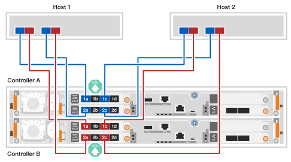
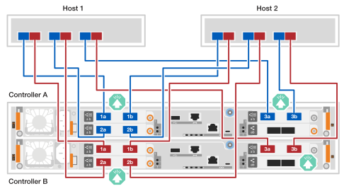
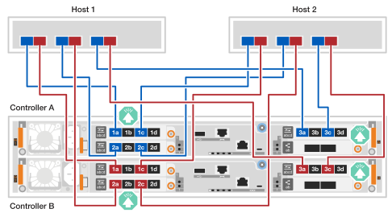
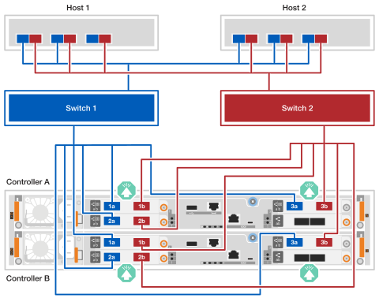

= Cable the hardware - EF50 and EF80
:icons: font
:imagesdir: ../media/

[.lead]
After you install your EF50 or EF80 storage system hardware, cable the inter-controller mirroring, host network connections, and SAS shelves if applicable. (You cable the management ports later in the Complete storage system setup section.)

.About this task

* The term _I/O module_ is used to refer to the host interface cards (HICs) in this procedure.

* The cabling graphics have arrow icons showing the proper orientation (up or down) of the cable connector pull-tab when inserting a connector into a port.
+
As you insert the connector, you should feel it click into place; if you do not feel it click, remove it, turn it over and try again.
+
image:../media/drw_cable_pull_tab_direction_ieops-1699.svg[Cable pull tab direction]

== Step 1: Cable the inter-controller mirroring connections

Cable the controllers to each other to enable inter-controller mirroring. Inter-controller mirroring connections ensure full system redundancy and are used for cache mirroring and I/O shipping. The cabling is the same for EF50 and EF80 storage systems.

NOTE: No matter the speed of the inter-controller mirroring I/O modules installed in your storage system (100 GbE or 200 GbE, as supported by your storage system), you use the included 200 GbE cables. If the speed of the inter-controller mirroring I/O modules is 100 GbE, the connection operates at the lower speed (100 GbE).

.Steps

. Connect the controllers together:
.. Cable controller A port e4a to controller B port e4a. 
.. Cable controller A port e4b to controller B port e4b.
+
*200 GbE Ethernet cables* 
+
image::../media/oie_cable100_gbe_qsfp28.png[100 gbe ethernet cable used for mirroring connections]
+
image:../media/drw_ef50-ef80_mirroring_2p_100gbe_ieops-2659.svg[ef50 and ef80 controller to controller mirroring connection cabling]

== Step 2: Cable the host connections

Cable the host connections for your storage system according to your network topology: direct attached or fabric attached.

.About this task
* Depending on your storage system model, the type of host I/O modules installed in the storage system can be Ethernet or Fibre Channel (FC). The cabling examples in this procedure show both types of host I/O modules as supported by the storage system models.

* Cabling examples do not show 4-port 64Gb FC HBAs in host 1 and host 2; however, if you have these installed, you cable every other port in the same manner as shown for the 2-port HBAs.

//open tabbed block 

[role="tabbed-block"]
=====
.Direct-attached topology
--

The following examples show cabling a storage system to the hosts using a direct-attached topology.

.EF50 with two 4-port 64Gb FC I/O modules
[%collapsible]
====

.About this task
* The cabling example shows host I/O modules in slots 1 and 2. This is the maximum number of host I/O modules supported for the EF50 storage system. However, only the host I/O module in slot 1 is required; the host I/O module in slot 2 is optional.
+
If your storage system has one host I/O module installed, you can ignore the cabling to the additional host I/O module and only cable to the installed host I/O module.

* A direct-attached storage system has two separate paths for redundancy: path A and path B.

** Path A connectivity is shown with blue cabling and blue ports on the hosts and controllers. It connects HBA ports on each host to controller A ports a and c.

** Path B connectivity is shown with red cabling and red ports on the hosts and controllers. It connects HBA ports on each host to controller B ports a and c.

* Although the cabling example shows I/O module ports a and c connected to the hosts, you can use ports a and b or ports c and d.

.Steps

. Cable the hosts to the controllers:
.. Cable host 1 path A (blue) HBA ports to controller A's a ports (1a and 2a).
.. Cable host 1 path B (red) HBA ports to controller B's a ports (1a and 2a).
.. Cable host 2 path A (blue) HBA ports to controller A's c ports (1c and 2c).
.. Cable host 2 path B (red) HBA ports to controller B's c ports (1c and 2c).
+
*64 Gb/s FC cables*
+
image:../media/oie_cable_sfp_gbe_copper.png[64 Gb fc cable]
+

====

.EF80 with three 2-port 200 GbE I/O modules
[%collapsible]
====

.About this task
* The cabling example shows host I/O modules in slots 1, 2, and 3. This is the maximum number of host I/O modules supported for the EF80 storage system. However, only the host I/O module in slot 1 is required; host I/O modules in slot 2 and slot 3 are both optional.
+
If your storage system has fewer host I/O modules installed, you can ignore the cabling to the additional host I/O modules and only cable to the installed host I/O modules.

* A direct-attached storage system has two separate paths for redundancy: path A and path B.

** Path A connectivity is shown with blue cabling and blue ports on the hosts and controllers. It connects HBA ports on each host to controller A ports a and b.

** Path B connectivity is shown with red cabling and red ports on the hosts and controllers. It connects HBA ports on each host to controller B ports a and b.

.Steps

. Cable the hosts to the controllers:
.. Cable host 1 path A (blue) HBA ports to controller A's a ports (e1a, e2a and e3a).
.. Cable host 1 path B (red) HBA ports to controller B's a ports (e1a, e2a and e3a).
.. Cable host 2 path A (blue) HBA ports to controller A's b ports (e1b, e2b and e3b).
.. Cable host 2 path B (red) HBA ports to controller B's b ports (e1b, e2b and e3b).
+
*200 GbE cables*
+
image::../media/oie_cable_sfp_gbe_copper.png[200 GbE cable]
+

====

.EF80 with three 4-port 64Gb FC I/O modules
[%collapsible]
====

.About this task
* The cabling example shows host I/O modules in slots 1, 2, and 3. This is the maximum number of host I/O modules supported for the EF80 storage system. However, only the host I/O module in slot 1 is required; host I/O modules in slot 2 and slot 3 are both optional.
+
If your storage system has fewer host I/O modules installed, you can ignore the cabling to the additional host I/O modules and only cable to the installed host I/O modules.

* A direct-attached storage system has two separate paths for redundancy: path A and path B.

** Path A connectivity is shown with blue cabling and blue ports on the hosts and controllers. It connects HBA ports on each host to controller A ports a and c.

** Path B connectivity is shown with red cabling and red ports on the hosts and controllers. It connects HBA ports on each host to controller B ports a and c.

* Although the cabling example shows I/O module ports a and c connected to the hosts, you can use ports a and b or ports c and d.

.Steps

. Cable the hosts to the controllers:
.. Cable host 1 path A (blue) HBA ports to controller A's a ports (1a, 2a and 3a).
.. Cable host 1 path B (red) HBA ports to controller B's a ports (1a, 2a and 3a).
.. Cable host 2 path A (blue) HBA ports to controller A's c ports (1c, 2c and 3c).
.. Cable host 2 path B (red) HBA ports to controller B's c ports (1c, 2c and 3c).
+
*64 Gb/s FC cables*
+
image:../media/oie_cable_sfp_gbe_copper.png[64 Gb fc cable]
+

====

--
.Fabric-attached topology
--

The following examples show cabling a storage system to the hosts using a fabric-attached topology.

.EF50 with two 4-port 64Gb FC I/O modules
[%collapsible]
====

.About this task
* The cabling example shows host I/O modules in slots 1 and 2. This is the maximum number of host I/O modules supported for the EF50 storage system. However, only the host I/O module in slot 1 is required; the host I/O module in slot 2 is optional.
+
If your storage system has one host I/O module installed, you can ignore the cabling to the additional host I/O module and only cable to the installed host I/O module.

* A fabric-attached storage system has two separate switch paths for redundancy: switch 1 path and switch 2 path.

** Switch 1 path connectivity is shown with blue cabling and blue ports on the hosts and controllers. It connects HBA ports on each host through switch 1 to controller A's and controller B's a and c ports.

** Switch 2 path connectivity is shown with red cabling and red ports on the hosts and controllers. It connects HBA ports on each host through switch 2 to controller A's and controller B's b and d ports.

.Steps

. Connect the hosts to the switches.
+
You can use any ports on the switches.
+
.. Cable host 1 and host 2 switch 1 path (blue) HBA ports to switch 1.
.. Cable host 1 and host 2 switch 2 path (red) HBA ports to switch 2.
+
. Connect the switches to the controllers:
.. Cable switch 1 (blue) to controller A's a and c ports (1a, 2a, 1c, and 2c).
.. Cable switch 1 (blue) to controller B's a and c ports (1a, 2a, 1c, and 2c).
.. Cable switch 2 (red) to controller A's b and d ports (1b, 2b, 1d, and 2d).
.. Cable switch 2 (red) to controller B's b and d ports (1b, 2b, 1d, and 2d).
+
*64 Gb/s FC cables*
+
image:../media/oie_cable_sfp_gbe_copper.png[64 Gb fc cable]
+
image:../media/drw_ef50_4p_64gb_fc_2hic_fabric_ieops-2673.svg[EF50 fabric-attached topology using two 4 port 64gb fc io modules]
====

.EF80 with three 2-port 200 GbE I/O modules
[%collapsible]
====

.About this task
* The cabling example shows host I/O modules in slots 1, 2, and 3. This is the maximum number of host I/O modules supported for the EF80 storage system. However, only the host I/O module in slot 1 is required; host I/O modules in slot 2 and slot 3 are both optional.
+
If your storage system has fewer host I/O modules installed, you can ignore the cabling to the additional host I/O modules and only cable to the installed host I/O modules.

* The cabling example shows three HBAs on each host. If your hosts have less than three HBAs, you can ignore the cabling to the additional HBAs and only cable to the installed HBAs.

* A fabric-attached storage system has two separate switch paths for redundancy: switch 1 path and switch 2 path.

** Switch 1 path connectivity is shown with blue cabling and blue ports on the hosts and controllers. It connects HBA ports on each host through switch 1 to controller A's and controller B's a ports.

** Switch 2 path connectivity is shown with red cabling and red ports on the hosts and controllers. It connects HBA ports on each host through switch 2 to controller A's and controller B's b ports.

.Steps

. Connect the hosts to the switches:
+
You can use any ports on the switches.
+
.. Cable host 1 and host 2 switch 1 path (blue) HBA ports to switch 1.
.. Cable host 1 and host 2 switch 2 path (red) HBA ports to switch 2.
+
. Connect the switches to the controllers:
.. Cable switch 1 (blue) to controller A's a ports (e1a, e2a, and e3a).
.. Cable switch 1 (blue) to controller B's a ports (e1a, e2a, and e3a).
.. Cable switch 2 (red) to controller A's b ports (e1b, e2b, and e3b).
.. Cable switch 2 (red) to controller B's b ports (e1b, e2b, and e3b).
+
*200 GbE cables*
+
image::../media/oie_cable_sfp_gbe_copper.png[200 GbE cable]
+

====

.EF80 with three 4-port 64Gb FC I/O modules
[%collapsible]
====

.About this task
* The cabling example shows host I/O modules in slots 1, 2, and 3. This is the maximum number of host I/O modules supported for the EF80 storage system. However, only the host I/O module in slot 1 is required; host I/O modules in slot 2 and slot 3 are both optional.
+
If your storage system has fewer host I/O modules installed, you can ignore the cabling to the additional host I/O modules and only cable to the installed host I/O modules.

* The cabling example shows three HBAs on each host. If your hosts have less than three HBAs, you can ignore the cabling to the additional HBAs and only cable to the installed HBAs.

* A fabric-attached storage system has two separate switch paths for redundancy: switch 1 path and switch 2 path.

** Switch 1 path connectivity is shown with blue cabling and blue ports on the hosts and controllers. It connects HBA ports on each host through switch 1 to controller A's and controller B's a and c ports.

** Switch 2 path connectivity is shown with red cabling and red ports on the hosts and controllers. It connects HBA ports on each host through switch 2 to controller A's and controller B's b and d ports.

.Steps

. Connect the hosts to the switches:
+
You can use any ports on the switches.
+
.. Cable host 1 and host 2 switch 1 path (blue) HBA ports to switch 1.
.. Cable host 1 and host 2 switch 2 path (red) HBA ports to switch 2.
+
. Connect the switches to the controllers:
.. Cable switch 1 (blue) to controller A's a and c ports (1a, 2a, 3a, 1c, 2c, and 3c).
.. Cable switch 1 (blue) to controller B's a and c ports (1a, 2a, 3a, 1c, 2c, and 3c).
.. Cable switch 2 (red) to controller A's b and d ports (1b, 2b, 3b, 1d, 2d, and 3d).
.. Cable switch 2 (red) to controller B's b and d ports (1b, 2b, 3b, 1d, 2d, and 3d).
+
*64 Gb/s FC cables*
+
image:../media/oie_cable_sfp_gbe_copper.png[64 Gb fc cable]
+
image:../media/drw_ef80_4p_64gb_fc_3hic_fabric_ieops-2675.svg[EF80 fabric-attached topology using three 4 port 64gb fc io modules]

====
--
=====
//closed tabbed block

== Step 3: Cable the SAS shelf connections

The following procedures show how to cable the controllers to one DE460C shelf or a stack of three DE460C shelves.

.About this task

* The cabling examples show DE460C shelves; however, additional SAS shelves are supported, see link:https://hwu.netapp.com[NetApp Hardware Universe^].

* For the maximum number of shelves supported for your storage system and all of your cabling options, such as optical, see link:https://hwu.netapp.com[NetApp Hardware Universe^].

* The cabling graphics show controller A cabling in blue and controller B cabling in red.

* You use the storage cables that came with your storage system, which could be the following cable type:
+
*mini-SAS HD cable*
+
image::../media/oie_cable_mini_sas_hd_to_mini_sas_hd.svg[mini-SAS HD cable,width=100px]

// start tabbed area

[role="tabbed-block"]
====

.Option 1: One DE460C shelf
--
Cable each controller to each IOM12 module on the DE460C shelf so that the controllers have an A-side path (IOMA) and a B-side path (IOMB) to the shelf. 

.Steps

. Cable controller A port 3a to shelf IOMA port 1.
. Cable controller A port 3b to shelf IOMA port 2.
. Cable controller A port 3c to shelf IOMB port 3.
. Cable controller A port 3d to shelf IOMB port 4.
. Cable controller B port 3a to shelf IOMA port 3.
. Cable controller B port 3b to shelf IOMA port 4.
. Cable controller B port 3c to shelf IOMB port 1.
. Cable controller B port 3d to shelf IOMB port 2.

When you are done cabling the shelf, the cabling should look like the following:

image:../media/drw_ef50-ef80_1_de460c_cabling_ieops-2981.svg[cable controller ports to one DE460C shelf]

--
.Option 2: Three DE460C shelves
--
Connect the three shelves together (shelf-to-shelf connections) and then connect each controller to each end of the stack (shelf 1 and shelf 3).

. Cable the shelf-to-shelf connections for the IOMA path:
.. Cable shelf 1 IOMA port 1 to shelf 2 IOMA port 4.
.. Cable shelf 1 IOMA port 2 to shelf 2 IOMA port 3.
.. Cable shelf 2 IOMA port 1 to shelf 3 IOMA port 4.
.. Cable shelf 2 IOMA port 2 to shelf 3 IOMA port 3.

. Cable the shelf-to-shelf connections for the IOMB path:
.. Cable shelf 1 IOMB port 1 to shelf 2 IOMB port 3.
.. Cable shelf 1 IOMB port 2 to shelf 2 IOMB port 4.
.. Cable shelf 2 IOMB port 1 to shelf 3 IOMB port 3.
.. Cable shelf 2 IOMB port 2 to shelf 3 IOMB port 4.

. Cable controller A to shelf 3 and 1:
.. Cable controller A port 3a to shelf 3 IOMA port 1
.. Cable controller A port 3b to shelf 3 IOMA port 2.
.. Cable controller A port 3c to shelf 1 IOMB port 3.
.. Cable controller A port 3d to shelf 1 IOMB port 4.

. Cable controller B to to shelf 1 and 3:
.. Cable controller B port 3a to shelf 1 IOMA port 3.
.. Cable controller B port 3b to shelf 1 IOMA port 4.
.. Cable controller B port 3c to shelf 3 IOMB port 1.
.. Cable controller B port 3d to shelf 3 IOMB port 2.

When you are done cabling the shelves, the cabling should look like the following:

image:../media/drw_ef50-ef80_3_de460c_cabling_ieops-2992.svg[cable controllers to de460c shelves 1 and 3]

--

====

// end tabbed area 

.What's next?

After cabling your storage system, link:install-power-hardware.html[power on your storage system].