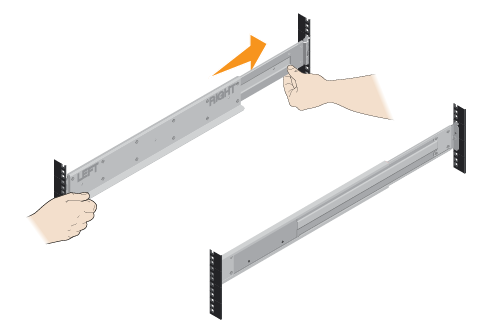
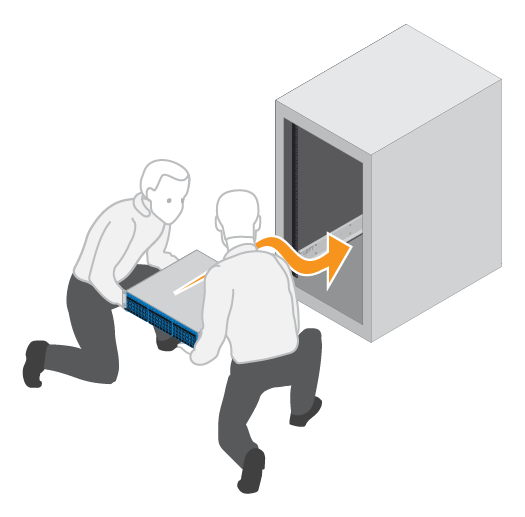

= Install the hardware
:icons: font
:imagesdir: ../media/

[.lead]
You can install an EF300 or EF600 storage system in a two-post rack or a NetApp system cabinet.

.Before you begin

Before you install an EF300 or EF600 storage system, make sure you do the following:

* Register your hardware at http://mysupport.netapp.com/[NetApp Support^].
* Prepare a flat, static-free work area.
* Take anti-static precautions.

.Steps

. Unpack the hardware.
 .. Unpack the contents and inventory the contained hardware against the packing slip.
 .. Before proceeding, read through all the instructions.
. Install the rails.
+
NOTE: To prevent the equipment from toppling over, install the hardware from the bottom of the rack or cabinet up to the top.
+
|===
a|
If instructions were included with your rack-mounting hardware, refer to them to learn  how to install the rails. For additional rack-mounting instructions, see link:../rackmount-hardware.html[Rack-mount hardware].
a|

|===

. Install the shelf.
+
|===
a|

 .. If you are installing multiple shelves, begin installing from the bottom to the top of the cabinet. Position the back of the shelf onto the rails.
+
CAUTION: When installing the shelf, use a team-lift with two people.

 .. Supporting the shelf from the bottom, slide it into the cabinet.

a|

|===

. Secure the shelf.
+
|===
a|
For more information, see link:../rackmount-hardware.html[Rack-mount hardware].
a|
image:../media/secure_shelf_inst-hw-ef600.png[]
|===

. Install the faceplate.
+
|===
a|

 .. Align the faceplate with the shelf, and snap into place.

a|
image:../media/install_faceplate_2_0_inst-hw-ef600.png[]
|===
