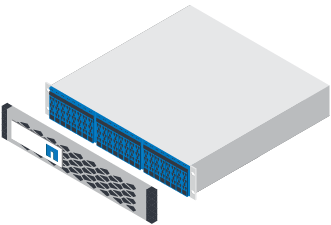
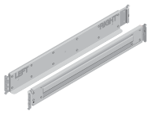

= Prepare for installation
:icons: font
:imagesdir: ../media/

[.lead]
To install your EF300 or EF600 series storage system, you need to create an account and register your hardware. You also need to inventory the appropriate number and type of cables for your storage system and provide some key items required for the hardware installation process.

If you are cabling your EF300 for SAS expansion see the link:../com.netapp.doc.e-f600-sysmaint/home.html[Maintaining EF300 and EF600 Hardware Guide] for SAS expansion card installation and the https://docs.netapp.com/ess-11/topic/com.netapp.doc.e-hw-cabling/home.html[Cabling E-Series Hardware Guide] for SAS expansion cabling.

. Create an account and register your hardware at http://mysupport.netapp.com/[mysupport.netapp.com].
. Ensure that the following items are in the box that you received.
+
|===
a|

a|
Shelf with drives installed     (bezel and end caps packaged separately)
a|

a|
Rack-mount hardware
|===
The following table identifies the types of cables you might receive. If you receive a cable not listed in the table, see https://hwu.netapp.com/[Hardware Universe] to locate the cable and identify its use.
+
|===
| Connector type| Cable type| Use
a|
image:../media/cable_ethernet_inst-hw-ef600.png[]
a|
    RJ-45 Ethernet cables
+
(if ordered)
a|
Management connection
a|
image:../media/cable_io_inst-hw-ef600.png[]
a|
    I/O cables
+
(if ordered)
a|
Cabling the data hosts
a|
image:../media/cable_power_inst-hw-ef600.png[]
a|
Power cables    (if ordered)
a|
Powering up the storage system
|===

. Ensure that you provide the following items.
+
|===
a|
image:../media/screwdriver_inst-hw-ef600.png[]
a|
Phillips #2 screwdriver
a|
image:../media/flashlight_inst-hw-ef600.png[]
a|
Flashlight
a|
image:../media/wrist_strap_inst-hw-ef600.png[]
a|
ESD strap
a|
image:../media/2u_rackspace_inst-hw-ef600.png[]
a|
    2U rack space: A standard 19 in. (48.30 cm) rack to fit 2U shelves of the following dimensions.
+
*Depth*: 19.0 in. (48.3 cm)
+
*Width*: 17.6 in. (44.7 cm)
+
*Height*: 3.34 in. (8.48 cm)
+
*Shelf*: 24-drive
+
*Max Weight*: 60.5 lb (27.4 kg)
+
NOTE: Using third-party cabinets might cause the power cables to restrict access to the controller.
a|

a|
    A supported browser for the management software
+
|===
