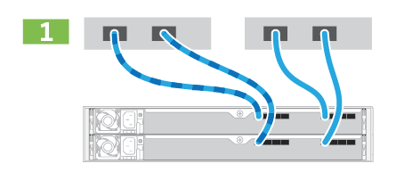
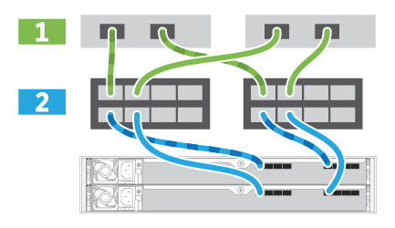
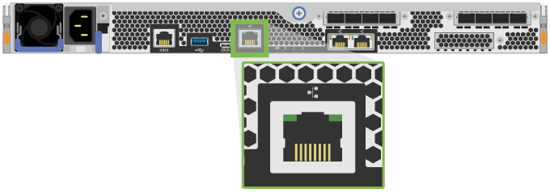

= Complete storage system setup and configuration
:icons: font
:imagesdir: ../media/

[.lead]
You cable the controllers to your network to complete storage system setup and configuration.

== Cable the data hosts

[.lead]
You cable the storage system according to your network topology.

=== Direct-attach topology

[.lead]
The following example shows cabling the data hosts using a direct-attach topology.

==== Example A: Direct-attach topology

|===
a|

a|

. Connect each host adapter directly to the host ports on the controllers.

|===

=== Fabric topology

[.lead]
The following example shows cabling the data hosts using a fabric topology.

==== Example B: Fabric topology

|===
a|

a|

. Connect each host adapter directly to the switch.
. Connect each switch directly to the host ports on the controllers.

|===

== Connect and configure the management connection

[.lead]
You can configure you controller management ports with a DHCP server, or the Configure Network Settings wizard.

* You have obtained the network configuration information from your network administrator for the controllers (IP address, subnet mask, gateway, and DNS and NTP server information).

=== Option 1: Management port configuration with DHCP

[.lead]
You can configure the management ports with a DHCP server.

* Your DHCP server is configured to associate an IP address, subnet mask, and gateway address as a permanent lease for each controller.
* You have obtained the assigned IP addresses you will use to connect to the storage system from your network administrator.

. Connect an Ethernet cable to each controller's management port, and connect the other end to your network.
+
|===
a|
image:../media/cable_ethernet.png[]
a|
RJ-45 Ethernet cables (if ordered)
|===
|===
a|
The following figure shows an example of the controller's management port location:
a|
     *Note:* EF600 pictured above.
+
|===

. Open a browser and connect to the storage system using one of the controller IP addresses provided to you by your network administrator.

=== Option 2: Management Port Configuration with static IP addresses

[.lead]
You configure the management ports manually by entering the IP address and the subnet mask.

* You have obtained the controllers`' IP address, subnet mask, gateway address, and DNS and NTP server information from your network administrator.
* You have ensured that the laptop you are using is not receiving network configuration from a DHCP server.

. Using an Ethernet cable, connect controller A's management port to the Ethernet port on a laptop.
+
NOTE: Controller A is the upper controller canister, and controller B is the lower controller canister.
+
|===
a|
image:../media/cable_ethernet.png[]
a|
RJ-45 Ethernet cables (if ordered)
|===
|===
a|
The following figure shows an example of the controller's management port location:
a|
     *Note:* EF600 pictured above.
+
|===

. Open a browser and use the default IP address (169.254.128.101) to establish a connection to the controller. The controller sends back a self-signed certificate. The browser informs you that the connection is not secure.
. Follow the browser's instructions to proceed and launch SANtricity System Manager.
+
NOTE: If you are unable to establish a connection, verify that you are not receiving network configuration from a DHCP server.

. Set the storage system's password to login.
. Use the network settings provided by your network administrator in the *Configure Network Settings* wizard to configure controller A's network settings, and then select Finish.
+
NOTE: Because you reset the IP address, System Manager loses connection to the controller.

. Disconnect your laptop from the storage system, and connect the management port on controller A to your network.
. Open a browser on a computer connected to your network, and enter controller A's newly configured IP address.
+
IMPORTANT: If you lose the connection to controller A, you can connect an ethernet cable to controller B to reestablish connection to controller A through controller B (169.254.128.102).

. Log in using the password you set previously.
+
The Configure Network Settings wizard will appear.

. Use the network settings provided by your network administrator in the *Configure Network Settings* wizard to configure controller B's network settings, and then select Finish.
. Connect controller B to your network.
. Validate controller B's network settings by entering controller B's newly configured IP address in a browser.
+
IMPORTANT: If you lose the connection to controller B, you can use your previously validated connection to controller A to reestablish connection to controller B through controller A.

== After installing the hardware

[.lead]
After you have installed the EF300 or EF600 hardware, use the SANtricity software to configure and manage your storage system.

* You have configured your management ports and have verified and recorded your password and IP addresses.

. Connect your controller to a web browser, and use SANtricity System Manager to manage your EF300 or EF600 series storage system.
+
|===
a|
image:../media/management_station.png[]
a|

 ** NOTE: You use the same IP addresses that you used to configure your management ports to access SANtricity System Manager.

+
|===
If you are cabling your EF300 for SAS expansion see the link:../com.netapp.doc.e-f600-sysmaint/home.html[Maintaining EF600 Hardware] for SAS expansion card installation and the https://docs.netapp.com/ess-11/topic/com.netapp.doc.e-hw-cabling/home.html[Cabling E-Series hardware] for SAS expansion cabling.
