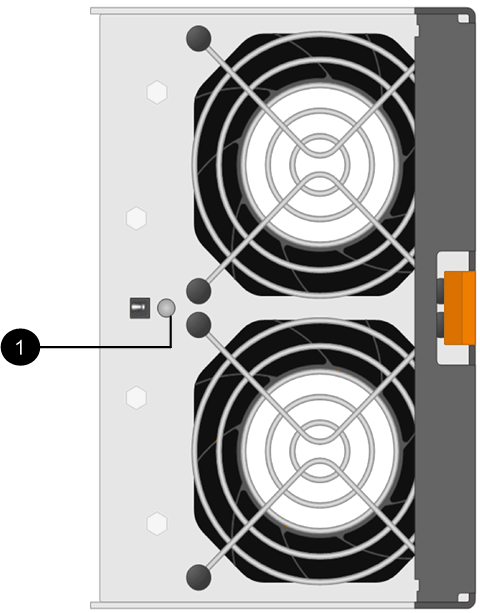

= Replace E2800 fan canister (60-drive)
:experimental:
:icons: font
:imagesdir: ../media/

[.lead]
You can replace a fan canister in an E2800 array with a 60-drive shelf, which include the following shelf types:

* E2860 controller shelf
* DE460C drive shelf

.About this task

Each 60-drive controller shelf or drive shelf includes two fan canisters. If a fan canister fails, you must replace it as soon as possible to ensure that the shelf has adequate cooling.

CAUTION: *Possible equipment damage* -- If you perform this procedure with the power turned on, you must complete it within 30 minutes to prevent the possibility of overheating the equipment.

.Before you begin

* Review the fan canister requirements in link:canisters-overview-supertask-concept.html[Requirements for canister replacement].
* Review the details in the Recovery Guru to confirm that there is an issue with the fan canister and select *Recheck* from the Recovery Guru to ensure no other items must be addressed first.
* Check that the amber Attention LED on the fan canister is on, indicating that the fan has a fault. Contact technical support for assistance if both fan canisters in the shelf have their amber Attention LEDs on.

.Before you begin

* A replacement fan canister (fan) that is supported for your controller shelf or drive shelf model.
* An ESD wristband, or you have taken other antistatic precautions.

== Step 1: Prepare to replace fan canister

Prepare to replace a fan canister in a 60-drive controller shelf or drive shelf by collecting support data about your storage array and locating the failed component.

.Steps

. Collect support data for your storage array using SANtricity System Manager.
 .. Select menu:Support[Support Center > Diagnostics].
 .. Select *Collect Support Data*.
 .. Click *Collect*.
+
The file is saved in the Downloads folder for your browser with the name, *support-data.7z*.
. From SANtricity System Manager, determine which fan canister has failed.
 .. Select *Hardware*.
 .. Look at the fan image:../media/sam1130_ss_hardware_fan_icon_maint-e2800.gif[] icon to the right of the *Shelf* drop-down lists to determine which shelf has the failed fan canister.
+
If a component has failed, this icon is red.

 .. When you find the shelf with a red icon, select *Show back of shelf*.
 .. Select either fan canister or the red fan icon.
 .. On the *Fans* tab, look at the statuses of the fan canisters to determine which fan canister must be replaced.
+
A component with a *Failed* status must be replaced.
+
NOTE: If the second fan canister in the shelf does not have *Optimal* status, do not attempt to hot-swap the failed fan canister. Instead, contact technical support for assistance.

+
You can also find information about the failed fan canister in the Details area of the Recovery Guru, or you can review the Event Log under Support and filter by Component Type.
. From the back of the storage array, look at the Attention LEDs to locate the fan canister you need to remove.
+
You must replace the fan canister that has its Attention LED on.
+

+
*(1)* _Attention LED_. If this LED displays as *Solid amber*, then the fan has a fault.

== Step 2: Remove failed fan canister and install new one

Remove a failed fan canister so you can replace it with a new one.

CAUTION: If you do not turn off the power to your storage array, ensure that you remove and replace the fan canister within 30 minutes to prevent the system from overheating.

.Steps

. Unpack the new fan canister, and place it on a level surface near the shelf.
+
Save all packing material for use when returning the failed fan.

. Press the orange tab to release the fan canister handle.
+
image::../media/28_dwg_e2860_de460c_single_fan_canister_with_orange_tab_callout_maint-e2800.gif[]
+
*(1)* _Tab that you press to release the fan canister handle_

. Use the fan canister handle to pull the fan canister out of the shelf.
+
image::../media/28_dwg_e2860_de460c_fan_canister_handle_with_callout_maint-e2800.gif[]
+
*(1)* _Handle to pull the fan canister out_

. Slide the replacement fan canister all the way into the shelf, and then move the fan canister handle until it latches with the orange tab.

== Step 3: Complete fan canister replacement

Confirm that the new fan canister is working correctly, gather support data, and resume normal operations.

.Steps

. Check the amber Attention LED on the new fan canister.
+
NOTE: After you replace the fan canister, the Attention LED stays on (solid amber) while the firmware checks that the fan canister was installed correctly. The LED goes off after this process is complete.

. From the Recovery Guru in SANtricity System Manager, select *Recheck* to ensure the problem has been resolved.
. If a failed fan canister is still being reported, repeat the steps in <<Step 2: Remove failed fan canister and install new one>>. If the problem persists, contact technical support.
. Remove the antistatic protection.
. Collect support data for your storage array using SANtricity System Manager.
 .. Select menu:Support[Support Center > Diagnostics].
 .. Select *Collect Support Data*.
 .. Click *Collect*.
+
The file is saved in the Downloads folder for your browser with the name, *support-data.7z*.
. Return the failed part to NetApp, as described in the RMA instructions shipped with the kit.

.What's next?

Your fan canister replacement is complete. You can resume normal operations.
