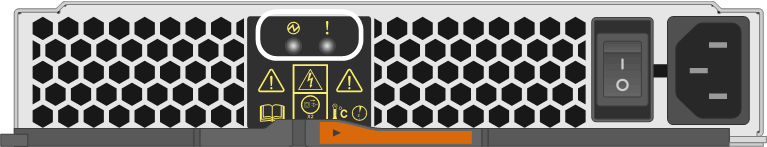
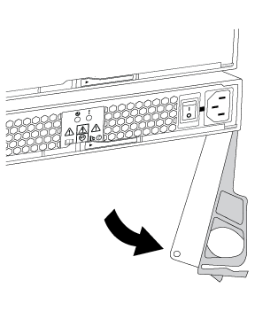

= Replace E2800 power supply (12-drive or 24-drive)
:icons: font
:imagesdir: ../media/

[.lead]
Follow this procedure to replace a power supply in an E2800 array with a 12-drive or 24-drive shelf.

.About this task

Each 12-drive or 24-drive controller shelf or drive shelf includes two power supplies with integrated fans. These are referred to as _power-fan canisters_ in SANtricity System Manager. If a power-fan canister fails, you must replace it as soon as possible to ensure that the shelf has a redundant power source and adequate cooling.

This task describes how to prepare to replace a power supply for the following controller shelves:

* E2812 controller shelf
* E2824 controller shelf
* EF280 flash array
* DE212C drive shelf
* DE224C drive shelf

You can replace a power supply while your storage array is powered on and performing host I/O operations, as long as the second power supply in the shelf has an Optimal status and the **OK to remove** field in the Details area of the Recovery Guru in SANtricity System Manager displays *Yes*.

.Before you begin

* Review the power supply requirements in link:canisters-overview-supertask-concept.html[Requirements for canister replacement].
* You have reviewed the details in the Recovery Guru to confirm that there is an issue with the power supply. Select *Recheck* from the Recovery Guru to ensure no other items must be addressed first.
* You have checked that the amber Attention LED on the power supply is on, indicating that the power supply or its integrated fan has a fault. Contact technical support for assistance if both power supplies in the shelf have their amber Attention LEDs on.

== Step 1: Prepare to replace power supply

Prepare to replace a power supply in a 12-drive or 24-drive controller shelf or drive shelf.

.Steps

. Collect support data for your storage array using SANtricity System Manager.
 .. Select *Support* > *Support Center* > *Diagnostics*.
 .. Select *Collect Support Data*.
 .. Click *Collect*.
The file is saved in the Downloads folder for your browser with the name support-data.7z.
. From SANtricity System Manager, determine which power supply has failed.
+
You can find this information in the Details area of the Recovery Guru, or you can review the information displayed for the shelf.

 .. Select *Hardware*.
 .. Look at the power image:../media/sam1130_ss_hardware_power_icon_maint-e2800.gif[] and fan image:../media/sam1130_ss_hardware_fan_icon_maint-e2800.gif[] icons to the right of the *Shelf* drop-down lists to determine which shelf has the failed power supply.
+
If a component has failed, either or both of these icons are red.

 .. When you find the shelf with a red icon, select *Show back of shelf*.
 .. Select either power supply.
 .. On the *Power Supplies* and *Fans* tabs, look at the statuses of the power-fan canisters, the power supplies, and the fans to determine which power supply must be replaced.
+
A component with a *Failed* status must be replaced.
+
NOTE: If the second power supply canister in the shelf does not have *Optimal* status, do not attempt to hot-swap the failed power supply. Instead, contact technical support for assistance.

. From the back of the storage array, look at the Attention LEDs to locate the power supply you need to remove.
+
You must replace the power supply that has its Attention LED on.
+

+
image:../media/drw_sas_power_icon_maint-e2800.gif[] Power LED: If it is *solid green*, the power supply is functioning correctly. If it is *Off*, the power supply failed, the AC switch is turned off, the AC power cord is not properly installed, or the AC power cord input voltage is not within margin (there is a problem at the source end of the AC power cord).
+
image:../media/drw_sas_fault_icon_maint-e2800.gif[] Attention LED: If it is *solid amber*, the power supply or its integrated fan has a fault.

== Step 2: Remove failed power supply

Remove a failed power supply so you can replace it with a new one.

.What you'll need

* An ESD wristband, or you have taken other antistatic precautions.

.Steps

. Unpack the new power supply, and set it on a level surface near the drive shelf.
+
Save all packing materials for use when returning the failed power supply.

. Turn off the power supply and disconnect the power cables:
 .. Turn off the power switch on the power supply.
 .. Open the power cord retainer, and then unplug the power cord from the power supply.
 .. Unplug the power cord from the power source.
. Squeeze the latch on the power supply cam handle, and then open the cam handle to fully release the power supply from the mid plane.
+

. Use the cam handle to slide the power supply out of the system.
+
CAUTION: When removing a power supply, always use two hands to support its weight.
+
As you remove the power supply, a flap swings into place to block the empty bay, helping to maintain air flow and cooling.

== Step 3: Install new power supply

Install a new power supply to replace the failed one.

.What you'll need

* A replacement power supply that is supported for your controller shelf or drive shelf model.

.Steps

. Make sure that the on/off switch of the new power supply is in the *Off* position.
. Using both hands, support and align the edges of the power supply with the opening in the system chassis, and then gently push the power supply into the chassis using the cam handle.
+
The power supplies are keyed and can only be installed one way.
+
CAUTION: Do not use excessive force when sliding the power supply into the system; you can damage the connector.

. Close the cam handle so that the latch clicks into the locked position and the power supply is fully seated.
. Reconnect the power supply cabling:
 .. Reconnect the power cord to the power supply and the power source.
 .. Secure the power cord to the power supply using the power cord retainer.
. Turn on the power to the new power supply canister.

== Step 4: Complete power supply replacement

Confirm that the new power supply is working correctly, gather support data, and resume normal operations.

.Steps

. On the new power supply, check that the green Power LED is on and the amber Attention LED is OFF.
. From the Recovery Guru in SANtricity System Manager, select *Recheck* to ensure the problem has been resolved.
. If a failed power supply is still being reported, repeat the steps in _Step 2: Remove failed power supply_ and in _Step 3: Install new power supply_. If the problem continues to persist, contact technical support.
. Remove the antistatic protection.
. Collect support data for your storage array using SANtricity System Manager.
 .. Select *Support* > *Support Center* > *Diagnostics*.
 .. Select *Collect Support Data*.
 .. Click *Collect*.
The file is saved in the Downloads folder for your browser with the name support-data.7z.
. Return the failed part to NetApp, as described in the RMA instructions shipped with the kit.

.Result

Your power supply replacement is complete. You can resume normal operations.
