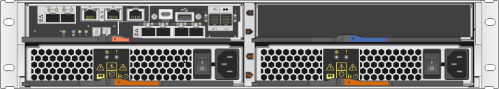
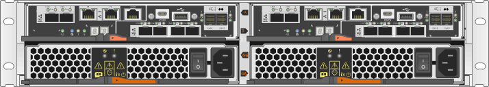

= Overview and requirements
:icons: font
:imagesdir: ../media/

[.lead]
Before you replace or add a controller you need to be aware of certain requirements and considerations.

== Controller overview

[.lead]
Each controller canister contains a controller card, a battery, and an optional host interface card (HIC). You can add a second controller to a simplex configuration or replace a failed controller.

=== Add second controller

You can add a second controller canister to the simplex version of the following controller shelves:

* E2812 controller shelf
* E2824 controller shelf
* EF280 flash array

The figures show an example controller shelf before adding a second controller (one controller canister and a controller blank) and after adding a second controller (two controller canisters).

NOTE: The figures show example controller canisters; the host ports on your controller canisters might be different.

=== Replace controller

When you replace a failed controller canister, you must remove the battery and HIC, if one is installed, from the original controller canister, and install them in the replacement controller canister.

You can determine if you have a failed controller canister in two ways:

* The Recovery Guru in SANtricity System Manager directs you to replace the controller canister.
* The amber Attention LED on the controller canister is on, indicating that the controller has a fault.

image::../media/28_dwg_2800_controller_attn_led.gif[]

image:../media/legend_icon_01.gif[]Attention LED

NOTE: The figure shows an example controller canister; the host ports on your controller canister might be different.

== Requirements for replacing or adding a controller

[.lead]
If you plan to replace a controller or add a second controller, keep the following requirements in mind.

=== Requirements for adding a second controller

* You must have a new controller canister with the same part number as the currently installed controller canister.
* If the currently installed controller canister includes a host interface card (HIC), you must have a new HIC that is identical to the HIC in the currently installed controller canister.
* You must have all cables, transceivers, switches, and host bus adapters (HBAs) needed to connect the new controller ports.
+
For information about compatible hardware, refer to the https://mysupport.netapp.com/NOW/products/interoperability[NetApp Interoperability Matrix] or the http://hwu.netapp.com/home.aspx[NetApp Hardware Universe].

* You must have installed a multipath driver on the host so that you can use both controllers. Refer to the link:../com.netapp.doc.ssm-exp-ic-lin/home.html[Linux express configuration], link:../com.netapp.doc.ssm-exp-ic-win/home.html[Windows express configuration], or link:../com.netapp.doc.ssm-exp-ic-vm/home.html[VMware express configuration] for instructions.
* You have an ESD wristband, or you have taken other antistatic precautions.
* You must have a #1 Phillips screwdriver.
* You must have labels to identify the new cables.
* You must have installed SANtricity Storage Manager on a management station, so you can use the storage array's command line interface (CLI).
+
If SANtricity Storage Manager has not yet been installed, follow the instructions in the link:../com.netapp.doc.ssm-exp-ic-lin/home.html[Linux express configuration], link:../com.netapp.doc.ssm-exp-ic-win/home.html[Windows express configuration], or link:../com.netapp.doc.ssm-exp-ic-vm/home.html[VMware express configuration] to download and install the software.

=== Requirements for replacing a failed controller

* You must have a replacement controller canister with the same part number as the controller canister you are replacing.
* You have an ESD wristband, or you have taken other antistatic precautions.
* You must use labels to identify each cable that is connected to the controller canister.
* You must have a #1 Phillips screwdriver.
* You must have installed SANtricity Storage Manager on a management station, so you can use the storage array's command line interface (CLI).
+
If this software has not yet been installed, follow the instructions in the link:../com.netapp.doc.ssm-exp-ic-lin/home.html[Linux express configuration], link:../com.netapp.doc.ssm-exp-ic-win/home.html[Windows express configuration], or link:../com.netapp.doc.ssm-exp-ic-vm/home.html[VMware express configuration] to download and install it.

*Duplex configuration*

If the controller shelf has two controllers (duplex configuration), you can replace a controller canister while your storage array is powered on and performing host I/O operations, as long as the following conditions are true:

* The second controller canister in the shelf has Optimal status.
* The *OK to remove* field in the Details area of the Recovery Guru in SANtricity System Manager displays *Yes*, indicating that it is safe to remove this component.

*Simplex configuration*

If you have only one controller canister (simplex configuration), data on the storage array will not be accessible until you replace the controller canister. You must stop host I/O operations and power down the storage array.
