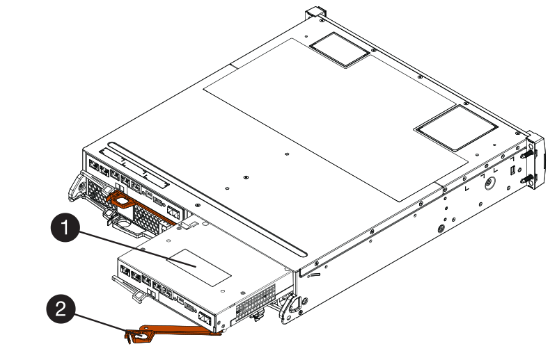
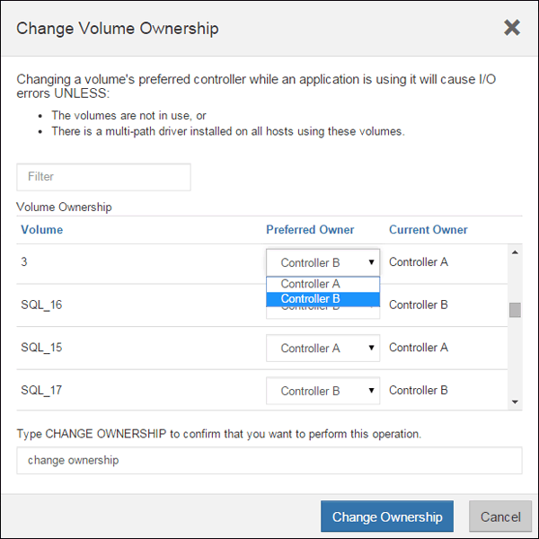

= Add second controller canister in E2800
:experimental:
:icons: font
:imagesdir: ../media/

[.lead]
You can add a second controller canister in the E2800 array.

.About this task

This task describes how to add a second controller canister to the simplex version of either a E2812 controller shelf, E2824 controller shelf, or EF280 flash array. This procedure is also referred to as a simplex-to-duplex conversion, which is an online procedure. You can access data on the storage array while you perform this procedure.

.Before you begin

Make sure you have the following:

* A new controller canister with the same part number as the currently installed controller canister. (See step 1 to verify the part number.)
* A new HIC that is identical to the HIC in the currently installed controller canister (only necessary if the currently installed controller canister includes a host interface card).
* An ESD wristband, or take other antistatic precautions.
* A #1 Phillips screwdriver.
* Labels to identify the new cables. For information about compatible hardware, refer to the https://mysupport.netapp.com/NOW/products/interoperability[NetApp Interoperability Matrix^] or the http://hwu.netapp.com/home.aspx[NetApp Hardware Universe^].
* All cables, transceivers, switches, and host bus adapters (HBAs) needed to connect the new controller ports.
* A management station with a browser that can access SANtricity System Manager for the controller. (To open the System Manager interface, point the browser to the controller's domain name or IP address.)

== Step 1: Verify the new controller's part number

Confirm that the new controller has the same part number as the currently installed controller.

.Steps

. Unpack the new controller canister, and set it on a flat, static-free surface.
. Locate the MAC address and FRU part number labels on the back of the controller canister.
+
image::../media/28_dwg_e2800_labels_maint-e2800.gif[]
+
*(1)* _MAC address:_ The MAC address for management port 1 ("`P1`"). If you used DHCP to obtain the original controller's IP address, you will need this address to connect to the new controller.
+
*(2)* _FRU part number:_ This number must match the replacement part number for the currently installed controller.
+

. From SANtricity System Manager, locate the replacement part number for the installed controller canister.
 .. Select *Hardware*.
 .. Locate the controller shelf, which is marked with the controller icon image:../media/sam1130_ss_hardware_controller_icon_maint-e2800.gif[].
 .. Click the controller icon.
 .. Select the controller, and click *Next*.
 .. On the *Base* tab, make a note of the *Replacement Part Number* for the controller.
. Confirm that the replacement part number for the installed controller is the same as the FRU part number for the new controller.
+
CAUTION: *Possible loss of data access* -- If the two part numbers are not the same, do not attempt this procedure. In addition, if the original controller canister includes a host interface card (HIC), you must install an identical HIC into the new controller canister. The presence of mismatched controllers or HICs will cause the new controller to lock down when you bring it online.

== Step 2: Install host interface card

If the currently installed controller includes a HIC, you must install the same model of host interface card (HIC) in the second controller canister.

.Steps

. Unpack the new HIC, and confirm it is identical to the existing HIC.
+
CAUTION: *Possible loss of data access* -- The HICs installed in the two controller canisters must be identical. If the replacement HIC is not identical to the HIC you are replacing, do not attempt this procedure. The presence of mismatched HICs will cause the new controller to lock down when it comes online.

. Turn the new controller canister over, so that the cover faces up.
. Press the button on the cover, and slide the cover off.
. Using a #1 Phillips screwdriver, remove the four screws that attach the blank faceplate to the controller canister, and remove the faceplate.
. Align the three thumbscrews on the HIC with the corresponding holes on the controller, and align the connector on the bottom of the HIC with the HIC interface connector on the controller card.
+
Be careful not to scratch or bump the components on the bottom of the HIC or on the top of the controller card.

. Carefully lower the HIC into place, and seat the HIC connector by pressing gently on the HIC.
+
CAUTION: *Possible equipment damage* -- Be very careful not to pinch the gold ribbon connector for the controller LEDs between the HIC and the thumbscrews.
+
image::../media/28_dwg_e2800_hic_thumbscrews_maint-e2800.gif[]
+
*(1)* _Host interface card_
+
*(2)* _Thumbscrews_

. Hand-tighten the HIC thumbscrews.
+
Do not use a screwdriver, or you might over tighten the screws.

. Using a #1 Phillips screwdriver, attach the new HIC faceplate to the controller canister with the four screws you removed previously.
+
image::../media/28_dwg_e2800_hic_faceplace_screws_maint-e2800.gif[]

. Reinstall the cover on the controller canister by sliding the cover from back to front until the button clicks.
. Set the controller canister aside until you are ready to install it.

== Step 3: Collect support data

Collect support data before and after replacing a component to ensure you can send a full set of logs to technical support in case the replacement does not resolve the problem.

.Steps

. From the Home page of SANtricity System Manager, ensure that the storage array has Optimal status.
+
If the status is not Optimal, use the Recovery Guru or contact technical support to resolve the problem. Do not continue with this procedure.

. Collect support data for your storage array using SANtricity System Manager.
 .. Select menu:Support[Support Center > Diagnostics].
 .. Select *Collect Support Data*.
 .. Click *Collect*.
+
The file is saved in the Downloads folder for your browser with the name, *support-data.7z*.
. Ensure that no I/O operations are occurring between the storage array and all connected hosts. For example, you can perform these steps:
 * Stop all processes that involve the LUNs mapped from the storage to the hosts.
 * Ensure that no applications are writing data to any LUNs mapped from the storage to the hosts.
 * Unmount all file systems associated with volumes on the array.
+
NOTE: The exact steps to stop host I/O operations depend on the host operating system and the configuration, which are beyond the scope of these instructions. If you are not sure how to stop host I/O operations in your environment, consider shutting down the host.
+
CAUTION: *Possible data loss* -- If you continue this procedure while I/O operations are occurring, you might lose data.

== Step 4: Change configuration to duplex

Before adding a second controller to the controller shelf, you must change the configuration to duplex by installing a new NVSRAM file and using the command line interface to set the storage array to duplex. The duplex version of the NVSRAM file is included with the download file for SANtricity OS Software (controller firmware).

.Steps

. Download the latest NVSRAM file from the NetApp Support site to your management client.

.. From SANtricity System Manager, select menu:Support[Upgrade Center]. In the area labeled “SANtricity OS Software upgrade,” click *NetApp SANtricity OS Downloads*.

.. From the NetApp Support site, select *E-Series SANtricity OS Controller software*.
.. Follow the online instructions to select the version of NVSRAM you want to install, and then complete the file download. Be sure to select the  duplex version of the NVSRAM (the file has "`D`" near the end of its name).
+
The file name will be similar to: *N290X-830834-D01.dlp*

. Upgrade the files using SANtricity System Manager.
+
CAUTION: *Risk of data loss or risk of damage to the storage array* -- Do not make changes to the storage array while the upgrade is occurring. Maintain power to the storage array.
+
You can cancel the operation during the pre-upgrade health check, but not during transferring or activating.

 * From SANtricity System Manager:
  .. Under *SANtricity OS Software upgrade*, click *Begin Upgrade*.
  .. Next to *Select Controller NVSRAM file*, click *Browse*, and then select the NVSRAM file you downloaded.
  .. Click *Start*, and then confirm that you want to perform the operation.
+
The upgrade begins and the following occurs:

** The pre-upgrade health check begins. If the pre-upgrade health check fails, use the Recovery Guru or contact technical support to resolve the problem.
** The controller files are transferred and activated. The time required depends on your storage array configuration.
** The controller reboots automatically to apply the new settings.
+
 * Alternatively, you can use the following CLI command to perform the upgrade:
+
----
download storageArray NVSRAM file="filename" healthCheckMelOverride=FALSE;
----
+
In this command, `filename` is the file path and the file name for duplex version of the Controller NVSRAM file (the file with "`D`" in its name). Enclose the file path and the file name in double quotation marks (" "). For example:
+
----
file="C:\downloads\N290X-830834-D01.dlp"
----

. (Optional) To see a list of what was upgraded, click *Save Log*.
+
The file is saved in the Downloads folder for your browser with the name, *latest-upgrade-log-timestamp.txt*.

 * After upgrading controller NVSRAM, verify the following in SANtricity System Manager:

 ** Go to the Hardware page, and verify that all components appear.

 ** Go to the Software and Firmware Inventory dialog box (go to menu:Support[Upgrade Center], and then click the link for *Software and Firmware Inventory*). Verify the new software and firmware versions.

 * When you upgrade controller NVSRAM, any custom settings that you have applied to the existing NVSRAM are lost during the process of activation. You must apply the custom settings to the NVSRAM again after the process of activation is complete.

. Change the storage array setting to duplex using CLI commands. To use CLI, you can either open a command prompt if you downloaded the CLI package or you can open the Enterprise Management Window (EMW) if you have Storage Manager installed.

* From a command prompt:
.. Use the following command to switch the array from simplex to duplex:
+
----
set storageArray redundancyMode=duplex;
----
.. Use the following command to reset the controller.
+
----
reset controller [a];
----

* From the EMW interface:
.. Select the storage array.
.. Select menu:Tools[Execute Script].
.. Type the following command in the text box.
+
----
set storageArray redundancyMode=duplex;
----
+
.. Select menu:Tools[Verify and Execute].
.. Type the following command in the text box.
+
----
reset controller [a];
----
+
.. Select menu:Tools[Verify and Execute].

After the controller reboots, an "`alternate controller missing`" error message is displayed. This message indicates that controller A has been successfully converted to duplex mode. This message persists until you install the second controller and connect the host cables.

== Step 5: Remove the controller blank

Remove the controller blank before you install the second controller. A controller blank is installed in controller shelves that have only one controller.

.Steps

. Squeeze the latch on the cam handle for the controller blank until it releases, and then open the cam handle to the right.
. Slide the blank controller canister out of the shelf and set it aside.
+
When you remove the controller blank, a flap swings into place to block the empty bay.

== Step 6: Install second controller canister

Install a second controller canister to change a simplex configuration to a duplex configuration.

.Steps

. Turn the controller canister over, so that the removable cover faces down.
. With the cam handle in the open position, slide the controller canister all the way into the controller shelf.
+

+
*(1)* _Controller canister_
+
*(2)* _Cam handle_

. Move the cam handle to the left to lock the controller canister in place.
. Insert any SFP+ transceivers, and connect cables to the new controller.

== Step 7: Complete adding a second controller

Complete the process of adding a second controller by confirming that it is working correctly, reinstall the duplex NVSRAM file, distribute volumes between the controllers, and collect support data.

.Steps

. As the controller boots, check the controller LEDs and the seven-segment display.
+
When communication with the other controller is reestablished:

 ** The seven-segment display shows the repeating sequence *OS*, *OL*, *_blank_* to indicate that the controller is offline.
 ** The amber Attention LED remains on.
 ** The Host Link LEDs might be on, blinking, or off, depending on the host interface.
image:../media/28_dwg_attn_led_7s_display_maint-e2800.gif[]
+
*(1)* _Attention LED (amber)_
+
*(2)* _Seven-segment display_
+
*(3)* _Host Link LEDs_
+
. Check the codes on the controller's seven-segment display as it comes online. If the display shows one of the following repeating sequences, immediately remove the controller.
 * *OE*, *L0*, *_blank_* (mismatched controllers)
 * *OE*, *L6*, *_blank_* (unsupported HIC)
+
CAUTION: *Possible loss of data access* -- If the controller you just installed shows one these codes, and the other controller is reset for any reason, the second controller could also lock down.

. Update the array's settings from simplex to duplex with the following CLI command:
+
`set storageArray redundancyMode=duplex;`

. From SANtricity System Manager, confirm that the controller's status is Optimal.
+
If the status is not Optimal or if any of the Attention LEDs are on, confirm that all cables are correctly seated, and check that the controller canister is installed correctly. If necessary, remove and reinstall the controller canister.
+
NOTE: If you cannot resolve the problem, contact technical support.

. Reinstall the duplex version of the NVSRAM file using SANtricity System Manager.
+
This step ensures that both controllers have an identical version of this file.
+
CAUTION: *Risk of data loss or risk of damage to the storage array* -- Do not make changes to the storage array while the upgrade is occurring. Maintain power to the storage array.
+
NOTE: You must install SANtricity OS software when you install a new NVSRAM file using SANtricity System Manager. If you already have the latest version of SANtricity OS software, you must reinstall that version.

  .. If necessary, download the latest version of the SANtricity OS software from the NetApp Support site.
  .. In System Manager, go to the Upgrade Center.
  .. Under *SANtricity OS Software upgrade*, click *Begin Upgrade*.
  .. Click *Browse*, and select the SANtricity OS software file.
  .. Click *Browse*, and select the Controller NVSRAM file.
  .. Click *Start*, and confirm that you want to perform the operation.
+
The transfer of control operation begins.
+
. After the controllers reboot, optionally distribute volumes between controller A and the new controller B.
 .. Select menu:Storage[Volumes].
 .. From the All Volumes tab, select menu:More[Change Ownership].
 .. Type the following command in the text box: `change ownership`
+
The Change Ownership button is enabled.

 .. For each volume you want to redistribute, select *Controller B* from the *Preferred Owner* list.
+

 .. Click *Change Ownership*.
+
When the process is complete, the Change Volume Ownership dialog shows the new values for *Preferred Owner* and *Current Owner*.
. Collect support data for your storage array using SANtricity System Manager.
 .. Select menu:Support[Support Center > Diagnostics].
 .. Click *Collect*.
+
The file is saved in the Downloads folder for your browser with the name, *support-data.7z*.

.What's next?

The process of adding a second controller is complete. You can resume normal operations.
