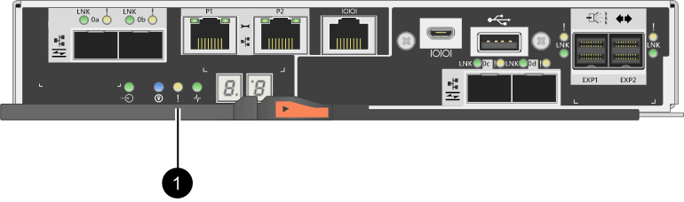

= Replace controller in E2800 simplex configuration
:experimental:
:icons: font
:imagesdir: ../media/

[.lead]
You can replace a failed controller canister in a simplex (single-controller) configuration, for the following controller shelves:

* E2812 controller shelf
* E2824 controller shelf
* EF280 flash array

.About this task

The controller canister contains a controller card, a battery, and an optional host interface card (HIC). When you replace a failed controller canister, you must remove the battery and HIC, if one is installed, from the original controller canister, and install them in the replacement controller canister.

This procedure applies to IOM12 and IOM12B drive shelves.

NOTE: This procedure is for like-for-like shelf IOM hot-swaps or replacements. This means you can only replace an IOM12 module with another IOM12 module or replace an IOM12B module with another IOM12B module. (Your shelf can have two IOM12 modules or have two IOM12B modules.)

.What you'll need

* A replacement controller canister with the same part number as the controller canister you are replacing.
* An ESD wristband, or you have taken other antistatic precautions.
* Labels to identify each cable that is connected to the controller canister.
* #1 Phillips screwdriver.
* A management station with a browser that can access SANtricity System Manager for the controller. (To open the System Manager interface, point the browser to the controller's domain name or IP address.)

== Step 1: Prepare to replace controller (simplex)

Prepare to replace a controller canister by saving the drive security key, backing up the configuration, and collecting support data. Then, you can stop host I/O operations and power down the controller shelf.

.Steps

. If possible, make a note of which version of SANtricity OS software is currently installed on the controller. Open SANtricity System Manager and select menu:Support[Upgrade Center > View Software and Firmware Inventory].
. If the Drive Security feature is enabled, be sure a saved key exists and that you know the pass phrase required to install it.
+
CAUTION: *Possible loss of data access* -- If all drives in the storage array are security enabled, the new controller will not be able to access the storage array until you unlock the secured drives using the Enterprise Management Window in SANtricity Storage Manager.
+
To save the key (might not be possible, depending on the state of the controller):

 .. From SANtricity System Manager, select menu:Settings[System].
 .. Under *Drive security key management*, select *Back Up Key*.
 .. In the *Define a pass phrase/Re-enter pass phrase* fields, enter and confirm a pass phrase for this backup copy.
 .. Click *Backup*.
 .. Record your key information in a secure location, and then click *Close*.
+
. Back up the storage array's configuration database using SANtricity System Manager.
+
If a problem occurs when you remove a controller, you can use the saved file to restore your configuration. The system will save the current state of the RAID configuration database, which includes all data for volume groups and disk pools on the controller.
+
* From System Manager:
 .. Select menu:Support[Support Center > Diagnostics].
 .. Select *Collect Configuration Data*.
 .. Click *Collect*.
+
The file is saved in the Downloads folder for your browser with the name, *configurationData-<arrayName>-<dateTime>.7z*.

* Alternatively, you can back up the configuration database by using the following CLI command:
+
`save storageArray dbmDatabase sourceLocation=onboard contentType=all file="filename";`
+
. Collect support data for your storage array using SANtricity System Manager.
+
If a problem occurs when you remove a controller, you can use the saved file to troubleshoot the issue. The system will save inventory, status, and performance data about your storage array in a single file.
+
.. Select menu:Support[Support Center > Diagnostics].
.. Select *Collect Support Data*.
.. Click *Collect*.
+
The file is saved in the Downloads folder for your browser with the name, *support-data.7z*.

. Ensure that no I/O operations are occurring between the storage array and all connected hosts. For example, you can perform these steps:
 ** Stop all processes that involve the LUNs mapped from the storage to the hosts.
 ** Ensure that no applications are writing data to any LUNs mapped from the storage to the hosts.
 ** Unmount all file systems associated with volumes on the array.
+
NOTE: The exact steps to stop host I/O operations depend on the host operating system and the configuration, which are beyond the scope of these instructions. If you are not sure how to stop host I/O operations in your environment, consider shutting down the host.
+
CAUTION: *Possible data loss* -- If you continue this procedure while I/O operations are occurring, you might lose data.
. Wait for any data in cache memory to be written to the drives.
+
The green Cache Active LED on the back of the controller is on when cached data needs to be written to the drives. You must wait for this LED to turn off.

. From the home page of SANtricity System Manager, select *View Operations in Progress*.
. Confirm that all operations have completed before continuing with the next step.
. Turn off both power switches on the controller shelf.
. Wait for all LEDs on the controller shelf to turn off.
. Select *Recheck* from the Recovery Guru, and confirm that the *OK to remove* field in the Details area displays *Yes*, indicating that it is safe to remove this component.
+
Data on the storage array will not be accessible until you replace the controller canister.

== Step 2: Remove failed controller (simplex)

Replace the failed canister with a new one.

=== Step 2a: Remove controller canister (simplex)

Remove a controller canister.

.Steps

. Put on an ESD wristband or take other antistatic precautions.
. Label each cable that is attached to the controller canister.
. Disconnect all the cables from the controller canister.
+
CAUTION: To prevent degraded performance, do not twist, fold, pinch, or step on the cables.

. If the HIC ports on the controller canister use SFP+ transceivers, remove the SFPs.
+
Because you must remove the HIC from the failed controller canister, you must remove any SFPs from the HIC ports. However, you can leave any SFPs installed in the baseboard host ports. When you are ready to cable the new controller, you can simply move those SFPs to the new controller canister. This approach is especially helpful if you have more than one type of SFP.

. Confirm that the Cache Active LED on the back of the controller is off.
+
The green Cache Active LED on the back of the controller is on when cached data needs to be written to the drives. You must wait for this LED to turn off before removing the controller canister.
+
NOTE: The figure shows an example controller canister. Your controller might have a different number and a different type of host ports.
+

+
*(1)* _Cache Active LED_

. Squeeze the latch on the cam handle until it releases, and then open the cam handle to the right to release the controller canister from the midplane.
+
image::../media/28_dwg_e2824_remove_controller_canister_simplex_maint-e2800.gif[]
+
*(1)* _Controller canister_
+
*(2)* _Cam handle_

. Using two hands and the cam handle, slide the controller canister out of the shelf.
+
CAUTION: Always use two hands to support the weight of a controller canister.
+
When you remove the controller canister, a flap swings into place to block the empty bay, helping to maintain air flow and cooling.

. Turn the controller canister over, so that the removable cover faces up.
. Place the controller canister on a flat, static-free surface.

=== Step 2b: Remove battery (simplex)

After removing the controller canister from the controller shelf, remove the battery.

.Steps

. Remove the controller canister's cover by pressing down on the button and sliding the cover off.
. Confirm that the green LED inside the controller (between the battery and the DIMMs) is off.
+
If this green LED is on, the controller is still using battery power. You must wait for this LED to go off before removing any components.
+
image::../media/28_dwg_e2800_internal_cache_active_led_maint-e2800.gif[]
+
*(1)* _Internal Cache Active_
+
*(2)* _Battery_

. Locate the blue release latch for the battery.
. Unlatch the battery by pushing the release latch down and away from the controller canister.
+
image::../media/28_dwg_e2800_remove_battery_maint-e2800.gif[]
+
*(1)* _Battery release latch_
+
*(2)* _Battery_

. Lift up on the battery, and slide it out of the controller canister.

=== Step 2c: Remove host interface card (simplex)

If the controller canister includes a host interface card (HIC), remove the HIC from the original controller canister so you can reuse it in the new controller canister.

.Steps

. Using a #1 Phillips screwdriver, remove the screws that attach the HIC faceplate to the controller canister.
+
There are four screws: one on the top, one on the side, and two on the front.
+
image::../media/28_dwg_e2800_hic_faceplace_screws_maint-e2800.gif[]

. Remove the HIC faceplate.
. Using your fingers or a Phillips screwdriver, loosen the three thumbscrews that secure the HIC to the controller card.
. Carefully detach the HIC from the controller card by lifting the card up and sliding it back.
+
CAUTION: Be careful not to scratch or bump the components on the bottom of the HIC or on the top of the controller card.
+
image::../media/28_dwg_e2800_hic_thumbscrews_maint-e2800.gif[]
+
*(1)* _Host interface card_
+
*(2)* _Thumbscrews_

. Place the HIC on a static-free surface.

== Step 3: Install new controller (simplex)

Install a new controller canister to replace the failed one.

=== Step 3a: Install battery (simplex)

Install the battery into the replacement controller canister. You can install the battery that you removed from the original controller canister or install a new battery that you ordered.

.Steps

. Unpack the replacement controller canister, and set it on a flat, static-free surface so that the removable cover faces up.
+
Save the packing materials to use when shipping the failed controller canister.

. Press down on the cover button, and slide the cover off.
. Orient the controller canister so that the slot for the battery faces toward you.
. Insert the battery into the controller canister at a slight downward angle.
+
You must insert the metal flange at the front of the battery into the slot on the bottom of the controller canister, and slide the top of the battery beneath the small alignment pin on the left side of the canister.

. Move the battery latch up to secure the battery.
+
When the latch clicks into place, the bottom of the latch hooks into a metal slot on the chassis.
+
image::../media/28_dwg_e2800_insert_battery_maint-e2800.gif[]
+
*(1)* _Battery release latch_
+
*(2)* _Battery_

. Turn the controller canister over to confirm that the battery is installed correctly.
+
CAUTION: *Possible hardware damage* -- The metal flange at the front of the battery must be completely inserted into the slot on the controller canister (as shown in the first figure). If the battery is not installed correctly (as shown in the second figure), the metal flange might contact the controller board, causing damage to the controller when you apply power.
+
** *Correct* -- The battery's metal flange is completely inserted in the slot on the controller:
+
image:../media/28_dwg_e2800_battery_flange_ok_maint-e2800.gif[]

** *Incorrect* -- The battery's metal flange is not inserted into the slot on the controller:
+
image:../media/28_dwg_e2800_battery_flange_not_ok_maint-e2800.gif[]

=== Step 3b: Install host interface card (simplex)

If you removed a host interface card (HIC) from the original controller canister, install that HIC in the new controller canister.

.Steps

. Using a #1 Phillips screwdriver, remove the four screws that attach the blank faceplate to the replacement controller canister, and remove the faceplate.
. Align the three thumbscrews on the HIC with the corresponding holes on the controller, and align the connector on the bottom of the HIC with the HIC interface connector on the controller card.
+
Be careful not to scratch or bump the components on the bottom of the HIC or on the top of the controller card.

. Carefully lower the HIC into place, and seat the HIC connector by pressing gently on the HIC.
+
CAUTION: *Possible equipment damage* -- Be very careful not to pinch the gold ribbon connector for the controller LEDs between the HIC and the thumbscrews.
+
image::../media/28_dwg_e2800_hic_thumbscrews_maint-e2800.gif[]
+
*(1)* _Host interface card_
+
*(2)* _Thumbscrews_

. Hand-tighten the HIC thumbscrews.
+
Do not use a screwdriver, or you might over tighten the screws.

. Using a #1 Phillips screwdriver, attach the HIC faceplate you removed from the original controller canister to the new controller canister with four screws.
+
image::../media/28_dwg_e2800_hic_faceplace_screws_maint-e2800.gif[]

=== Step 3c: Install new controller canister (simplex)

After installing the battery and the HIC, if one was initially installed, you can install the new controller canister into the controller shelf.

.Steps

. Reinstall the cover on the controller canister by sliding the cover from back to front until the button clicks.
. Turn the controller canister over, so that the removable cover faces down.
. With the cam handle in the open position, slide the controller canister all the way into the controller shelf.
+
image::../media/28_dwg_e2824_remove_controller_canister_simplex_maint-e2800.gif[]
+
*(1)* _Controller canister_
+
*(2)* _Cam handle_

. Move the cam handle to the left to lock the controller canister in place.
. Install the SFPs from the original controller in the host ports on the new controller, and reconnect all the cables.
+
If you are using more than one host protocol, be sure to install the SFPs in the correct host ports.

. Determine how you will assign an IP address to the replacement controller, based on whether you connected its Ethernet port 1 (labeled P1) to a network with a DHCP server and on whether all drives are secured.
+
[options = "header"]
|===
| Using DHCP server?| All drives secured?| Steps
a|
Yes
a|
No
a|
The new controller obtains its IP address from the DHCP server. This value might be different than the original controller's IP address. Locate the MAC address on the label on the back of the replacement controller, and contact your network administrator with this information to obtain the IP address that was assigned by the DHCP server.
a|
Yes
a|
Yes
a|
The new controller obtains its IP address from the DHCP server. This value might be different than the original controller's IP address. Locate the MAC address on the label on the back of the replacement controller, and contact your network administrator with this information to obtain the IP address that was assigned by the DHCP server. You can then unlock the drives using the command line interface.
a|
No
a|
No
a|
The new controller adopts the IP address of the controller you removed.
a|
No
a|
Yes
a|
You must set the IP address of the new controller manually. (You can reuse the IP address of the old controller or use a new IP address.) When the controller has an IP address, you can unlock the drives using the command line interface.     After the drives are unlocked, the new controller will re-use the original controller's IP address automatically.
|===

== Step 4: Complete controller replacement (simplex)

Power on the controller shelf, collect support data, and resume operations.

.Steps

. Turn on the two power switches at the back of the controller shelf.
 ** Do not turn off the power switches during the power-on process, which typically takes 90 seconds or less to complete.
 ** The fans in each shelf are very loud when they first start up. The loud noise during start-up is normal.
. As the controller boots, check the controller LEDs and seven-segment display.
 ** The seven-segment display shows the repeating sequence *OS*, *Sd*, *_blank_* to indicate that the controller is performing Start-of-day (SOD) processing. After a controller has successfully booted up, its seven-segment display should show the tray ID.
 ** The amber Attention LED on the controller turns on and then turns off, unless there is an error.
 ** The green Host Link LEDs turn on.
+
NOTE: The figure shows an example controller canister. Your controller might have a different number and a different type of host ports.
+
image::../media/28_dwg_attn_led_7s_display_maint-e2800.gif[]
+
*(1)* _Attention LED (amber)_
+
*(2)* _Seven-segment display_
+
*(3)* _Host Link LEDs_

+
. If any of the controller shelf's Attention LEDs remain on, check that the controller canister has been installed correctly and that all cables are correctly seated. Reinstall the controller canister, if necessary.
+
NOTE: If you cannot resolve the problem, contact technical support.

. If the storage array has secure drives, import the drive security key; otherwise, go to the next step. Follow the appropriate procedure below for a storage array with all secure drives or a mix of secure and unsecure drives.
+
NOTE: _Unsecure drives_ are unassigned drives, global hot spare drives, or drives that are part of a volume group or a pool that is not secured by the Drive Security feature. _Secure drives_ are assigned drives that are a part of a secured volume group or disk pool using Drive Security.

* *Only secured drives (no unsecure drives)*:
 .. Access the storage array's command line interface (CLI).
 .. Enter the following command to import the security key:
+
----
import storageArray securityKey file="C:/file.slk"
passPhrase="passPhrase";
----
+
where:

  ** `C:/file.slk` represents the directory location and name of your drive security key
  ** `passPhrase` is the pass phrase needed to unlock the file
After the security key has been imported, the controller reboots, and the new controller adopts the saved settings for the storage array.
+
.. Go to the next step to confirm that the new controller is Optimal.

* *Mix of secure and unsecure drives*:
 .. Collect the support bundle and open the storage array profile.
 .. Find and record all the unsecure drives’ locations, which are found in the support bundle.
 .. Power off the system.
 .. Remove the unsecure drives.
 .. Replace the controller.
 .. Power on the system and wait for the seven-segment display to show the tray number.
 .. From SANtricity System Manager, select menu:Settings[System].
 .. In the Security Key Management section, select *Create/Change Key* to create a new security key.
 .. Select *Unlock Secure Drives* to import the security key you saved.
 .. Run the `set allDrives nativeState` CLI command.
+
The controller will reboot automatically.

 .. Wait for the controller to boot up and for the seven-segment display to show the tray number or a flashing L5.
 .. Power off the system.
 .. Reinstall the unsecure drives.
 .. Reset the controller using SANtricity System Manager.
 .. Power on the system and wait for the seven-segment display to show the tray number.
 .. Go to the next step to confirm that the new controller is Optimal.
+

. From SANtricity System Manager, confirm that the new controller is Optimal.
 .. Select *Hardware*.
 .. For the controller shelf, select *Show back of shelf*.
 .. Select the controller canister you replaced.
 .. Select *View settings*.
 .. Confirm that the controller's *Status* is Optimal.
 .. If the status is not Optimal, highlight the controller, and select *Place Online*.
+
. Collect support data for your storage array using SANtricity System Manager.
 .. Select menu:Support[Support Center > *Diagnostics].
 .. Select *Collect Support Data*.
 .. Click *Collect*.
+
The file is saved in the Downloads folder for your browser with the name, *support-data.7z*.

.What's next?

Your controller replacement is complete. You can resume normal operations.
